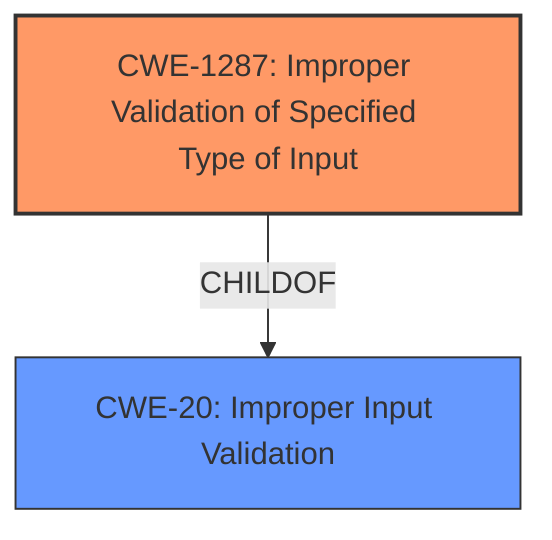

# Raw Analyzer Response for CVE-2021-44397

# Summary
| CWE ID    | CWE Name                                                                    | Confidence | CWE Abstraction Level | CWE Vulnerability Mapping Label | CWE-Vulnerability Mapping Notes |
| --------- | --------------------------------------------------------------------------- | ---------- | --------------------- | ------------------------------- | ------------------------------- |
| CWE-1287  | Improper Validation of Specified Type of Input                            | 0.9        | Base                  | Primary                         | Allowed                        |
| CWE-20    | Improper Input Validation                                                   | 0.7        | Class                 | Secondary                       | Discouraged                    |

## Evidence and Confidence

*   **Confidence Score:** 0.8
*   **Evidence Strength:** HIGH

## Relationship Analysis
The primary CWE is CWE-1287, which is a Base level CWE. The description clearly states that the vulnerability arises because the code does not validate the type of the "param" element in the JSON input. CWE-20 is a parent Class of CWE-1287 but is less specific. The relationship ChildOf(CWE-1287, CWE-20) influenced the decision to choose the more specific Base CWE-1287 as the primary mapping.

## Vulnerability Chain
The vulnerability chain starts with the receipt of a crafted HTTP request containing a JSON payload. The **JSON parsing issue** occurs because the code **does not validate** whether the "param" element is an object. This leads to an assertion failure, which in turn causes the `cgiserver.cgi` process to terminate, resulting in a denial-of-service (reboot).

## Summary of Analysis
The initial analysis focused on the **JSON parsing issue** and the **lack of validation** of the "param" element type. The vulnerability description explicitly mentions that the code assumes the "param" element will always be an object, and the **failure to check** this assumption is the root cause. This aligns perfectly with CWE-1287, "Improper Validation of Specified Type of Input." The CVE Reference Links Content Summary provides strong evidence for this: "The `cgiserver.cgi` process incorrectly handles JSON input when parsing commands and parameters. Specifically, the code assumes that the "param" JSON element will always be an object... However, if a string or another non-object type is provided for "param," an assertion failure occurs."

CWE-20 was considered because it is a general class for "Improper Input Validation," and it was listed as the Primary CWE Match for similar CVE Descriptions. However, CWE-1287 is a more specific Base CWE that accurately describes the **root cause**, making it the preferred choice.

Relevant CWE Information:

# Enhanced Context (25 CWEs)

## CWE-1287: Improper Validation of Specified Type of Input
**Abstraction Level**: Base
**Similarity Score**: 0.80

**Description**:
The product receives input that is expected to be of a certain type, but it does not validate or incorrectly validates that the input is actually of the expected type.

**Mapping Guidance**:
- Usage: Allowed

## CWE-20: Improper Input Validation
**Abstraction Level**: Class
**Similarity Score**: 0.291

**Description**:
The product receives input or data, but it does not validate or incorrectly validates that the input has the properties that are required to process the data safely and correctly.

**Mapping Guidance**:
- Usage: Discouraged

### Final Conclusion

CWE-1287 is the optimal choice because it directly addresses the **lack of type validation** in the JSON parsing logic. This is supported by the vulnerability description and the CVE Reference Links Content Summary. Choosing CWE-1287 provides a more precise and actionable classification than the more general CWE-20.