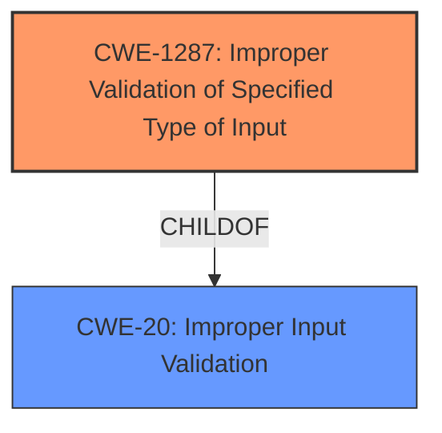

# Analysis Report for CVE-2021-44398

# Vulnerability Analysis Report: CVE-2021-44398

## Description


## Analysis (with Relationship Data)

# Summary
| CWE ID | CWE Name | Confidence | CWE Abstraction Level | CWE Vulnerability Mapping Label | CWE-Vulnerability Mapping Notes |
|---|---|---|---|---|---|
| CWE-1287 | Improper Validation of Specified Type of Input | 0.9 | Base | Allowed | Primary CWE |
| CWE-20 | Improper Input Validation | 0.6 | Class | Discouraged | Secondary Candidate |

## Evidence and Confidence

*   **Confidence Score:** 0.8
*   **Evidence Strength:** HIGH

## Relationship Analysis
The primary CWE, CWE-1287 (Improper Validation of Specified Type of Input), is a child of CWE-20 (Improper Input Validation). This hierarchical relationship indicates that CWE-1287 is a more specific case of CWE-20, focusing on the type of the input. Given the details of the vulnerability, CWE-1287 is a more precise classification because the **vulnerability arises from the code's failure to validate that the `param` field in the JSON command is of the expected type (a JSON object).** CWE-20 is too general since it covers all forms of improper validation.



## Vulnerability Chain
The vulnerability chain starts with the **improper input validation** of the `param` field's type (CWE-1287). Because the code doesn't check if `param` is a JSON object, it attempts to access it as if it were an object, leading to an assertion failure. This causes the `cgiserver.cgi` process to crash, resulting in a device reboot, which is a denial-of-service (DoS) condition.

Chain:
1.  CWE-1287: **Improper Validation of Specified Type of Input** (Root Cause)
2.  Process Crash (Intermediary Effect)
3.  Denial of Service (Impact)

## Summary of Analysis
The initial analysis identified a denial-of-service vulnerability due to **improper input validation** in the cgiserver.cgi JSON command parser. The code **fails to validate that the `param` field of a JSON command is a JSON object.** When a non-object value is provided, it causes an assertion failure and reboot.

The retriever results suggested several CWEs, but CWE-1287 (Improper Validation of Specified Type of Input) emerged as the most relevant. The "CVE Reference Links Content Summary" section explicitly states, "The code lacks proper checks to ensure that the `param` field is a JSON object before attempting to access its members using the subscription operator." This statement directly supports the selection of CWE-1287.

CWE-20 (Improper Input Validation) was also considered but deemed too general. While the vulnerability fundamentally involves **improper input validation**, CWE-1287 is more specific because it focuses on the validation of the input *type*.

The "Relationship Analysis" section emphasizes this point: CWE-1287 is a child of CWE-20, making it a more precise classification.

The final decision to prioritize CWE-1287 is based on the evidence from the "CVE Reference Links Content Summary," the retriever results, and the hierarchical relationship between CWE-1287 and CWE-20. The selected CWE is at the optimal level of specificity, aligning with MITRE's mapping guidance to choose the most detailed applicable CWE.

Relevant CWE Information:

# Enhanced Context (25 CWEs)
The following CWEs were identified as potentially relevant to this vulnerability:

## CWE-1289: Improper Validation of Unsafe Equivalence in Input
**Abstraction Level**: Base
**Similarity Score**: 0.80
**Source**: dense

**Description**:
The product receives an input value that is used as a resource identifier or other type of reference, but it does not validate or incorrectly validates that the input is equivalent to a potentially-unsafe value.
**Rationale for Not Using**: This CWE does not match the vulnerability. The vulnerability is not about validating if the input is equivalent to an unsafe value, but rather if the input has the correct type.

## CWE-138: Improper Neutralization of Special Elements
**Abstraction Level**: Class
**Similarity Score**: 0.77
**Source**: dense

**Description**:
The product receives input from an upstream component, but it does not neutralize or incorrectly neutralizes special elements that could be interpreted as control elements or syntactic markers when they are sent to a downstream component.
**Rationale for Not Using**: This CWE does not match the vulnerability. The vulnerability is not about special elements, but rather incorrect typing of the input.

## CWE-184: Incomplete List of Disallowed Inputs
**Abstraction Level**: Base
**Similarity Score**: 0.76
**Source**: dense

**Description**:
The product implements a protection mechanism that relies on a list of inputs (or properties of inputs) that are not allowed by policy or otherwise require other action to neutralize before additional processing takes place, but the list is incomplete.
**Rationale for Not Using**: This CWE does not match the vulnerability. The vulnerability is not about incomplete list of disallowed inputs.

## CWE-74: Improper Neutralization of Special Elements in Output Used by a Downstream Component ('Injection')
**Abstraction Level**: Class
**Similarity Score**: 0.76
**Source**: dense

**Description**:
The product constructs all or part of a command, data structure, or record using externally-influenced input from an upstream component, but it does not neutralize or incorrectly neutralizes special elements that could modify how it is parsed or interpreted when it is sent to a downstream component.
**Rationale for Not Using**: This CWE does not match the vulnerability. The vulnerability is not about neutralizing special elements in output.

## CWE-1288: Improper Validation of Consistency within Input
**Abstraction Level**: Base
**Similarity Score**: 0.76
**Source**: dense

**Description**:
The product receives a complex input with multiple elements or fields that must be consistent with each other, but it does not validate or incorrectly validates that the input is actually consistent.
**Rationale for Not Using**: This CWE does not match the vulnerability. The vulnerability is not about validating consistency of multiple elements, but rather incorrect typing of the input.

## CWE-134: Use of Externally-Controlled Format String
**Abstraction Level**: Base
**Similarity Score**: 0.76
**Source**: dense

**Description**:
The product uses a function that accepts a format string as an argument, but the format string originates from an external source.
**Rationale for Not Using**: This CWE does not match the vulnerability. The vulnerability is not about format strings.

## CWE-807: Reliance on Untrusted Inputs in a Security Decision
**Abstraction Level**: Base
**Similarity Score**: 0.76
**Source**: dense

**Description**:
The product uses a protection mechanism that relies on the existence or values of an input, but the input can be modified by an untrusted actor in a way that bypasses the protection mechanism.
**Rationale for Not Using**: This CWE does not match the vulnerability. The vulnerability is not about reliance on untrusted inputs in a security decision.

## CWE-183: Permissive List of Allowed Inputs
**Abstraction Level**: Base
**Similarity Score**: 0.76
**Source**: dense

**Description**:
The product implements a protection mechanism that relies on a list of inputs (or properties of inputs) that are explicitly allowed by policy because the inputs are assumed to be safe, but the list is too permissive - that is, it allows an input that is unsafe, leading to resultant weaknesses.
**Rationale for Not Using**: This CWE does not match the vulnerability. The vulnerability is not about permissive list of allowed inputs.

## CWE-1286: Improper Validation of Syntactic Correctness of Input
**Abstraction Level**: Base
**Similarity Score**: 0.75
**Source**: dense

**Description**:
The product receives input that is expected to be well-formed - i.e., to comply with a certain syntax - but it does not validate or incorrectly validates that the input complies with the syntax.
**Rationale for Not Using**: This CWE does not match the vulnerability. The vulnerability is not about syntactic correctness, but rather incorrect typing of the input.

## CWE-115: Misinterpretation of Input
**Abstraction Level**: Base
**Similarity Score**: 0.75
**Source**: dense

**Description**:
The product misinterprets an input, whether from an attacker or another product, in a security-relevant fashion.
**Rationale for Not Using**: This CWE does not match the vulnerability. The vulnerability is not about misinterpretation of input, but rather incorrect typing of the input.

## CWE-1284: Improper Validation of Specified Quantity in Input
**Abstraction Level**: Base
**Similarity Score**: 8157.80
**Source**: sparse

**Description**:
The product receives input


## CWE Relationship Analysis

Current CWEs represent these abstraction levels: .


### Vulnerability Chain Analysis

**Chain starting from CWE-184:**
- 184 (Incomplete List of Disallowed Inputs) - ROOT


**Chain starting from CWE-115:**
- 115 (Misinterpretation of Input) - ROOT


### CWE Relationship Diagram

```mermaid
graph TD
    classDef primary fill:#f96,stroke:#333,stroke-width:2px
    classDef secondary fill:#69f,stroke:#333
    classDef tertiary fill:#9e9,stroke:#333
```


*Report generated on 2025-03-31 08:14:17*
