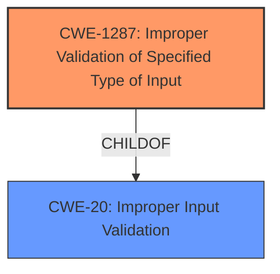

# Analysis for CVE-2021-44399

# Summary
| CWE ID | CWE Name | Confidence | CWE Abstraction Level | CWE Vulnerability Mapping Label | CWE-Vulnerability Mapping Notes |
|---|---|---|---|---|---|
| CWE-1287 | Improper Validation of Specified Type of Input | 0.9 | Base | Allowed | Primary CWE |
| CWE-20 | Improper Input Validation | 0.6 | Class | Discouraged | Secondary CWE |

## Evidence and Confidence

*   **Confidence Score:** 0.8
*   **Evidence Strength:** HIGH

## Relationship Analysis
The primary CWE selected is CWE-1287, which is a Base level weakness and a child of CWE-20. CWE-20 is a more general class of weakness. Since the vulnerability specifically involves **improper validation of the type of input**, CWE-1287 is a more accurate and specific choice.

## Vulnerability Chain
The vulnerability chain starts with the **improper validation of the input type**, leading to an assertion failure and the crash of the `cgiserver.cgi` process. This crash results in a denial of service by causing a device reboot.

## Summary of Analysis
Initially, CWE-20 was considered as a potential mapping due to the general nature of the **improper input validation**. However, the vulnerability description and the CVE reference content summary provide more specific information, indicating that the `cgiserver.cgi` application **incorrectly handles non-object JSON values passed to the `param` field**. This leads to an assertion failure due to an incorrect type check, which then results in the process crashing. Given this specific detail, **CWE-1287: Improper Validation of Specified Type of Input** is a more precise classification. The retriever results also suggest CWE-1287 as the top candidate with a high similarity score.

The evidence supporting this decision is derived from the "CVE Reference Links Content Summary," which states: "The `cgiserver.cgi` application incorrectly handles non-object JSON values passed to the `param` field, leading to an assertion failure due to an incorrect type check in the JSON parsing library when attempting to use the subscription operator on a non-object type, which then results in the process crashing."

Relevant CWE Information:

# Enhanced Context (25 CWEs)
The following CWEs were identified as potentially relevant to this vulnerability:

## CWE-1287: Improper Validation of Specified Type of Input
**Abstraction Level**: Base
**Similarity Score**: 0.80
**Source**: dense

**Description**:
The product receives input that is expected to be of a certain type, but it does not validate or incorrectly validates that the input is actually of the expected type.

**Mapping Guidance**:
- Usage: Allowed
- Rationale: This CWE entry is at the Base level of abstraction, which is a preferred level of abstraction for mapping to the root causes of vulnerabilities.
## CWE-20: Improper Input Validation
**Abstraction Level**: Class
**Similarity Score**: 0.353
**Source**: sparse

**Description**:
The product receives input or data, but it does
        not validate or incorrectly validates that the input has the
        properties that are required to process the data safely and
        correctly.

**Mapping Guidance**:
- Usage: Discouraged
- Rationale: CWE-20 is commonly misused in low-information vulnerability reports when lower-level CWEs could be used instead, or when more details about the vulnerability are available [REF-1287]. It is not useful for trend analysis. It is also a level-1 Class (i.e., a child of a Pillar).
**Comments:** Consider lower-level children such as Improper Use of Validation Framework (CWE-1173) or improper validation involving specific types or properties of input such as Specified Quantity (CWE-1284); Specified Index, Position, or Offset (CWE-1285); Syntactic Correctness (CWE-1286); Specified Type (CWE-1287); Consistency within Input (CWE-1288); or Unsafe Equivalence (CWE-1289).

CWE-1287 is the most appropriate because the vulnerability is rooted in the application's failure to validate that the "param" field in the JSON input is of the expected type (a JSON object). This aligns directly with the description of CWE-1287: "The product receives input that is expected to be of a certain type, but it does not validate or incorrectly validates that the input is actually of the expected type."

CWE-20 was considered but ultimately deemed less specific. While **improper input validation** is a general issue, the specific flaw is the **failure to validate the type of the JSON parameter**.