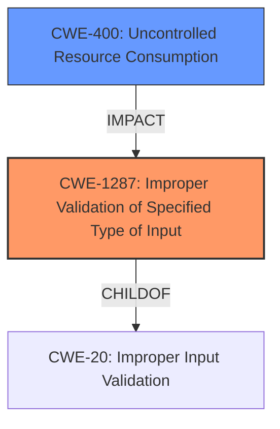

# Enhanced Analysis for CVE-2021-44402

# Summary
| CWE ID | CWE Name | Confidence | CWE Abstraction Level | CWE Vulnerability Mapping Label | CWE-Vulnerability Mapping Notes |
|---|---|---|---|---|---|
| CWE-1287 | Improper Validation of Specified Type of Input | 1.0 | Base | Allowed | Primary CWE |
| CWE-400 | Uncontrolled Resource Consumption | 0.7 | Class | Discouraged | Secondary CWE |

## Evidence and Confidence

*   **Confidence Score:** 0.9
*   **Evidence Strength:** HIGH

## Relationship Analysis
The primary CWE is CWE-1287 (**Improper Validation of Specified Type of Input**), a **Base** level weakness that is a child of CWE-20 (**Improper Input Validation**). The secondary CWE is CWE-400 (**Uncontrolled Resource Consumption**), a **Class** level weakness, which describes the impact of the vulnerability.



## Vulnerability Chain
The chain of events is as follows:
1.  The application receives a specially-crafted HTTP request.
2.  The `cgiserver.cgi` JSON command parser **fails to validate the type** of the "param" field, assuming it is always an object (CWE-1287).
3.  The code attempts to access the "param" field as an object using the subscription operator, which leads to an assertion failure and process termination.
4.  The `cgiserver.cgi` process terminates, leading to a device reboot, resulting in a denial of service (CWE-400).

## Summary of Analysis
The primary weakness is CWE-1287 (**Improper Validation of Specified Type of Input**), supported by the following evidence:
*   The "CVE Reference Links Content Summary" states: "The root cause is the **improper input validation** in the `cgiserver.cgi` JSON command parser. Specifically, the code assumes that the "param" JSON element will always be an object, but this is not always the case."
*   The description for CWE-1287 states: "The product receives input that is expected to be of a certain type, but it does not validate or incorrectly validates that the input is actually of the expected type."
*   The "CVE Reference Links Content Summary" states: "The `cgiserver.cgi` does not properly validate the type of the JSON element provided for the "param" key. It assumes that the "param" value is always an object."
*   CWE-1287 is a **Base** level CWE, which is the preferred level of abstraction.

The secondary weakness is CWE-400 (**Uncontrolled Resource Consumption**), supported by the following evidence:
*   The vulnerability description states: "**A denial of service vulnerability exists**"
*   The "CVE Reference Links Content Summary" states: "An attacker can cause a denial of service by sending a specially crafted HTTP request to the camera, resulting in a reboot."
*   CWE-400 is a **Class** level CWE, and per mapping guidelines, should be replaced with a **Base** level CWE. However, there is no **Base** level CWE that matches more closely.

CWE-20 (**Improper Input Validation**) was considered, as it is the parent of CWE-1287. However, CWE-1287 is a more specific **Base** level CWE that describes the vulnerability, so it is preferred.


## CWE Relationship Analysis

Current CWEs represent these abstraction levels: .


### Vulnerability Chain Analysis

**Chain starting from CWE-400:**
- 400 (Uncontrolled Resource Consumption) - ROOT


**Chain starting from CWE-20:**
- 20 (Improper Input Validation) - ROOT


### CWE Relationship Diagram

```mermaid
graph TD
    classDef primary fill:#f96,stroke:#333,stroke-width:2px
    classDef secondary fill:#69f,stroke:#333
    classDef tertiary fill:#9e9,stroke:#333
```