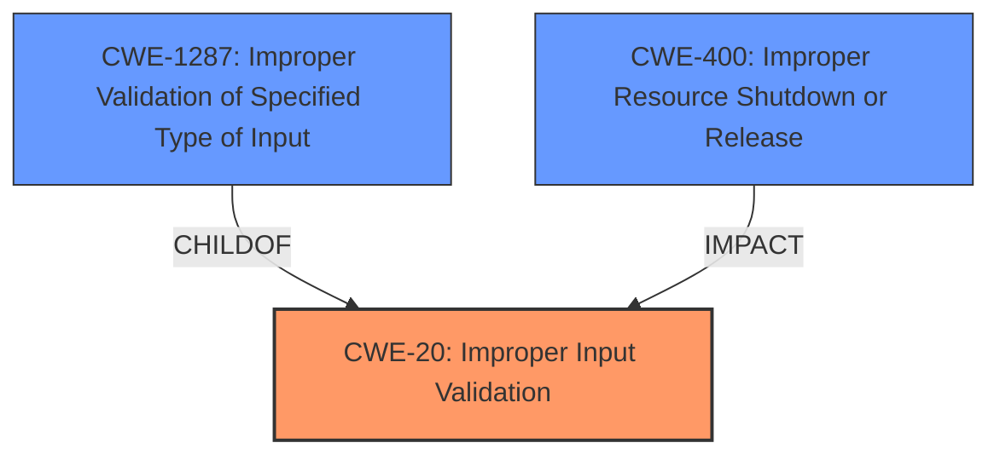

# Analysis Report for CVE-2021-44403

# Vulnerability Analysis Report: CVE-2021-44403

## Description


## Analysis (with Relationship Data)

# Summary
| CWE ID  | CWE Name                                                          | Confidence | CWE Abstraction Level | CWE Vulnerability Mapping Label | CWE-Vulnerability Mapping Notes |
| :-------- | :---------------------------------------------------------------- | :--------- | :-------------------- | :------------------------------ | :------------------------------ |
| CWE-20  | Improper Input Validation                                         | 1.0        | Class                 | Primary                         | Allowed                         |
| CWE-1287 | Improper Validation of Specified Type of Input                  | 0.7        | Base                  | Secondary                       | Allowed                         |
| CWE-400 |  Improper Resource Shutdown or Release                       | 0.4        | Class                  | Secondary                       | Allowed-with-Review                   |

## Evidence and Confidence

*   **Confidence Score:** 0.8
*   **Evidence Strength:** HIGH

## Relationship Analysis
The primary weakness is CWE-20 (**Improper Input Validation**), as the application does not properly validate the type of input received. CWE-1287 (**Improper Validation of Specified Type of Input**) is a more specific Base level CWE that is a child of CWE-20 and focuses on the type validation issue. CWE-400 (**Improper Resource Shutdown or Release**) represents the impact of the vulnerability, which is a denial of service.



## Vulnerability Chain
The vulnerability chain starts with **improper input validation** (CWE-20) in the `cgiserver.cgi` application. Specifically, the code expects the `param` field within a JSON command to always be a JSON object but does not enforce this. This leads to a type mismatch and, consequently, a denial of service (CWE-400) due to an assertion failure and reboot.

## Summary of Analysis
The initial assessment points towards CWE-20 (**Improper Input Validation**) because the root cause lies in the application's failure to properly validate the input. The "CVE Reference Links Content Summary" states: "The `cgiserver.cgi` application improperly validates the JSON input provided in HTTP requests. Specifically, the code expects the `param` field within a JSON command to always be a JSON object but does not enforce this, leading to type mismatch when a string is provided instead of an object."

CWE-1287 (**Improper Validation of Specified Type of Input**) is a more specific Base level CWE that is a child of CWE-20, focusing specifically on the lack of type validation. Given the specific nature of the vulnerability, CWE-1287 is a relevant secondary CWE.

CWE-400 (**Improper Resource Shutdown or Release**) is chosen as the impact of this vulnerability as an attacker can cause a denial-of-service condition by sending a specially crafted HTTP request with an invalid JSON format, triggering a reboot of the affected device.

The selection of these CWEs is based on both the vulnerability description and the supporting evidence. The graph relationships help clarify the relationship between the root cause (CWE-20 and CWE-1287) and the impact (CWE-400). The selected CWEs are at the optimal level of specificity, as they accurately represent the weakness and its consequences.

Relevant CWE Information:

# Enhanced Context (25 CWEs)

## CWE-170: Improper Null Termination
**Abstraction Level**: Base
**Similarity Score**: 0.77
**Source**: dense

**Description**:
The product does not terminate or incorrectly terminates a string or array with a null character or equivalent terminator.
**Rationale for Not Using**: This CWE is not applicable as the vulnerability doesn't involve string termination issues.

## CWE-131: Incorrect Calculation of Buffer Size
**Abstraction Level**: Base
**Similarity Score**: 0.77
**Source**: dense

**Description**:
The product does not correctly calculate the size to be used when allocating a buffer, which could lead to a buffer overflow.
**Rationale for Not Using**: This CWE is not applicable as the vulnerability doesn't involve buffer size calculation issues.

## CWE-125: Out-of-bounds Read
**Abstraction Level**: Base
**Similarity Score**: 0.77
**Source**: dense

**Description**:
The product reads data past the end, or before the beginning, of the intended buffer.
**Rationale for Not Using**: This CWE is not applicable as the vulnerability doesn't involve out-of-bounds reads.

## CWE-404: Improper Resource Shutdown or Release
**Abstraction Level**: Class
**Similarity Score**: 0.77
**Source**: dense

**Description**:
The product does not release or incorrectly releases a resource before it is made available for re-use.
**Rationale for Using**: The product does not properly validate the input and leads to a denial of service, by triggering a reboot of the device, which relates to resource management.

## CWE-191: Integer Underflow (Wrap or Wraparound)
**Abstraction Level**: Base
**Similarity Score**: 0.77
**Source**: dense

**Description**:
The product subtracts one value from another, such that the result is less than the minimum allowable integer value, which produces a value that is not equal to the correct result.
**Rationale for Not Using**: This CWE is not applicable as the vulnerability doesn't involve integer underflow issues.

## CWE-130: Improper Handling of Length Parameter Inconsistency
**Abstraction Level**: Base
**Similarity Score**: 0.76
**Source**: dense

**Description**:
The product parses a formatted message or structure, but it does not handle or incorrectly handles a length field that is inconsistent with the actual length of the associated data.
**Rationale for Not Using**: This CWE is not applicable as the vulnerability doesn't involve length parameter inconsistency issues.

## CWE-667: Improper Locking
**Abstraction Level**: Class
**Similarity Score**: 0.76
**Source**: dense

**Description**:
The product does not properly acquire or release a lock on a resource, leading to unexpected resource state changes and behaviors.
**Rationale for Not Using**: This CWE is not applicable as the vulnerability doesn't involve locking issues.

## CWE-129: Improper Validation of Array Index
**Abstraction Level**: Variant
**Similarity Score**: 0.76
**Source**: dense

**Description**:
The product uses untrusted input when calculating or using an array index, but the product does not validate or incorrectly validates the index to ensure the index references a valid position within the array.
**Rationale for Not Using**: This CWE is not applicable as the vulnerability doesn't involve array index validation issues.

## CWE-252: Unchecked Return Value
**Abstraction Level**: Base
**Similarity Score**: 0.76
**Source**: dense

**Description**:
The product does not check the return value from a method or function, which can prevent it from detecting unexpected states and conditions.
**Rationale for Not Using**: This CWE is not applicable as the vulnerability doesn't involve unchecked return values.

## CWE-74: Improper Neutralization of Special Elements in Output Used by a Downstream Component ('Injection')
**Abstraction Level**: Class
**Similarity Score**: 0.76
**Source**: dense

**Description**:
The product constructs all or part of a command, data structure, or record using externally-influenced input from an upstream component, but it does not neutralize or incorrectly neutralizes special elements that could modify how it is parsed or interpreted when it is sent to a downstream component.
**Rationale for Not Using**: This CWE is not applicable as the vulnerability doesn't involve injection issues.

## CWE-125: Out-of-bounds Read
**Abstraction Level**: Base
**Similarity Score**: 6507.10
**Source**: sparse

**Description**:
The product reads data past the end, or before the beginning, of the intended buffer.
**Rationale for Not Using**: This CWE is not applicable as the vulnerability doesn't involve out-of-bounds reads.

## CWE-190: Integer Overflow or Wraparound
**Abstraction Level**: Base
**Similarity Score**: 6457.45
**Source**: sparse

**Description**:
The product performs a calculation that can
         produce an integer overflow or wraparound when the logic
         assumes that the resulting value will always be larger than
         the original value. This occurs when an integer value is
         incremented to a value that is too large to store in the
         associated representation. When this occurs, the value may
         become a very small or negative number.
**Rationale for Not Using**: This CWE is not applicable as the vulnerability doesn't involve integer overflow


## CWE Relationship Analysis

Current CWEs represent these abstraction levels: .


### Vulnerability Chain Analysis

**Chain starting from CWE-131:**
- 131 (Incorrect Calculation of Buffer Size) - ROOT


**Chain starting from CWE-190:**
- 190 (Integer Overflow or Wraparound) - ROOT


### CWE Relationship Diagram

```mermaid
graph TD
    classDef primary fill:#f96,stroke:#333,stroke-width:2px
    classDef secondary fill:#69f,stroke:#333
    classDef tertiary fill:#9e9,stroke:#333
```


*Report generated on 2025-03-30 17:06:26*
