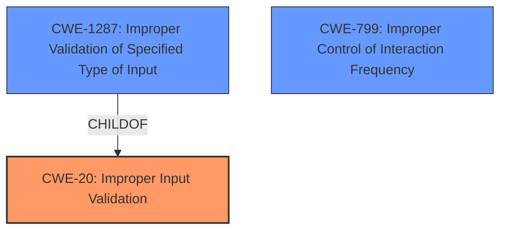

# Analysis for CVE-2021-44404

# Summary
| CWE ID  | CWE Name                                                        | Confidence | CWE Abstraction Level | CWE Vulnerability Mapping Label | CWE-Vulnerability Mapping Notes |
|---------|-----------------------------------------------------------------|------------|-----------------------|---------------------------------|-------------------------------|
| CWE-20  | Improper Input Validation                                        | 0.9        | Class                  | Primary                           | Discouraged                  |
| CWE-1287 | Improper Validation of Specified Type of Input                | 0.8        | Base                   | Secondary                         | Allowed                       |
| CWE-799  | Improper Control of Interaction Frequency                      | 0.6        | Class                  | Secondary                         | Allowed-with-Review          |

## Evidence and Confidence

*   **Confidence Score:** 0.8
*   **Evidence Strength:** HIGH

## Relationship Analysis
The primary relationship is that CWE-1287 is a child of CWE-20. CWE-20 is a broad class, while CWE-1287 is more specific, dealing with the **improper validation of the specified type of input**. While CWE-20 is generally discouraged due to its broad nature, the evidence supports its selection as a high-level cause, with CWE-1287 providing a more precise description of the vulnerability. CWE-799 is a class that could be related, but the evidence is not quite there.

## Vulnerability Chain
The vulnerability chain starts with the **improper input validation** (CWE-20 and CWE-1287) in the JSON command parser. The parser does not validate the type of the `param` JSON element. This leads to the `cgiserver.cgi` process terminating, which results in a device reboot, causing a denial of service.

## Summary of Analysis
The initial analysis, based on the provided evidence, suggests that the vulnerability stems from **improper input validation** in the `cgiserver.cgi` application's JSON command parser.

The "CVE Reference Links Content Summary" states: "*Root cause of vulnerability*: The `cgiserver.cgi` application's JSON command parser does not properly validate the type of the `param` JSON element before passing it to API-specific parameter parsers. It assumes the `param` value is always a JSON object and attempts to access it using the subscription operator. However, if a string or other non-object type is provided, it leads to an assertion failure and process termination."

The primary CWE match suggested is CWE-20, **Improper Input Validation**. Given that the vulnerability arises from a failure to validate the type of the JSON `param` element, CWE-20 aligns with the general class of the weakness. However, CWE-1287, **Improper Validation of Specified Type of Input**, is a more specific Base level CWE. The vulnerability specifically involves the **improper validation of the TYPE of the input**, thus making CWE-1287 a more precise fit. However, the primary recommendation in the provided text is CWE-20 and, because there could be other unspecified input validations, it is appropriate to list CWE-20 first as the more general case, followed by CWE-1287.

CWE-799, **Improper Control of Interaction Frequency**, was considered because a crafted HTTP request leads to a reboot, implying the potential for repeated interactions. However, the root cause is more directly related to input validation, and the interaction frequency is a secondary concern. CWE-799 is not the primary driver of the vulnerability, therefore it is not a good match.

CWE-20 and CWE-1287 are at the optimal level of specificity, as they directly address the **root cause** of the vulnerability, which is the **lack of proper input validation** of the JSON parameter type.

Relevant CWE Information:

# Enhanced Context (25 CWEs)
The following CWEs were identified as potentially relevant to this vulnerability:

## CWE-1289: Improper Validation of Unsafe Equivalence in Input
**Abstraction Level**: Base
**Similarity Score**: 0.76

## CWE-625: Permissive Regular Expression
**Abstraction Level**: Base
**Similarity Score**: 0.75

## CWE-799: Improper Control of Interaction Frequency
**Abstraction Level**: Class
**Similarity Score**: 0.74

## CWE-407: Inefficient Algorithmic Complexity
**Abstraction Level**: Class
**Similarity Score**: 0.74

## CWE-138: Improper Neutralization of Special Elements
**Abstraction Level**: Class
**Similarity Score**: 0.73

## CWE-606: Unchecked Input for Loop Condition
**Abstraction Level**: Base
**Similarity Score**: 0.73

## CWE-185: Incorrect Regular Expression
**Abstraction Level**: Class
**Similarity Score**: 0.73

## CWE-184: Incomplete List of Disallowed Inputs
**Abstraction Level**: Base
**Similarity Score**: 0.73

## CWE-74: Improper Neutralization of Special Elements in Output Used by a Downstream Component ('Injection')
**Abstraction Level**: Class
**Similarity Score**: 0.73

## CWE-41: Improper Resolution of Path Equivalence
**Abstraction Level**: Base
**Similarity Score**: 0.73

## CWE-1284: Improper Validation of Specified Quantity in Input
**Abstraction Level**: Base
**Similarity Score**: 7895.22

## CWE-190: Integer Overflow or Wraparound
**Abstraction Level**: Base
**Similarity Score**: 7855.38

## CWE-125: Out-of-bounds Read
**Abstraction Level**: Base
**Similarity Score**: 7815.16

## CWE-789: Memory Allocation with Excessive Size Value
**Abstraction Level**: Variant
**Similarity Score**: 7675.79

## CWE-22: Improper Limitation of a Pathname to a Restricted Directory ('Path Traversal')
**Abstraction Level**: Base
**Similarity Score**: 7640.98

## CWE-170: Improper Null Termination
**Abstraction Level**: base
**Similarity Score**: 5.03

## CWE-843: Access of Resource Using Incompatible Type ('Type Confusion')
**Abstraction Level**: base
**Similarity Score**: 5.03

## CWE-22: Improper Limitation of a Pathname to a Restricted Directory ('Path Traversal')
**Abstraction Level**: base
**Similarity Score**: 4.33

## CWE-770: Allocation of Resources Without Limits or Throttling
**Abstraction Level**: base
**Similarity Score**: 4.33

## CWE-73: External Control of File Name or Path
**Abstraction Level**: base
**Similarity Score**: 4.33

## CWE-190: Integer Overflow or Wraparound
**Abstraction Level**: base
**Similarity Score**: 4.33

## CWE-1284: Improper Validation of Specified Quantity in Input
**Abstraction Level**: base
**Similarity Score**: 4.33

## CWE-120: Buffer Copy without Checking Size of Input ('Classic Buffer Overflow')
**Abstraction Level**: base
**Similarity Score**: 4.33

## CWE-123: Write-what-where Condition
**Abstraction Level**: base
**Similarity Score**: 4.33

## CWE-131: Incorrect Calculation of Buffer Size
**Abstraction Level**: base
**Similarity Score**: 4.33