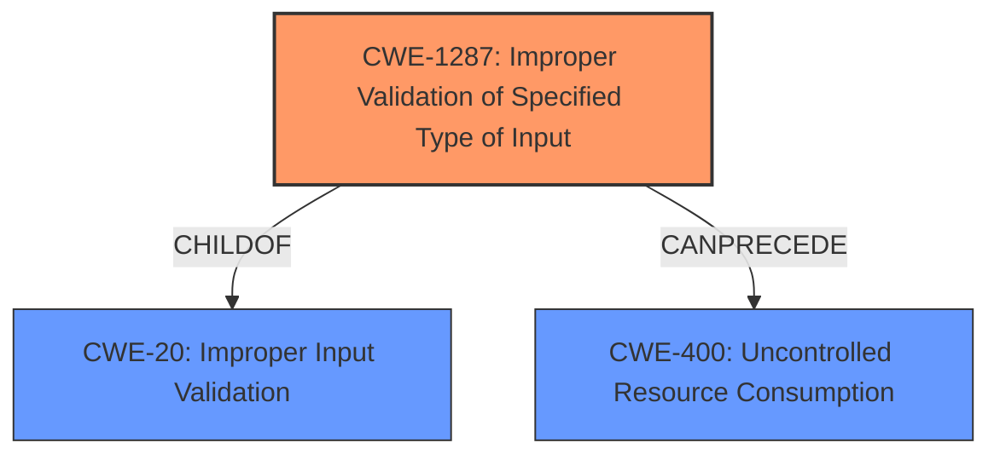

# Analysis for CVE-2021-44410

# Summary
| CWE ID | CWE Name | Confidence | CWE Abstraction Level | CWE Vulnerability Mapping Label | CWE-Vulnerability Mapping Notes |
|---|---|---|---|---|---|
| CWE-1287 | Improper Validation of Specified Type of Input | 0.9 | Base | Primary | Allowed |
| CWE-400 | Uncontrolled Resource Consumption | 0.6 | Class | Secondary | Allowed-with-Review |

## Evidence and Confidence

*   **Confidence Score:** 0.8
*   **Evidence Strength:** HIGH

## Relationship Analysis
The primary CWE is CWE-1287, which is a Base level weakness and a child of CWE-20 (Improper Input Validation). CWE-400 (Uncontrolled Resource Consumption) is a Class-level weakness that represents the impact of the vulnerability. The relationship between CWE-1287 and CWE-400 can be viewed as a chain, where improper input validation leads to resource consumption.

## Vulnerability Chain
The vulnerability chain starts with the Reolink RLC-410W camera's `cgiserver.cgi` process.
1.  The `UpgradePrepare` API receives an HTTP request with a JSON payload.
2.  The JSON command parser **fails to validate the type** of the "param" element.
3.  The parser assumes "param" is an object, but it can be any JSON type.
4.  If "param" is not an object, the code attempts to access it using the subscription operator, causing an assert and crashing `cgiserver.cgi`.
5.  The crashing of `cgiserver.cgi` results in a device reboot, leading to a denial of service.

The root cause is the **improper input validation** (CWE-1287). The impact is denial of service (CWE-400) due to a reboot.

## Summary of Analysis
The initial analysis identified the **rootcause** as a **denial of service vulnerability in JSON command parser** due to the `UpgradePrepare` API parser incorrectly assuming the 'param' JSON element is an object.

The vulnerability description and CVE reference summary clearly indicate that the `cgiserver.cgi` process does not properly validate the type of the "param" element in the JSON payload of an `UpgradePrepare` API call. This **lack of validation** leads to a crash and subsequent reboot when the code attempts to access the "param" element as an object, even when it is not.

The primary CWE selected is CWE-1287 (Improper Validation of Specified Type of Input) because it accurately describes the **root cause** of the vulnerability, where the program **fails to validate the type** of the JSON input. The CVE summary explicitly mentions that the code "doesn't check the type of JSON elements before attempting to access their members."

CWE-20 (Improper Input Validation) was considered, as it is a parent of CWE-1287 and the top CWE match for similar CVE descriptions. However, CWE-1287 is a more specific, base-level weakness that provides a better description of the **root cause**. The MITRE mapping guidance for CWE-20 discourages its use when lower-level CWEs are available.

CWE-400 (Uncontrolled Resource Consumption) was also considered, as it describes the denial-of-service impact of the vulnerability. However, it is more appropriate to classify CWE-400 as a secondary weakness representing the impact, while CWE-1287 represents the **root cause**.

Other CWEs were considered based on the retriever results, but they were not as relevant as CWE-1287. For example, CWE-120 (Buffer Copy without Checking Size of Input) is not applicable because the vulnerability does not involve a buffer copy operation.

The final decision is based on the evidence from the vulnerability description and CVE reference summary, the relationship analysis, and the MITRE mapping guidance. CWE-1287 is the most appropriate CWE because it specifically addresses the **improper validation of the input type**, which is the **root cause** of the vulnerability.

Relevant CWE Information:

# Enhanced Context (25 CWEs)
The following CWEs were identified as potentially relevant to this vulnerability:

## CWE-1289: Improper Validation of Unsafe Equivalence in Input
**Abstraction Level**: Base
**Similarity Score**: 0.76
**Source**: dense

**Description**:
The product receives an input value that is used as a resource identifier or other type of reference, but it does not validate or incorrectly validates that the input is equivalent to a potentially-unsafe value.

**Mapping Guidance**:
- Usage: Allowed
- Rationale: This CWE entry is at the Base level of abstraction, which is a preferred level of abstraction for mapping to the root causes of vulnerabilities.

## CWE-625: Permissive Regular Expression
**Abstraction Level**: Base
**Similarity Score**: 0.75
**Source**: dense

**Description**:
The product uses a regular expression that does not sufficiently restrict the set of allowed values.

**Mapping Guidance**:
- Usage: Allowed
- Rationale: This CWE entry is at the Base level of abstraction, which is a preferred level of abstraction for mapping to the root causes of vulnerabilities.

## CWE-407: Inefficient Algorithmic Complexity
**Abstraction Level**: Class
**Similarity Score**: 0.74
**Source**: dense

**Description**:
An algorithm in a product has an inefficient worst-case computational complexity that may be detrimental to system performance and can be triggered by an attacker, typically using crafted manipulations that ensure that the worst case is being reached.

**Mapping Guidance**:
- Usage: Allowed-with-Review
- Rationale: This CWE entry is a Class and might have Base-level children that would be more appropriate

## CWE-138: Improper Neutralization of Special Elements
**Abstraction Level**: Class
**Similarity Score**: 0.73
**Source**: dense

**Description**:
The product receives input from an upstream component, but it does not neutralize or incorrectly neutralizes special elements that could be interpreted as control elements or syntactic markers when they are sent to a downstream component.

**Mapping Guidance**:
- Usage: Discouraged
- Rationale: This CWE entry is a level-1 Class (i.e., a child of a Pillar). It might have lower-level children that would be more appropriate

## CWE-799: Improper Control of Interaction Frequency
**Abstraction Level**: Class
**Similarity Score**: 0.73
**Source**: dense

**Description**:
The product does not properly limit the number or frequency of interactions that it has with an actor, such as the number of incoming requests.

**Mapping Guidance**:
- Usage: Allowed-with-Review
- Rationale: This CWE entry is a Class and might have Base-level children that would be more appropriate

## CWE-185: Incorrect Regular Expression
**Abstraction Level**: Class
**Similarity Score**: 0.73
**Source**: dense

**Description**:
The product specifies a regular expression in a way that causes data to be improperly matched or compared.

**Mapping Guidance**:
- Usage: Allowed-with-Review
- Rationale: This CWE entry is a Class and might have Base-level children that would be more appropriate

## CWE-606: Unchecked Input for Loop Condition
**Abstraction Level**: Base
**Similarity Score**: 0.73
**Source**: dense

**Description**:
The product does not properly check inputs that are used for loop conditions, potentially leading to a denial of service or other consequences because of excessive looping.

**Mapping Guidance**:
- Usage: Allowed
- Rationale: This CWE entry is at the Base level of abstraction, which is a preferred level of abstraction for mapping to the root causes of vulnerabilities.

## CWE-74: Improper Neutralization of Special Elements in Output Used by a Downstream Component ('Injection')
**Abstraction Level**: Class
**Similarity Score**: 0.73
**Source**: dense

**Description**:
The product constructs all or part of a command, data structure, or record using externally-influenced input from an upstream component, but it does not neutralize or incorrectly neutralizes special elements that could modify how it is parsed or interpreted when it is sent to a downstream component.

**Mapping Guidance**:
- Usage: Discouraged
- Rationale: CWE-74 is high-level and often misused when lower-level weaknesses are more appropriate.

## CWE-184: Incomplete List of Disallowed Inputs
**Abstraction Level**: Base
**Similarity