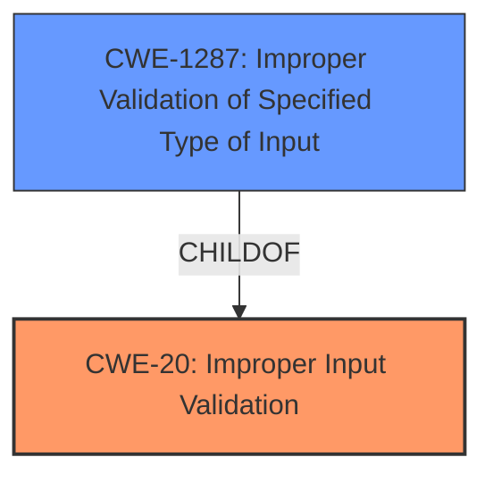

# Analysis for CVE-2021-44412

# Summary
| CWE ID | CWE Name | Confidence | CWE Abstraction Level | CWE Vulnerability Mapping Label | CWE-Vulnerability Mapping Notes |
|---|---|---|---|---|---|
| CWE-20 | Improper Input Validation | 1.0 | Class | Discouraged | The product receives input or data, but it does not validate or incorrectly validates that the input has the properties that are required to process the data safely and correctly. |
| CWE-1287 | Improper Validation of Specified Type of Input | 0.9 | Base | Allowed | The product receives input that is expected to be of a certain type, but it does not validate or incorrectly validates that the input is actually of the expected type. |

## Evidence and Confidence

*   **Confidence Score:** 1.0
*   **Evidence Strength:** HIGH

## Relationship Analysis
The primary CWE is CWE-20, which is a Class-level CWE. However, CWE-1287 is a Base-level CWE and a child of CWE-20, making it a more specific and appropriate classification for this vulnerability.

## Vulnerability Chain
The vulnerability chain involves:
1.  The product receives an HTTP request with a JSON command.
2.  The `cgiserver.cgi` JSON command parser **fails to validate that the "param" field is a JSON object**.
3.  The code attempts to access the "param" field as a JSON object, leading to an assertion failure.
4.  The device reboots, causing a denial of service.

## Summary of Analysis
The initial assessment, based on the provided evidence, points to CWE-20 (**Improper Input Validation**). However, further analysis reveals that a more specific CWE, CWE-1287 (**Improper Validation of Specified Type of Input**), is more appropriate.

The **root cause** of the vulnerability lies in the fact that the `cgiserver.cgi` JSON command parser **does not validate** whether the "param" field in the JSON command is actually a JSON object. Instead, it assumes that it will always be a JSON object and attempts to access it using the subscription operator. This **lack of validation** leads to an assertion failure and a device reboot.

The evidence for this assessment comes from the "CVE Reference Links Content Summary," which states: "The `cgiserver.cgi` JSON command parser in Reolink RLC-410W devices improperly handles JSON parameters, specifically when a string is provided instead of a JSON object for the 'param' field. The code assumes that the 'param' field will always be a JSON object and tries to access it using the subscription operator. This leads to an assertion failure and subsequently a device reboot."

The "Vulnerability Description Key Phrases" also point to a denial of service vulnerability, which is a direct consequence of the improper input validation.

The Retriever Results also list CWE-20 as a candidate, but it is a discouraged mapping. CWE-1287 is a better fit because it is more specific to the type of input validation that is missing (i.e., validation of the type of the input).

Therefore, the final assessment is that the primary CWE is CWE-20 (**Improper Input Validation**), with CWE-1287 (**Improper Validation of Specified Type of Input**) as a secondary candidate. CWE-1287 is more specific because it highlights that the application is not validating the *type* of input, which is the core issue.