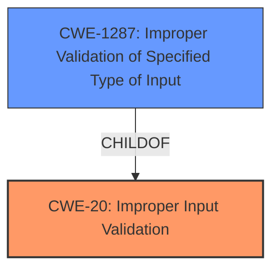

# Analysis Report for CVE-2021-44413

# Vulnerability Analysis Report: CVE-2021-44413

## Description


## Analysis (with Relationship Data)

# Summary
| CWE ID | CWE Name | Confidence | CWE Abstraction Level | CWE Vulnerability Mapping Label | CWE-Vulnerability Mapping Notes |
|---|---|---|---|---|---|
| CWE-20 | Improper Input Validation | 0.9 | Class | Primary | Discouraged |
| CWE-1287 | Improper Validation of Specified Type of Input | 0.8 | Base | Secondary | Allowed |

## Evidence and Confidence

*   **Confidence Score:** 0.9
*   **Evidence Strength:** HIGH

## Relationship Analysis
The primary relationship that influenced the CWE selection was the ChildOf relationship between CWE-1287 (Improper Validation of Specified Type of Input) and CWE-20 (Improper Input Validation). Although CWE-20 is the top CWE from similar CVE descriptions and the retriever results, it is a Class-level CWE and is discouraged. CWE-1287, a Base-level CWE and a child of CWE-20, provides a more specific description of the vulnerability.



## Vulnerability Chain
The vulnerability chain starts with the receipt of a crafted HTTP request containing a JSON command with a non-object "param" field. The `cgiserver.cgi` JSON command parser **fails to validate the type** of the "param" field. This **improper input validation** leads to an assertion failure, which causes the device to reboot, resulting in a denial of service.

## Summary of Analysis
The initial assessment identified **improper input validation** as the root cause of the vulnerability, which leads to a denial-of-service condition. The analysis focused on identifying the most specific CWE that accurately represents the weakness. The final decision was to select CWE-20 as the primary CWE, given its prevalence in similar CVE descriptions, with CWE-1287 as a secondary CWE because of its specific description of **improper validation of the input type**.

The supporting evidence is:
*   Vulnerability Description Key Phrases: "**rootcause:** **JSON parsing issue**"
*   CVE Reference Links Content Summary: "The root cause lies in the **improper input validation** within the `cgiserver.cgi` JSON command parser of the Reolink RLC-410W camera. Specifically, the code assumes that the "param" field within a JSON command is always a JSON object. If a different type is provided, it leads to an assertion failure and a subsequent device reboot."
*   CVE Reference Links Content Summary: "**Improper Input Validation (CWE-20):** The `cgiserver.cgi` **does not properly validate the type** of the `param` field in the JSON commands. The code assumes it is an object and attempts to access it using the subscription operator as if it were an object, without checking its actual type first."

CWE-20 and CWE-1287 are at the optimal level of specificity. While CWE-20 is more general, it aligns with the overall **improper input validation** root cause. CWE-1287 pinpoints the specific type validation issue, making it a valuable secondary classification.

Relevant CWE Information:

# Enhanced Context (25 CWEs)
The following CWEs were identified as potentially relevant to this vulnerability:

## CWE-1289: Improper Validation of Unsafe Equivalence in Input
**Abstraction Level**: Base
**Similarity Score**: 0.77

This CWE was not selected because the vulnerability is not about validating equivalence but about validating the type of input.

## CWE-74: Improper Neutralization of Special Elements in Output Used by a Downstream Component ('Injection')
**Abstraction Level**: Class
**Similarity Score**: 0.76

This CWE was not selected because the vulnerability is not about injection.

## CWE-943: Improper Neutralization of Special Elements in Data Query Logic
**Abstraction Level**: Class
**Similarity Score**: 0.75

This CWE was not selected because the vulnerability is not related to data query logic.

## CWE-138: Improper Neutralization of Special Elements
**Abstraction Level**: Class
**Similarity Score**: 0.75

This CWE was not selected because the vulnerability is not about neutralization of special elements.

## CWE-807: Reliance on Untrusted Inputs in a Security Decision
**Abstraction Level**: Base
**Similarity Score**: 0.74

This CWE was not selected because the vulnerability does not involve making a security decision based on untrusted inputs.

## CWE-184: Incomplete List of Disallowed Inputs
**Abstraction Level**: Base
**Similarity Score**: 0.74

This CWE was not selected because the vulnerability is not about an incomplete list of disallowed inputs.

## CWE-80: Improper Neutralization of Script-Related HTML Tags in a Web Page (Basic XSS)
**Abstraction Level**: Variant
**Similarity Score**: 0.74

This CWE was not selected because the vulnerability is not related to Cross-Site Scripting (XSS).

## CWE-917: Improper Neutralization of Special Elements used in an Expression Language Statement ('Expression Language Injection')
**Abstraction Level**: Base
**Similarity Score**: 0.73

This CWE was not selected because the vulnerability is not about expression language injection.

## CWE-1286: Improper Validation of Syntactic Correctness of Input
**Abstraction Level**: Base
**Similarity Score**: 0.73

This CWE was not selected because the vulnerability is not about syntactic correctness but type of input.

## CWE-129: Improper Validation of Array Index
**Abstraction Level**: Variant
**Similarity Score**: 0.73

This CWE was not selected because the vulnerability is not about validating array indices.

## CWE-190: Integer Overflow or Wraparound
**Abstraction Level**: Base
**Similarity Score**: 7326.89

This CWE was not selected because the vulnerability is not related to integer overflows or wraparounds.

## CWE-1284: Improper Validation of Specified Quantity in Input
**Abstraction Level**: Base
**Similarity Score**: 7252.84

This CWE was not selected because the vulnerability is not about validating quantities in input.

## CWE-125: Out-of-bounds Read
**Abstraction Level**: Base
**Similarity Score**: 7223.56

This CWE was not selected because the vulnerability is not about out-of-bounds reads.

## CWE-116: Improper Encoding or Escaping of Output
**Abstraction Level**: Class
**Similarity Score**: 7096.37

This CWE was not selected because the vulnerability is not about encoding or escaping output.

## CWE-22: Improper Limitation of a Pathname to a Restricted Directory ('Path Traversal')
**Abstraction Level**: Base
**Similarity Score**: 7087.51

This CWE was not selected because the vulnerability is not about path traversal.

## CWE-843: Access of Resource Using Incompatible Type ('Type Confusion')
**Abstraction Level**: base
**Similarity Score**: 5.03

CWE-843 was not selected because, while it deals with incompatible types, the core issue is the **lack of validation** that leads to the type confusion, rather than the access using an incompatible type itself. The vulnerability is triggered before any access attempts.

## CWE-770: Allocation of Resources Without Limits or Throttling
**Abstraction Level**: base
**Similarity Score**: 4.33

This CWE was not selected because the vulnerability is not about resource allocation without limits.

## CWE-120: Buffer Copy without Checking Size of Input ('Classic Buffer Overflow')
**Abstraction Level**: base
**Similarity Score**: 4.33

This CWE was not selected because the vulnerability is not about buffer overflows.

## CWE-123: Write-what-where Condition
**Abstraction Level**: base
**Similarity Score**: 4.33

This CWE was not selected because the vulnerability does not involve a write-what-where condition.

## CWE-131: Incorrect Calculation of Buffer Size
**Abstraction Level**: base
**Similarity Score**: 4.33

This CWE was not selected because the vulnerability is not about incorrect buffer size calculation.

## CWE-476: NULL Pointer Dereference
**Abstraction Level**: base
**Similarity Score**: 4.33

This CWE was not selected, even though it was ranked as a top CWE for similar CVE descriptions, because the vulnerability does not specifically involve a NULL pointer dereference. The crash occurs due to the code attempting to use a non-object as an object.

## CWE-78: Improper Neutralization of Special Elements used in an OS Command ('OS Command Injection')
**Abstraction Level**: base
**Similarity Score**: 4.31

This CWE was not selected because the vulnerability is not about OS command injection.


## CWE Relationship Analysis

Current CWEs represent these abstraction levels: .


### Vulnerability Chain Analysis

**Chain starting from CWE-807:**
- 807 (Reliance on Untrusted Inputs in a Security Decision) - ROOT


**Chain starting from CWE-917:**
- 917 (Improper Neutralization of Special Elements used in an Expression Language Statement ('Expression Language Injection')) - ROOT


### CWE Relationship Diagram

```mermaid
graph TD
    classDef primary fill:#f96,stroke:#333,stroke-width:2px
    classDef secondary fill:#69f,stroke:#333
    classDef tertiary fill:#9e9,stroke:#333
```


*Report generated on 2025-03-30 22:04:00*
