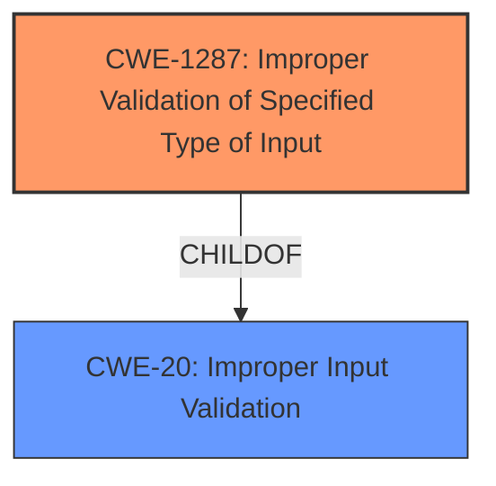

# Enhanced Analysis for CVE-2021-44416

# Summary
| CWE ID | CWE Name | Confidence | CWE Abstraction Level | CWE Vulnerability Mapping Label | CWE-Vulnerability Mapping Notes |
|---|---|---|---|---|---|
| CWE-1287 | Improper Validation of Specified Type of Input | 0.9 | Base | Allowed | Primary CWE |
| CWE-20 | Improper Input Validation | 0.7 | Class | Discouraged | Secondary Candidate |

## Evidence and Confidence

*   **Confidence Score:** 0.8
*   **Evidence Strength:** HIGH

## Relationship Analysis
The primary CWE selected is CWE-1287, which is a base-level CWE and a child of CWE-20. CWE-20 is a class-level CWE that represents improper input validation. The relationship that influenced the decision was the child-parent relationship, where the base-level CWE provides a more specific description of the vulnerability than the class-level CWE.



## Vulnerability Chain
The chain of root cause and weaknesses for the Vulnerability Description is as follows:
1.  The device receives a specially crafted HTTP request (attacker-initiated).
2.  The `cgiserver.cgi` JSON command parser **fails to validate that the "param" field is of the expected JSON object type (CWE-1287)**.
3.  The code attempts to access the "param" field as a JSON object, resulting in an assertion failure and process crash.
4.  The `cgiserver.cgi` process is responsible for heartbeats, so the crash causes the device to reboot, leading to a denial-of-service (DoS) condition.

The root cause is the **improper validation of the input type (CWE-1287)**. The impact is a denial-of-service.

## Summary of Analysis
The initial analysis identified a denial of service vulnerability due to improper input validation in the cgiserver.cgi JSON command parser of Reolink RLC-410W. The vulnerability occurs because the code **does not validate the type of the "param" field** in a JSON command before accessing it, leading to a crash if the field is not a JSON object.

The analysis is based on the provided evidence, specifically from the "CVE Reference Links Content Summary":
"The root cause is **improper input validation** in the `cgiserver.cgi` JSON command parser. Specifically, the code assumes that the "param" field in a JSON command will always be a JSON object. When this field is a string (or other non-object JSON type), the program attempts to access it using the subscription operator, leading to an assertion failure, causing the process to crash."

The graph relationships influenced the final selection by highlighting the relationship between CWE-1287 and CWE-20. CWE-1287 is at the optimal level of specificity because it accurately describes the specific type of input validation that is missing, i.e., validating the type of the input. CWE-20 is too general, as it only indicates that input validation is missing but does not specify what kind of validation.

Relevant CWE Information:

# Enhanced Context (25 CWEs)
The following CWEs were identified as potentially relevant to this vulnerability:

## CWE-1289: Improper Validation of Unsafe Equivalence in Input
**Abstraction Level**: Base
**Similarity Score**: 0.80

CWE-1289 was not selected because the vulnerability does not specifically relate to the equivalence of the input to an unsafe value. The issue is a type validation issue.

## CWE-138: Improper Neutralization of Special Elements
**Abstraction Level**: Class
**Similarity Score**: 0.77

CWE-138 was not selected as it relates to neutralization of special elements, which is not the primary issue in this vulnerability. The core problem is the lack of type validation.

## CWE-184: Incomplete List of Disallowed Inputs
**Abstraction Level**: Base
**Similarity Score**: 0.76

CWE-184 was not selected because the vulnerability isn't about an incomplete list of disallowed inputs. The vulnerability is centered around **the failure to validate the type of the input.**

## CWE-74: Improper Neutralization of Special Elements in Output Used by a Downstream Component ('Injection')
**Abstraction Level**: Class
**Similarity Score**: 0.76

CWE-74 was not selected because the vulnerability doesn't involve injecting special elements into a downstream component. The core problem is the **lack of input type validation.**

## CWE-1288: Improper Validation of Consistency within Input
**Abstraction Level**: Base
**Similarity Score**: 0.76

CWE-1288 was not selected because the issue isn't about the consistency of input elements with each other, but about the **failure to validate the data type.**

## CWE-134: Use of Externally-Controlled Format String
**Abstraction Level**: Base
**Similarity Score**: 0.76

CWE-134 was not selected because the vulnerability doesn't involve externally controlled format strings. The core problem is the **lack of input type validation.**

## CWE-807: Reliance on Untrusted Inputs in a Security Decision
**Abstraction Level**: Base
**Similarity Score**: 0.76

CWE-807 was not selected because the vulnerability doesn't involve making security decisions based on untrusted inputs. The core problem is the **lack of input type validation.**

## CWE-183: Permissive List of Allowed Inputs
**Abstraction Level**: Base
**Similarity Score**: 0.76

CWE-183 was not selected because the vulnerability isn't about a permissive list of allowed inputs. The vulnerability is centered around the **failure to validate the type of the input.**

## CWE-115: Misinterpretation of Input
**Abstraction Level**: Base
**Similarity Score**: 0.75

CWE-115 was not selected because the vulnerability is about improper validation of input type and not necessarily misinterpretation of input.

## CWE-1286: Improper Validation of Syntactic Correctness of Input
**Abstraction Level**: Base
**Similarity Score**: 0.75

CWE-1286 was not selected as the vulnerability involves validating the type of input and not the syntax.

## CWE-1284: Improper Validation of Specified Quantity in Input
**Abstraction Level**: Base
**Similarity Score**: 7983.27

CWE-1284 was not selected as the vulnerability involves validating the type of input and not the quantity.

## CWE-190: Integer Overflow or Wraparound
**Abstraction Level**: Base
**Similarity Score**: 7972.99

CWE-190 was not selected as the vulnerability involves validating the type of input and not integer overflow.

## CWE-125: Out-of-bounds Read
**Abstraction Level**: Base
**Similarity Score**: 7932.06

CWE-125 was not selected as the vulnerability involves validating the type of input and not an out-of-bounds read.

## CWE-116: Improper Encoding or Escaping of Output
**Abstraction Level**: Class
**Similarity Score**: 7834.57

CWE-116 was not selected as the vulnerability involves validating the type of input and not encoding of output.

## CWE-22: Improper Limitation of a Pathname to a Restricted Directory ('Path Traversal')
**Abstraction Level**: Base
**Similarity Score**: 7800.96

CWE-22 was not selected as the vulnerability involves validating the type of input and not limiting pathnames.

## CWE-78: Improper Neutralization of Special Elements used in an OS Command ('OS Command Injection')
**Abstraction Level**: base
**Similarity Score**: 5.03

CWE-78 was not selected as the vulnerability involves validating the type of input and not OS command injection.

## CWE-843: Access of Resource Using Incompatible Type ('Type Confusion')
**Abstraction Level**: base
**Similarity Score**: 5.03

CWE-843 was not selected as the vulnerability involves validating the type of input and not using an incompatible type.

## CWE-22: Improper Limitation of a Pathname to a Restricted Directory ('Path Traversal')
**Abstraction Level**: base
**Similarity Score**: 4.33

CWE-22 was not selected as the vulnerability involves validating the type of input and not limiting pathnames.

## CWE-770: Allocation of Resources Without Limits or Throttling
**Abstraction Level**: base
**Similarity Score**: 4.33

CWE-770 was not selected as the vulnerability involves validating the type of input and not resource allocation.

## CWE-73


## CWE Relationship Analysis

Current CWEs represent these abstraction levels: .


### Vulnerability Chain Analysis

**Chain starting from CWE-807:**
- 807 (Reliance on Untrusted Inputs in a Security Decision) - ROOT


**Chain starting from CWE-1288:**
- 1288 (Improper Validation of Consistency within Input) - ROOT


### CWE Relationship Diagram

```mermaid
graph TD
    classDef primary fill:#f96,stroke:#333,stroke-width:2px
    classDef secondary fill:#69f,stroke:#333
    classDef tertiary fill:#9e9,stroke:#333
```