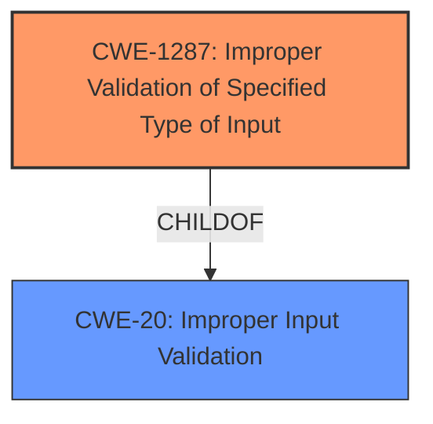

# Analysis Report for CVE-2021-44417

# Vulnerability Analysis Report: CVE-2021-44417

## Description


## Analysis (with Relationship Data)

# Summary
| CWE ID | CWE Name | Confidence | CWE Abstraction Level | CWE Vulnerability Mapping Label | CWE-Vulnerability Mapping Notes |
|---|---|---|---|---|---|
| CWE-1287 | Improper Validation of Specified Type of Input | 0.9 | Base | Allowed | Primary CWE |
| CWE-20 | Improper Input Validation | 0.6 | Class | Discouraged | Secondary Candidate |

## Evidence and Confidence

*   **Confidence Score:** 0.8
*   **Evidence Strength:** HIGH

## Relationship Analysis
The primary CWE, CWE-1287, is a child of CWE-20, indicating a more specific type of input validation issue. While CWE-20 is a broader category, CWE-1287 specifically addresses the improper validation of the *type* of input. This aligns well with the vulnerability where the system expects a JSON object but receives a string. The Retriever Results also highlight this parent-child relationship, guiding the selection of the more specific CWE where appropriate.



## Vulnerability Chain
The vulnerability chain starts with the **command parser being too permissive**, leading to **improper input validation** (specifically, of the input type), and culminating in a **denial of service** due to a crash.

## Summary of Analysis
The initial assessment considered CWE-20 as a potential candidate, as it's a common and broad classification for input validation issues. However, the Retriever Results and the detailed vulnerability description pointed towards CWE-1287, which is a more specific Base-level CWE focused on the **improper validation of the *type* of input**. The evidence from the "CVE Reference Links Content Summary" explicitly states that the `cgiserver.cgi` does not validate the type of the `param` JSON element, leading to a crash when a string is provided instead of a JSON object.

The choice of CWE-1287 is further supported by its "Allowed" usage designation and the rationale that it's at the Base level of abstraction, which is preferred. While CWE-20 is a parent Class, its "Discouraged" usage and suggestion of lower-level children further reinforce the selection of CWE-1287.

The analysis is based on the explicit evidence provided in the vulnerability description and the CVE Reference Links Content Summary. The graph relationships confirm that CWE-1287 is a more specific child of the broader CWE-20, making it the optimal choice for accurately representing the vulnerability.

The selected CWEs are at the optimal level of specificity because they directly address the root cause of the vulnerability, which is the **failure to validate the type of the input**. This is more precise than simply stating that there is "improper input validation" (CWE-20).

Relevant CWE Information:

# Enhanced Context (25 CWEs)
The following CWEs were identified as potentially relevant to this vulnerability:

## CWE-1289: Improper Validation of Unsafe Equivalence in Input
**Abstraction Level**: Base
**Similarity Score**: 0.80

## CWE-138: Improper Neutralization of Special Elements
**Abstraction Level**: Class
**Similarity Score**: 0.77

## CWE-134: Use of Externally-Controlled Format String
**Abstraction Level**: Base
**Similarity Score**: 0.77

## CWE-184: Incomplete List of Disallowed Inputs
**Abstraction Level**: Base
**Similarity Score**: 0.77

## CWE-74: Improper Neutralization of Special Elements ('Injection')
**Abstraction Level**: Class
**Similarity Score**: 0.76

## CWE-1288: Improper Validation of Consistency within Input
**Abstraction Level**: Base
**Similarity Score**: 0.76

## CWE-183: Permissive List of Allowed Inputs
**Abstraction Level**: Base
**Similarity Score**: 0.76

## CWE-807: Reliance on Untrusted Inputs in a Security Decision
**Abstraction Level**: Base
**Similarity Score**: 0.76

## CWE-1286: Improper Validation of Syntactic Correctness of Input
**Abstraction Level**: Base
**Similarity Score**: 0.76

## CWE-115: Misinterpretation of Input
**Abstraction Level**: Base
**Similarity Score**: 0.76

## CWE-1284: Improper Validation of Specified Quantity in Input
**Abstraction Level**: Base
**Similarity Score**: 7915.09

## CWE-190: Integer Overflow or Wraparound
**Abstraction Level**: Base
**Similarity Score**: 7915.07

## CWE-125: Out-of-bounds Read
**Abstraction Level**: Base
**Similarity Score**: 7866.99

## CWE-116: Improper Encoding or Escaping of Output
**Abstraction Level**: Class
**Similarity Score**: 7764.62

## CWE-88: Improper Neutralization of Argument Delimiters
**Abstraction Level**: Base
**Similarity Score**: 7742.75

## CWE-78: Improper Neutralization of Special Elements
**Abstraction Level**: base
**Similarity Score**: 5.03

## CWE-843: Access of Resource Using Incompatible Type ('Type Confusion')
**Abstraction Level**: base
**Similarity Score**: 5.03

## CWE-22: Improper Limitation of a Pathname to a Restricted Directory
**Abstraction Level**: base
**Similarity Score**: 4.33

## CWE-770: Allocation of Resources Without Limits or Throttling
**Abstraction Level**: base
**Similarity Score**: 4.33

## CWE-190: Integer Overflow or Wraparound
**Abstraction Level**: base
**Similarity Score**: 4.33

## CWE-120: Buffer Copy without Checking Size of Input ('Classic Buffer Overflow')
**Abstraction Level**: base
**Similarity Score**: 4.33

## CWE-123: Write-what-where Condition
**Abstraction Level**: base
**Similarity Score**: 4.33

## CWE-131: Incorrect Calculation of Buffer Size
**Abstraction Level**: base
**Similarity Score**: 4.33

## CWE-1284: Improper Validation of Specified Quantity in Input
**Abstraction Level**: base
**Similarity Score**: 3.89

## CWE-89: Improper Neutralization of Special Elements used in an SQL Command ('SQL Injection')
**Abstraction Level**: base
**Similarity Score**: 3.89

**CWE-1287: Improper Validation of Specified Type of Input**

*   **Technical Explanation:** The `cgiserver.cgi` JSON command parser expects a JSON object for the `param` field in the `GetAlarm` API request but fails to validate the input type. When a string is provided instead, it triggers an assertion failure, leading to a crash and reboot. This directly aligns with the CWE's description of a product receiving input expected to be of a certain type but not validating that it actually is.
*   **Security Implications:** This allows an attacker to cause a denial of service by sending a specially crafted HTTP request, disrupting the normal operation of the device.
*   **Relationship:** CWE-1287 is a child of CWE-20, which represents a broader category of input validation issues.
*   **Primary/Secondary:** This is the primary weakness.
*   **MITRE Mapping Guidance:** The usage is "Allowed," and it's at the preferred Base level of abstraction.

**CWE-20: Improper Input Validation**

*   **Technical Explanation:** While CWE-1287 is the more specific weakness, CWE-20 is still relevant as it broadly describes the **lack of input validation**. The system does not validate that the input conforms to the expected structure and type.
*   **Security Implications:** This can lead to various vulnerabilities, including denial of service, as demonstrated in this specific case.
*   **Relationship:** CWE-20 is the parent of CWE-1287.
*   **Primary/Secondary:** This is a secondary weakness.
*   **MITRE Mapping Guidance:** The usage is "Discouraged" due to its broad nature and the availability of more specific CWEs.

**CWEs Considered But Not Used:**

*   **CWE-1289: Improper Validation of Unsafe Equivalence in Input:** This CWE focuses on validating that an input is equivalent to a potentially unsafe value. While input validation is involved, the core issue here is the type validation, not equivalence, so it is not a good fit.
*   **CWE-134: Use of Externally-Controlled Format String:** This CWE is related to format string vulnerabilities, which are not present in this case. The vulnerability is due to the **lack of type validation**


## CWE Relationship Analysis

Current CWEs represent these abstraction levels: .


### Vulnerability Chain Analysis

**Chain starting from CWE-89:**
- 89 (Improper Neutralization of Special Elements used in an SQL Command ('SQL Injection')) - ROOT


**Chain starting from CWE-807:**
- 807 (Reliance on Untrusted Inputs in a Security Decision) - ROOT


### CWE Relationship Diagram

```mermaid
graph TD
    classDef primary fill:#f96,stroke:#333,stroke-width:2px
    classDef secondary fill:#69f,stroke:#333
    classDef tertiary fill:#9e9,stroke:#333
```


*Report generated on 2025-03-31 02:08:51*
