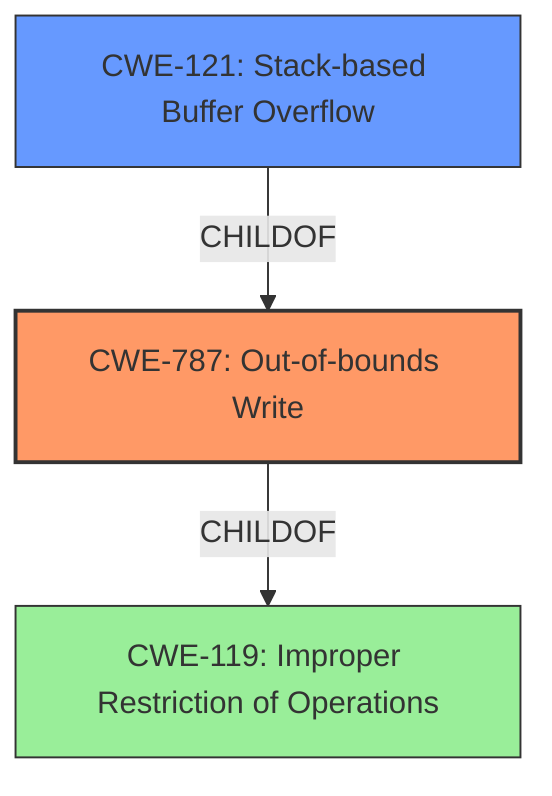

# Analysis for CVE-2021-44435

# Summary
| CWE ID | CWE Name | Confidence | CWE Abstraction Level | CWE Vulnerability Mapping Label | CWE-Vulnerability Mapping Notes |
|---|---|---|---|---|---|
| CWE-787 | Out-of-bounds Write | 1.0 | Base | Allowed | Primary CWE |
| CWE-121 | Stack-based Buffer Overflow | 0.9 | Variant | Allowed | Secondary Candidate |
| CWE-119 | Improper Restriction of Operations within the Bounds of a Memory Buffer | 0.6 | Class | Discouraged | Secondary Candidate |

## Evidence and Confidence

*   **Confidence Score:** 0.95
*   **Evidence Strength:** HIGH

## Relationship Analysis
The primary weakness is a **stack-based buffer overflow**, which is a type of **out-of-bounds write**. CWE-787 (Out-of-bounds Write) is a parent of CWE-121 (Stack-based Buffer Overflow), and CWE-119 (Improper Restriction of Operations within the Bounds of a Memory Buffer) is a more general class. The selection was driven by the desire to be as specific as possible while accurately reflecting the vulnerability.

## Vulnerability Chain
The chain of events is as follows:
1.  A specially crafted JT file is parsed.
2.  Due to a **stack-based buffer overflow**, data is written beyond the allocated buffer.
3.  This leads to potential code execution in the context of the current process.
The root cause is the **stack-based buffer overflow**, and the impact is code execution.

## Summary of Analysis
The initial assessment pointed towards CWE-787 (Out-of-bounds Write) or CWE-121 (Stack-based Buffer Overflow) due to the vulnerability description explicitly mentioning a **stack-based buffer overflow**. The primary match from similar CVE descriptions was CWE-787.

The final decision was to select CWE-787 as the primary CWE because it directly describes the **out-of-bounds write** condition, which is the root cause. CWE-121 is included as a secondary candidate, providing more specific context about the location of the buffer.

The evidence supporting this decision is the vulnerability description stating "JTTK library in affected products is vulnerable to **stack based buffer overflow** while parsing specially crafted JT files". Also, the CVE Reference Links Content Summary states "**Root cause of vulnerability**: Stack-based buffer overflow while parsing specially crafted JT files."

CWE-119 (Improper Restriction of Operations within the Bounds of a Memory Buffer) was considered but ultimately deemed too general. While it is a parent of both CWE-787 and CWE-121, the vulnerability description provides sufficient detail to choose a more specific CWE.

The selected CWEs are at the optimal level of specificity, accurately reflecting the nature of the vulnerability based on the available evidence.

Relevant CWE Information:

# Enhanced Context (25 CWEs)

## CWE-1289: Improper Validation of Unsafe Equivalence in Input
**Abstraction Level**: Base
**Similarity Score**: 0.75

**Description**:
The product receives an input value that is used as a resource identifier or other type of reference, but it does not validate or incorrectly validates that the input is equivalent to a potentially-unsafe value.
*This CWE was not selected because the provided information does not suggest that there was improper validation of unsafe equivalence.*

## CWE-1288: Improper Validation of Consistency within Input
**Abstraction Level**: Base
**Similarity Score**: 0.74

**Description**:
The product receives a complex input with multiple elements or fields that must be consistent with each other, but it does not validate or incorrectly validates that the input is actually consistent.
*This CWE was not selected because the provided information does not suggest that there was improper validation of consistency with the input.*

## CWE-606: Unchecked Input for Loop Condition
**Abstraction Level**: Base
**Similarity Score**: 0.73

**Description**:
The product does not properly check inputs that are used for loop conditions, potentially leading to a denial of service or other consequences because of excessive looping.
*This CWE was not selected because the provided information does not suggest the root cause was due to unchecked input for loop conditions.*

## CWE-131: Incorrect Calculation of Buffer Size
**Abstraction Level**: Base
**Similarity Score**: 0.73

**Description**:
The product does not correctly calculate the size to be used when allocating a buffer, which could lead to a buffer overflow.
*This CWE was not selected because the provided information suggests the root cause was a stack based buffer overflow.*

## CWE-191: Integer Underflow (Wrap or Wraparound)
**Abstraction Level**: Base
**Similarity Score**: 0.73

**Description**:
The product subtracts one value from another, such that the result is less than the minimum allowable integer value, which produces a value that is not equal to the correct result.
*This CWE was not selected because the provided information does not suggest the root cause was due to integer underflow.*

## CWE-805: Buffer Access with Incorrect Length Value
**Abstraction Level**: Base
**Similarity Score**: 0.72

**Description**:
The product uses a sequential operation to read or write a buffer, but it uses an incorrect length value that causes it to access memory that is outside of the bounds of the buffer.
*This CWE was not selected because the provided information suggests the root cause was a stack based buffer overflow.*

## CWE-681: Incorrect Conversion between Numeric Types
**Abstraction Level**: Base
**Similarity Score**: 0.72

**Description**:
When converting from one data type to another, such as long to integer, data can be omitted or translated in a way that produces unexpected values. If the resulting values are used in a sensitive context, then dangerous behaviors may occur.
*This CWE was not selected because the provided information does not suggest the root cause was due to an incorrect conversion between numeric types.*

## CWE-125: Out-of-bounds Read
**Abstraction Level**: Base
**Similarity Score**: 0.72

**Description**:
The product reads data past the end, or before the beginning, of the intended buffer.
*This CWE was not selected because the provided information suggests the root cause was a stack based buffer overflow which is a write and not a read.*

## CWE-124: Buffer Underwrite ('Buffer Underflow')
**Abstraction Level**: Base
**Similarity Score**: 0.72

**Description**:
The product writes to a buffer using an index or pointer that references a memory location prior to the beginning of the buffer.
*This CWE was not selected because the provided information suggests the root cause was a stack based buffer overflow which is an overwrite and not an underwrite.*

## CWE-197: Numeric Truncation Error
**Abstraction Level**: Base
**Similarity Score**: 0.72

**Description**:
Truncation errors occur when a primitive is cast to a primitive of a smaller size and data is lost in the conversion.
*This CWE was not selected because the provided information does not suggest the root cause was due to numeric truncation error.*

## CWE-190: Integer Overflow or Wraparound
**Abstraction Level**: Base
**Similarity Score**: 7652.00

**Description**:
The product performs a calculation that can produce an integer overflow or wraparound when the logic assumes that the resulting value will always be larger than the original value. This occurs when an integer value is incremented to a value that is too large to store in the associated representation. When this occurs, the value may become a very small or negative number.
*This CWE was not selected because the provided information does not suggest the root cause was due to an integer overflow.*

## CWE-1284: Improper Validation of Specified Quantity in Input
**Abstraction Level**: Base
**Similarity Score**: 7195.69

**Description**:
The product receives input that is expected to specify a quantity (such as size or length), but it does not validate or incorrectly validates that the quantity has the required properties.
*This CWE was not selected because the provided information suggests the root cause was a stack based buffer overflow.*

## CWE-125: Out-of-bounds Read
**Abstraction Level**: Base
**Similarity Score**: 7195.03

**Description**:
The product reads data past the end, or before the beginning, of the intended buffer.
*This CWE was not selected because the provided information suggests the root cause was a stack based buffer overflow which is