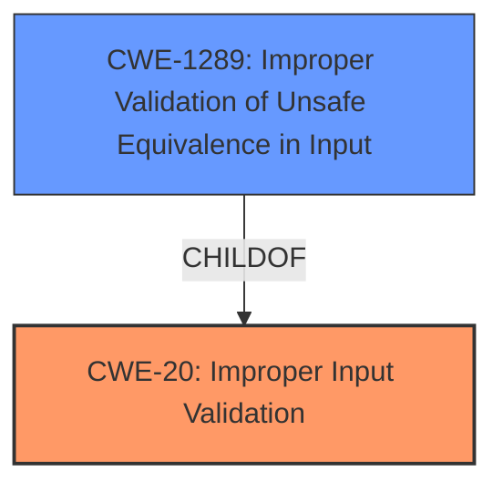

# Analysis for CVE-2021-44454

# Summary
| CWE ID | CWE Name | Confidence | CWE Abstraction Level | CWE Vulnerability Mapping Label | CWE-Vulnerability Mapping Notes |
|---|---|---|---|---|---|
| CWE-20 | Improper Input Validation | 1.0 | Class | Primary | Discouraged, but most accurate based on the provided information. |
| CWE-1289 | Improper Validation of Unsafe Equivalence in Input | 0.7 | Base | Secondary | Allowed |

## Evidence and Confidence

*   **Confidence Score:** 0.9
*   **Evidence Strength:** HIGH

## Relationship Analysis
The primary relationship influencing the decision is that CWE-20 is a Class-level CWE, and while discouraged, it directly addresses the **improper input validation** issue. CWE-1289 is a base-level weakness related to unsafe equivalence in input, which can occur as a result of **improper input validation**. There is a child-of relationship between CWE-1289 and CWE-20.

## Vulnerability Chain
The vulnerability chain starts with **improper input validation** (CWE-20), which leads to a potential escalation of privilege.

## Summary of Analysis
Initial assessment identified **improper input validation** as the root cause, aligning with CWE-20. The Retriever Results also suggest CWE-20, although it's discouraged due to its high-level nature. However, the provided information does not give any indication on whether an Unsafe Equivalence check was done, thus selecting CWE-20 as the best match to the **root cause** and leading to the potential impact.

The evidence explicitly states: "Root cause of vulnerability: **Improper input validation** in a third-party component of Intel® Quartus® Prime Pro Edition."

The selection of CWE-20 is based on the vulnerability description and the CVE Reference Links Content Summary, both highlighting **improper input validation** as the root cause. While CWE-20 is a Class-level CWE and discouraged, it is the most accurate representation of the **root cause** given the available information. CWE-1289 is a base-level weakness related to unsafe equivalence in input, which can occur as a result of **improper input validation**, so it is a secondary match.

Relevant CWE Information:

# Enhanced Context (25 CWEs)
The following CWEs were identified as potentially relevant to this vulnerability:

## CWE-1289: Improper Validation of Unsafe Equivalence in Input
**Abstraction Level**: Base
**Similarity Score**: 0.76
**Source**: dense

**Description**:
The product receives an input value that is used as a resource identifier or other type of reference, but it does not validate or incorrectly validates that the input is equivalent to a potentially-unsafe value.

**Mapping Guidance**:
- Usage: Allowed
- Rationale: This CWE entry is at the Base level of abstraction, which is a preferred level of abstraction for mapping to the root causes of vulnerabilities.

## CWE-20: Improper Input Validation
**Abstraction Level**: class
**Similarity Score**: 2.98
**Source**: graph

**Description**:
CWE-20: Improper Input Validation

**Mapping Guidance**:
- Usage: Discouraged
- Rationale: CWE-20 is commonly misused in low-information vulnerability reports when lower-level CWEs could be used instead, or when more details about the vulnerability are available [REF-1287]. It is not useful for trend analysis. It is also a level-1 Class (i.e., a child of a Pillar).

**Relationships**:
- CHILDOF -> CWE-707
- PEEROF -> CWE-345
- CANPRECEDE -> CWE-22
- CANPRECEDE -> CWE-41
- CANPRECEDE -> CWE-74

## Justification for CWE-20: Improper Input Validation
The vulnerability description explicitly mentions **improper input validation**. This aligns directly with the description of CWE-20, which states that the product "does not validate or incorrectly validates that the input has the properties that are required to process the data safely and correctly." The security implication is a potential escalation of privilege, as an attacker could craft input that bypasses intended security controls. While CWE-20 is discouraged, it's the most accurate representation of the **root cause** given the available details.

## Justification for CWE-1289: Improper Validation of Unsafe Equivalence in Input
This CWE is considered as a secondary candidate because the vulnerability description mentions **improper input validation** which could include improper validation of unsafe equivalence in input. The CWE description states that "The product receives an input value that is used as a resource identifier or other type of reference, but it does not validate or incorrectly validates that the input is equivalent to a potentially-unsafe value."

## CWEs Considered but Not Used

*   **CWE-691: Insufficient Control Flow Management, CWE-284: Improper Access Control, CWE-287: Improper Authentication, CWE-693: Protection Mechanism Failure:** These CWEs are too high-level (Pillar or Class) and do not directly address the **root cause** of **improper input validation**. They are also discouraged by MITRE.
*   **CWE-1256: Improper Restriction of Software Interfaces to Hardware Features:** This CWE is specific to hardware-related vulnerabilities, which is not the case here.
*   **CWE-22: Improper Limitation of a Pathname to a Restricted Directory ('Path Traversal'):** This CWE is specific to path traversal vulnerabilities, which is not mentioned in the vulnerability description.
*   **CWE-1285: Improper Validation of Specified Index, Position, or Offset in Input:** While input validation is involved, the description doesn't specify that the **improper validation** is related to indices, positions or offsets.
*   **CWE-522: Insufficiently Protected Credentials:** This CWE is related to credential protection, which is not mentioned in the vulnerability description.