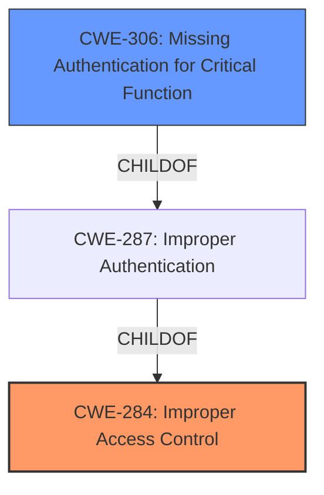

# Raw Analyzer Response for CVE-2021-44467

# Summary
| CWE ID | CWE Name | Confidence | CWE Abstraction Level | CWE Vulnerability Mapping Label | CWE-Vulnerability Mapping Notes |
|---|---|---|---|---|---|
| CWE-284 | Improper Access Control | 0.9 | Pillar | Primary | Discouraged |
| CWE-306 | Missing Authentication for Critical Function | 0.7 | Base | Secondary | Allowed |

## Evidence and Confidence

*   **Confidence Score:** 0.8
*   **Evidence Strength:** HIGH

## Relationship Analysis
The primary CWE, CWE-284 (Improper Access Control), is a high-level Pillar. While the vulnerability clearly involves access control issues, a more specific classification is possible. The description points to a lack of authentication as the root cause. CWE-306 (Missing Authentication for Critical Function) is a child of CWE-287 (Improper Authentication), which itself is a child of CWE-284. Therefore, a chain of relationships exists, with CWE-306 providing a more granular representation of the vulnerability's root cause.

## Vulnerability Chain
The vulnerability chain begins with the **missing authentication** (**CWE-306**) for the `KillDupUsr_func` function. This **root cause** allows an unauthenticated attacker to arbitrarily terminate active sessions of other users, leading to a Denial-of-Service (DoS) condition. The chain is relatively simple:

1.  **Missing Authentication (CWE-306):** The `KillDupUsr_func` function lacks authentication.
2.  **Broken Access Control (CWE-284):** As a consequence of the missing authentication, access control is broken.
3.  **Denial of Service (DoS):** The attacker can terminate user sessions, causing a DoS.

## Summary of Analysis
The initial assessment considered CWE-284 (Improper Access Control) due to the **broken access control** vulnerability. However, based on the vulnerability description and the provided CVE Reference Links Content Summary, the **root cause** is the **lack of authentication** for the `KillDupUsr_func` function. The CVE summary explicitly states that the function "does not perform proper session verification" and allows "unauthenticated users to call the function." This points directly to a missing authentication issue.

While CWE-284 is a valid high-level classification, CWE-306 (Missing Authentication for Critical Function) provides a more specific and accurate representation of the **root cause**. The MITRE mapping guidance discourages the use of CWE-284 because it is a high-level Pillar and suggests considering more specific descendants.

Therefore, CWE-284 is flagged as the primary CWE and CWE-306 as a secondary CWE to describe the vulnerability. The higher confidence is assigned to CWE-284 because the description explicitly mentions "broken access control." However, the root cause is more accurately represented by the missing authentication.

Relevant CWE Information:
# Enhanced Context (25 CWEs)
The following CWEs were identified as potentially relevant to this vulnerability:

## CWE-807: Reliance on Untrusted Inputs in a Security Decision
**Abstraction Level**: Base
**Similarity Score**: 0.76

## CWE-799: Improper Control of Interaction Frequency
**Abstraction Level**: Class
**Similarity Score**: 0.76

## CWE-303: Incorrect Implementation of Authentication Algorithm
**Abstraction Level**: Base
**Similarity Score**: 0.76

## CWE-668: Exposure of Resource to Wrong Sphere
**Abstraction Level**: Class
**Similarity Score**: 0.76

## CWE-1390: Weak Authentication
**Abstraction Level**: Class
**Similarity Score**: 0.76

## CWE-664: Improper Control of a Resource Through its Lifetime
**Abstraction Level**: Pillar
**Similarity Score**: 0.76

## CWE-345: Insufficient Verification of Data Authenticity
**Abstraction Level**: Class
**Similarity Score**: 0.76

## CWE-639: Authorization Bypass Through User-Controlled Key
**Abstraction Level**: Base
**Similarity Score**: 0.75

## CWE-404: Improper Resource Shutdown or Release
**Abstraction Level**: Class
**Similarity Score**: 0.75

## CWE-1220: Insufficient Granularity of Access Control
**Abstraction Level**: Base
**Similarity Score**: 0.75

## CWE-639: Authorization Bypass Through User-Controlled Key
**Abstraction Level**: Base
**Similarity Score**: 7125.59

## CWE-1390: Weak Authentication
**Abstraction Level**: Class
**Similarity Score**: 6798.35

## CWE-863: Incorrect Authorization
**Abstraction Level**: Class
**Similarity Score**: 6785.78

## CWE-287: Improper Authentication
**Abstraction Level**: Class
**Similarity Score**: 6682.30

## CWE-285: Improper Authorization
**Abstraction Level**: Class
**Similarity Score**: 6655.80

## CWE-208: Observable Timing Discrepancy
**Abstraction Level**: base
**Similarity Score**: 4.33

## CWE-385: Covert Timing Channel
**Abstraction Level**: base
**Similarity Score**: 4.33

## CWE-410: Insufficient Resource Pool
**Abstraction Level**: base
**Similarity Score**: 4.33

## CWE-1284: Improper Validation of Specified Quantity in Input
**Abstraction Level**: base
**Similarity Score**: 4.33

## CWE-22: Improper Limitation of a Pathname to a Restricted Directory ('Path Traversal')
**Abstraction Level**: base
**Similarity Score**: 3.89

## CWE-789: Memory Allocation with Excessive Size Value
**Abstraction Level**: variant
**Similarity Score**: 3.88

## CWE-190: Integer Overflow or Wraparound
**Abstraction Level**: base
**Similarity Score**: 3.42

## CWE-770: Allocation of Resources Without Limits or Throttling
**Abstraction Level**: base
**Similarity Score**: 3.30

## CWE-73: External Control of File Name or Path
**Abstraction Level**: base
**Similarity Score**: 3.23

## CWE-787: Out-of-bounds Write
**Abstraction Level**: base
**Similarity Score**: 3.14