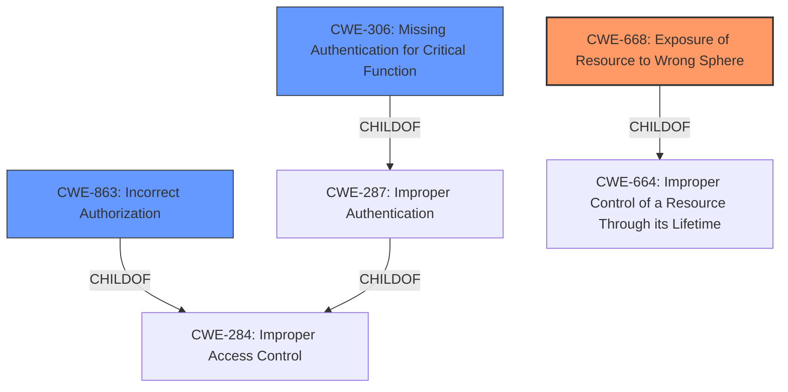

# Analysis Report for CVE-2021-44523

# Vulnerability Analysis Report: CVE-2021-44523

## Description


## Analysis (with Relationship Data)

# Summary
| CWE ID | CWE Name | Confidence | CWE Abstraction Level | CWE Vulnerability Mapping Label | CWE-Vulnerability Mapping Notes |
|---|---|---|---|---|---|
| CWE-668 | Exposure of Resource to Wrong Sphere | 1.0 | Class | Primary | Allowed |
| CWE-863 | Incorrect Authorization | 0.7 | Class | Secondary | Allowed-with-Review |
| CWE-306 | Missing Authentication for Critical Function | 0.6 | Base | Secondary | Allowed |

## Evidence and Confidence

*   **Confidence Score:** 0.8
*   **Evidence Strength:** HIGH

## Relationship Analysis
The primary CWE selected is CWE-668, indicating a resource exposed to the wrong control sphere, aligning with the description of **insufficiently limiting access** to the database. Although the description suggests a potential **missing authorization** (CWE-862) or **incorrect authorization** (CWE-863), the lack of specific details about an authorization mechanism points towards a broader exposure issue, hence choosing CWE-668. The secondary CWEs, CWE-863 and CWE-306, were considered, with the final decision hinging on the root cause's emphasis on limited access rather than explicit authorization failure or missing authentication, though their relevance as contributing factors is acknowledged.



## Vulnerability Chain
The vulnerability chain starts with **insufficient access control** to the activity feed database. This **insufficient access control** leads to an unauthenticated remote attacker being able to read, modify, or delete activity feed entries. This results in a **loss of confidentiality** and **loss of integrity**.

## Summary of Analysis
The initial assessment focused on identifying the root cause of the vulnerability based on the provided description. The description clearly states the root cause as "**insufficiently limit the access to the internal activity feed database**". This indicates a problem with access control. The provided "CVE Reference Links Content Summary" also supports this by stating "**Insufficient Access Control:** The core weakness is that the applications do not properly restrict access to the internal activity feed database. This allows unauthorized access."

The retriever results listed CWE-668 (Exposure of Resource to Wrong Sphere) as the top match, which aligns well with the root cause. CWE-668's description states: "The product exposes a resource to the wrong control sphere, providing unintended actors with inappropriate access to the resource." This directly reflects the vulnerability where the internal activity feed database is accessible to an unauthenticated remote attacker.

CWE-863 (Incorrect Authorization) and CWE-306 (Missing Authentication for Critical Function) were also considered. While the vulnerability allows unauthenticated access, the primary issue isn't necessarily a complete lack of authentication for the specific function of accessing the activity feed, but rather that the access controls in place are insufficient. Similarly, incorrect authorization could be a factor, but the description focuses more on the broader issue of the database being exposed to the wrong sphere of control.

Therefore, CWE-668 is the most appropriate primary CWE because it directly addresses the root cause of the vulnerability, which is the exposure of a resource (the activity feed database) to an unintended actor (unauthenticated remote attacker).

The final decision prioritizes CWE-668 due to its alignment with the root cause description, emphasizing the **insufficient limitation of access**. While CWE-863 and CWE-306 represent possible contributing factors, the primary weakness lies in the broader exposure of the resource, justifying CWE-668 as the most specific and accurate classification.


## CWE Relationship Analysis

Current CWEs represent these abstraction levels: .


### Vulnerability Chain Analysis

**Chain starting from CWE-862:**
- 862 (Missing Authorization) - ROOT


**Chain starting from CWE-668:**
- 668 (Exposure of Resource to Wrong Sphere) - ROOT


### CWE Relationship Diagram

```mermaid
graph TD
    classDef primary fill:#f96,stroke:#333,stroke-width:2px
    classDef secondary fill:#69f,stroke:#333
    classDef tertiary fill:#9e9,stroke:#333
```


*Report generated on 2025-03-30 12:23:21*
