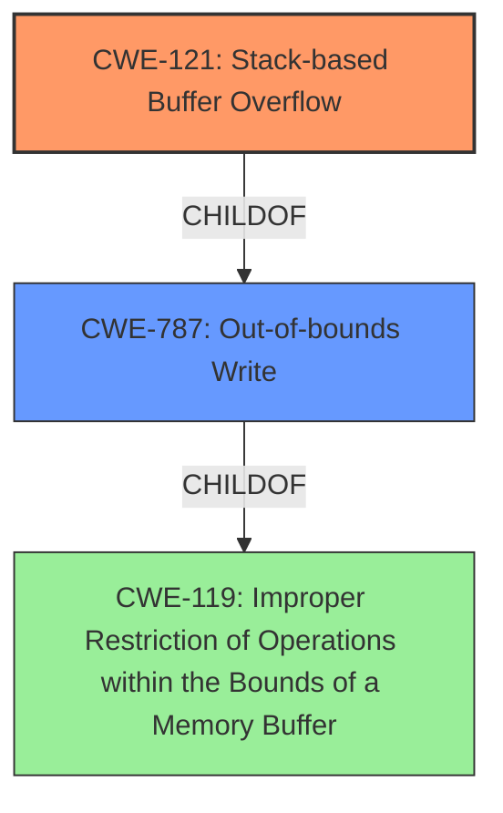

# Analysis for CVE-2021-44703

# Summary
| CWE ID    | CWE Name                                                                | Confidence | CWE Abstraction Level | CWE Vulnerability Mapping Label | CWE-Vulnerability Mapping Notes |
| :--------- | :----------------------------------------------------------------------- | :--------- | :-------------------- | :------------------------------ | :------------------------------ |
| CWE-121  | Stack-based Buffer Overflow | 1          | Variant               | Primary CWE Match               | Allowed                       |
| CWE-787 | Out-of-bounds Write                                                        | 0.8          | Base                  | Secondary Candidate             | Allowed                       |

## Evidence and Confidence

*   **Confidence Score:** 0.9
*   **Evidence Strength:** HIGH

## Relationship Analysis
The primary CWE is CWE-121 Stack-based Buffer Overflow, a Variant of CWE-787 Out-of-bounds Write, which in turn is a ChildOf CWE-119 Improper Restriction of Operations within the Bounds of a Memory Buffer. The relationships guide the selection of the most specific CWE (CWE-121) while acknowledging the broader class of buffer overflows (CWE-119).

## Vulnerability Chain
The vulnerability chain starts with **insecure handling of a crafted file**, leading to a **stack buffer overflow**, and ultimately resulting in arbitrary code execution.

## Summary of Analysis
The initial analysis strongly points to a stack-based buffer overflow, given the explicit mention of it in the vulnerability description. The supporting evidence from the CVE reference links confirms this. The relationship analysis highlights the hierarchical structure of CWEs related to buffer overflows, allowing for a precise mapping. The final selection of CWE-121 is based on the clear evidence and the goal of specificity in CWE mapping.

The vulnerability description states: "Acrobat Reader DC version 21.007.20099 (and earlier), 20.004.30017 (and earlier) and 17.011.30204 (and earlier) are affected by a **stack buffer overflow** vulnerability due to **insecure handling of a crafted file**, potentially resulting in arbitrary code execution in the context of the current user."

The **rootcause** is the **insecure handling of a crafted file**, and the resulting **weakness** is a **stack buffer overflow**.

The CVE Reference Links Content Summary states:
"**Root cause of vulnerability:** Stack-based buffer overflow."
"**Weaknesses/vulnerabilities present:** Stack-based buffer overflow (CWE-121)"

Based on this information the best CWE is CWE-121.

Relevant CWE Information:

# Enhanced Context (25 CWEs)

## CWE-121: Stack-based Buffer Overflow
**Abstraction:** Variant
**Status:** Draft

### Description
A stack-based buffer overflow condition is a condition where the buffer being overwritten is allocated on the stack (i.e., is a local variable or, rarely, a parameter to a function).

### Extended Description
Not provided

### Alternative Terms
Stack Overflow: "Stack Overflow" is often used to mean the same thing as stack-based buffer overflow, however it is also used on occasion to mean stack exhaustion, usually a result from an excessively recursive function call. Due to the ambiguity of the term, use of stack overflow to describe either circumstance is discouraged.

### Relationships
ChildOf -> CWE-788
ChildOf -> CWE-787

### Mapping Guidance
**Usage:** Allowed
**Rationale:** This CWE entry is at the Variant level of abstraction, which is a preferred level of abstraction for mapping to the root causes of vulnerabilities.
**Comments:** Carefully read both the name and description to ensure that this mapping is an appropriate fit. Do not try to 'force' a mapping to a lower-level Base/Variant simply to comply with this preferred level of abstraction.
**Reasons:**
- Acceptable-Use

### Additional Notes
**[Other]** Stack-based buffer overflows can instantiate in return address overwrites, stack pointer overwrites or frame pointer overwrites. They can also be considered function pointer overwrites, array indexer overwrites or write-what-where condition, etc.

### Observed Examples
- **CVE-2021-35395:** Stack-based buffer overflows in SFK for wifi chipset used for IoT/embedded devices, as exploited in the wild per CISA KEV.

## CWE-787: Out-of-bounds Write
**Abstraction:** Base
**Status:** Draft

### Description
The product writes data past the end, or before the beginning, of the intended buffer.

### Extended Description
Not provided

### Alternative Terms
Memory Corruption: Often used to describe the consequences of writing to memory outside the bounds of a buffer, or to memory that is otherwise invalid.

### Relationships
ChildOf -> CWE-119
ChildOf -> CWE-119
ChildOf -> CWE-119
ChildOf -> CWE-119

### Mapping Guidance
**Usage:** Allowed
**Rationale:** This CWE entry is at the Base level of abstraction, which is a preferred level of abstraction for mapping to the root causes of vulnerabilities.
**Comments:** Carefully read both the name and description to ensure that this mapping is an appropriate fit. Do not try to 'force' a mapping to a lower-level Base/Variant simply to comply with this preferred level of abstraction.
**Reasons:**
- Acceptable-Use

### Observed Examples
- **CVE-2023-1017:** The reference implementation code for a Trusted Platform Module does not implement length checks on data, allowing for an attacker to write 2 bytes past the end of a buffer.
- **CVE-2021-21220:** Chain: insufficient input validation (CWE-20) in browser allows heap corruption (CWE-787), as exploited in the wild per CISA KEV.
- **CVE-2021-28664:** GPU kernel driver allows memory corruption because a user can obtain read/write access to read-only pages, as exploited in the wild per CISA KEV.

### Other Considered CWEs:

*   **CWE-119 Improper Restriction of Operations within the Bounds of a Memory Buffer:** While this is a relevant parent class, the description clearly indicates a stack-based buffer overflow, making CWE-121 more specific and appropriate. The mapping guidance for CWE-119 discourages its use when lower-level CWEs are available.
*   **CWE-190 Integer Overflow or Wraparound:** This CWE was considered because integer overflows can sometimes lead to buffer overflows, but there is no mention of integer manipulation in the description.
*   **CWE-788 Access of Memory Location After End of Buffer:** This CWE is less specific than CWE-121, as it does not specify the memory allocation location (stack vs heap).
*   **CWE-356 Product UI does not Warn User of Unsafe Actions:** While user interaction is required to trigger the vulnerability, the root cause is not related to the UI failing to warn the user.
*   **CWE-122 Heap-based Buffer Overflow:** This CWE is incorrect because the vulnerability description specifies a stack-based buffer overflow.
*   **CWE-200 Exposure of Sensitive Information to an Unauthorized Actor:** This CWE is not relevant because the vulnerability does not involve the exposure of sensitive information.
*   **CWE-20 Improper Input Validation:** Although the vulnerability stems from **insecure handling of a crafted file**, this is too broad, and a more specific CWE is available. The root cause is the stack buffer overflow from a specially crafted file.
*   **CWE-1284 Improper Validation of Specified Quantity in Input:** Not related to the root cause.