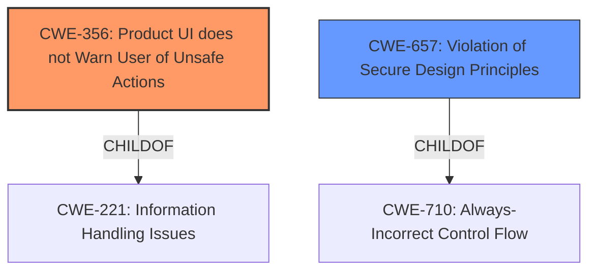

# Raw Analyzer Response for CVE-2021-44714

# Summary
| CWE ID | CWE Name | Confidence | CWE Abstraction Level | CWE Vulnerability Mapping Label | CWE-Vulnerability Mapping Notes |
|---|---|---|---|---|---|
| CWE-356 | Product UI does not Warn User of Unsafe Actions | 0.9 | Base | Allowed | Primary CWE |
| CWE-657 | Violation of Secure Design Principles | 0.7 | Class | Discouraged | Secondary Candidate |

## Evidence and Confidence

*   **Confidence Score:** 0.8
*   **Evidence Strength:** HIGH

## Relationship Analysis
The primary CWE selected is CWE-356, which is a Base level CWE. CWE-356 is a child of CWE-221 (Information Handling Issues). CWE-657 is a class level CWE, and is a parent of several more specific weaknesses. The relationship that impacted the decision was choosing CWE-356, a Base level CWE, over CWE-657, a Class level CWE.

## Vulnerability Chain
The chain of root cause and weaknesses for the Vulnerability Description is:
  - **Root Cause:** Product UI does not adequately warn users of unsafe actions (CWE-356)
  - **Weakness:** This leads to a violation of secure design principles, making it easier to mislead users (CWE-657)
  - **Impact:** Security feature bypass.

## Summary of Analysis
The initial assessment was based on the vulnerability description indicating a **"violation of secure design principles"**, which initially pointed towards CWE-657. However, after reviewing the details and the provided summary from the CVE reference links, it became clear that the core issue is the lack of adequate warning to the user about potentially unsafe actions. The vulnerability description states that "Acrobat Reader DC displays a warning message when a user clicks on a PDF file, which could be used by an attacker to mislead the user. In affected versions, this warning message does not include custom protocols when used by the sender. User interaction is required to abuse this vulnerability as they would need to click allow on the warning message of a malicious file." This directly corresponds to CWE-356 (Product UI does not Warn User of Unsafe Actions), which is at a more specific and appropriate level of abstraction (Base) than CWE-657 (Class). The CVE Reference Links Content Summary reinforces this by detailing that the vulnerability is due to a flaw in the design or implementation of a security mechanism (CWE-657), but the specific manifestation is related to the user interface not properly warning the user.

The decision to select CWE-356 was influenced by the MITRE mapping guidance, which recommends choosing the most specific CWE (Base or Variant) that accurately represents the weakness. CWE-356 fits this criterion because it directly addresses the issue of insufficient UI warning, whereas CWE-657 is a broader, more general classification.

The retriever results also support this decision, with CWE-356 being the top combined result.

Other CWEs Considered and Rejected:

*   CWE-657: Violation of Secure Design Principles: While the vulnerability description mentions this, it is a high-level class. The root cause is more accurately represented by CWE-356.
*   CWE-200: Exposure of Sensitive Information to an Unauthorized Actor: This is not applicable as the vulnerability doesn't directly involve the exposure of sensitive information.
*   CWE-787: Out-of-bounds Write: This is not applicable as the vulnerability doesn't involve writing data past the end of a buffer.
*   CWE-357: Insufficient UI Warning of Dangerous Operations: Similar to CWE-356, but CWE-356 is broader and more accurately captures the essence of the weakness.
*   CWE-327: Use of a Broken or Risky Cryptographic Algorithm: This is not relevant as the vulnerability doesn't involve cryptographic algorithms.

The selected CWE, CWE-356, is at the optimal level of specificity as it accurately reflects the root cause of the vulnerability: the product's UI not adequately warning users of unsafe actions. This is supported by the vulnerability description, the CVE reference summary, and the retriever results.