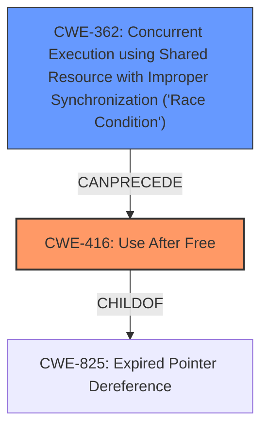

# Enhanced Analysis for CVE-2021-44733

# Summary
| CWE ID | CWE Name | Confidence | CWE Abstraction Level | CWE Vulnerability Mapping Label | CWE-Vulnerability Mapping Notes |
|---|---|---|---|---|---|
| CWE-416 | Use After Free | 1.0 | Variant | Allowed | Primary CWE |
| CWE-362 | Concurrent Execution using Shared Resource with Improper Synchronization ('Race Condition') | 1.0 | Class | Allowed-with-Review | Secondary Candidate |

## Evidence and Confidence

*   **Confidence Score:** 1.0
*   **Evidence Strength:** HIGH

## Relationship Analysis
The primary weakness is **CWE-416 (Use After Free)**, which occurs due to a **race condition**. **CWE-362 (Concurrent Execution using Shared Resource with Improper Synchronization ('Race Condition'))** is the Class-level CWE that encompasses the specific race condition leading to the UAF. The relationship **CWE-362** CanPrecede **CWE-416** indicates that the race condition sets the stage for the use-after-free vulnerability.



## Vulnerability Chain
The vulnerability chain starts with a **race condition** (**CWE-362**), which allows a shared memory object to be freed while another thread is still accessing it. This leads to a **use-after-free** (**CWE-416**).

## Summary of Analysis
The analysis identified **CWE-416 (Use After Free)** as the primary weakness and **CWE-362 (Concurrent Execution using Shared Resource with Improper Synchronization ('Race Condition'))** as a secondary contributing factor.

The evidence from the vulnerability description explicitly states a **use-after-free** exists and is triggered by a **race condition**: "A **use-after-free** exists... because of a **race condition**... during an attempt to free a shared memory object." The **CVE Reference Links Content Summary** section reinforces this by detailing the root cause as a **race condition** due to insufficient synchronization.

The Retriever Results also support this conclusion, ranking **CWE-416** and **CWE-362** highly.

The selection of **CWE-416** at the Variant level is appropriate because it precisely describes the vulnerability. **CWE-362** is at the Class level but is included because it describes the nature of the race condition.

# Relevant CWE Information:

## CWE-416: Use After Free
**Abstraction:** Variant
**Status:** Stable

### Description
The product reuses or references memory after it has been freed. At some point afterward, the memory may be allocated again and saved in another pointer, while the original pointer references a location somewhere within the new allocation. Any operations using the original pointer are no longer valid because the memory "belongs" to the code that operates on the new pointer.

### Extended Description
Not provided

### Alternative Terms
Dangling pointer: a pointer that no longer points to valid memory, often after it has been freed
UAF: commonly used acronym for Use After Free
Use-After-Free

### Relationships
ChildOf -> CWE-825
ChildOf -> CWE-672
ChildOf -> CWE-672
ChildOf -> CWE-672
CanPrecede -> CWE-120
CanPrecede -> CWE-123

### Mapping Guidance
**Usage:** Allowed
**Rationale:** This CWE entry is at the Variant level of abstraction, which is a preferred level of abstraction for mapping to the root causes of vulnerabilities.
**Comments:** Carefully read both the name and description to ensure that this mapping is an appropriate fit. Do not try to 'force' a mapping to a lower-level Base/Variant simply to comply with this preferred level of abstraction.
**Reasons:**
- Acceptable-Use

## CWE-362: Concurrent Execution using Shared Resource with Improper Synchronization ('Race Condition')
**Abstraction:** Class
**Status:** Draft

### Description
The product contains a concurrent code sequence that requires temporary, exclusive access to a shared resource, but a timing window exists in which the shared resource can be modified by another code sequence operating concurrently.

### Extended Description
A race condition occurs within concurrent environments, and it is effectively a property of a code sequence. Depending on the context, a code sequence may be in the form of a function call, a small number of instructions, a series of program invocations, etc.

A race condition violates these properties, which are closely related:

- Exclusivity - the code sequence is given exclusive access to the shared resource, i.e., no other code sequence can modify properties of the shared resource before the original sequence has completed execution.

- Atomicity - the code sequence is behaviorally atomic, i.e., no other thread or process can concurrently execute the same sequence of instructions (or a subset) against the same resource.

A race condition exists when an "interfering code sequence" can still access the shared resource, violating exclusivity.

The interfering code sequence could be "trusted" or "untrusted." A trusted interfering code sequence occurs within the product; it cannot be modified by the attacker, and it can only be invoked indirectly. An untrusted interfering code sequence can be authored directly by the attacker, and typically it is external to the vulnerable product.

### Alternative Terms
Race Condition

### Relationships
ChildOf -> CWE-691
CanPrecede -> CWE-416
CanPrecede -> CWE-476

### Mapping Guidance
**Usage:** Allowed-with-Review
**Rationale:** This CWE entry is a Class and might have Base-level children that would be more appropriate
**Comments:** Examine children of this entry to see if there is a better fit
**Reasons:**
- Abstraction

### Additional Notes
**[Maintenance]** The relationship between race conditions and synchronization problems (CWE-662) needs to be further developed. They are not necessarily two perspectives of the same core concept, since synchronization is only one technique for avoiding race conditions, and synchronization can be used for other purposes besides race condition prevention.

### Considered but not Used:

*   **CWE-366: Race Condition within a Thread**: This is a Base level CWE and more specific than **CWE-362**. However, the description for this vulnerability does not provide the detail necessary to differentiate between a race condition within a thread versus other types of race conditions. So **CWE-362** is the better fit.
*   **CWE-367: Time-of-check Time-of-use (TOCTOU) Race Condition**: This CWE is not applicable because the vulnerability is not specifically related to a time-of-check time-of-use scenario.
*   **CWE-364: Signal Handler Race Condition**: This CWE is not applicable because the vulnerability is not specifically related to signal handlers.
*   **CWE-763: Release of Invalid Pointer or Reference**: This is not directly applicable as it describes the release of an invalid pointer but the primary issue is the use of memory after it has already been released.
*   **CWE-123: Write-what-where Condition**: This is a potential consequence of the UAF, but not the root cause itself.
*   **CWE-415: Double Free**: This is not applicable because the vulnerability is not about freeing the same memory twice, but about using it after it has been freed.
*   **CWE-667: Improper Locking**: While locking issues might contribute to the race condition, the description doesn't focus on locking mechanisms, making **CWE-362** more directly relevant.
*   **CWE-911: Improper Update of Reference Count**: The vulnerability description mentions reference counting problems, but the core issue is the race condition that leads to the UAF. While reference counting issues contribute to the UAF, **CWE-362** and **CWE-416** more accurately capture the primary flaws.


## CWE Relationship Analysis

Current CWEs represent these abstraction levels: .


### Vulnerability Chain Analysis

**Chain starting from CWE-911:**
- 911 (Improper Update of Reference Count) - ROOT


**Chain starting from CWE-825:**
- 825 (Expired Pointer Dereference) - ROOT


### CWE Relationship Diagram

```mermaid
graph TD
    classDef primary fill:#f96,stroke:#333,stroke-width:2px
    classDef secondary fill:#69f,stroke:#333
    classDef tertiary fill:#9e9,stroke:#333
```