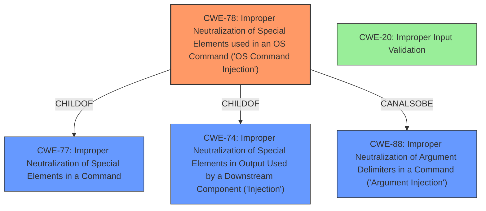

# Raw Analyzer Response for CVE-2021-44734

# Summary
| CWE ID | CWE Name | Confidence | CWE Abstraction Level | CWE Vulnerability Mapping Label | CWE-Vulnerability Mapping Notes |
|---|---|---|---|---|---|
| CWE-78 | Improper Neutralization of Special Elements used in an OS Command ('OS Command Injection') | 0.9 | Base | Allowed | Primary CWE |
| CWE-20 | Improper Input Validation | 0.7 | Class | Discouraged | Secondary Candidate |

## Evidence and Confidence

*   **Confidence Score:** 0.8
*   **Evidence Strength:** HIGH

## Relationship Analysis
The primary relationship impacting the decision is the hierarchical structure where CWE-78 ('OS Command Injection') is a child of CWE-77 (Improper Neutralization of Special Elements) and CWE-74 (Improper Neutralization of Special Elements in Output Used by a Downstream Component ('Injection')). The CanAlsoBe relationship between CWE-78 and CWE-88 (Improper Neutralization of Argument Delimiters in a Command ('Argument Injection')) suggests a potential alternative or contributing factor. CWE-20 is a high level class that is frequently misused and has many potential base level children.

## Vulnerability Chain
The vulnerability chain starts with **improper input sanitization** due to a **lack of proper validation of a user-supplied string**. This leads to **code injection** through a configuration file, which results in **remote code execution**.

## Summary of Analysis
Initially, the key phrase "**improper input sanitization**" suggested a broader class of weaknesses related to input validation and neutralization. However, the "CVE Reference Links Content Summary" provided crucial details: the **root cause** is the **failure to properly sanitize user-supplied input** when writing to a configuration file, enabling **code injection** and ultimately leading to **remote code execution**. This level of detail strongly points towards CWE-78, Improper Neutralization of Special Elements used in an OS Command ('OS Command Injection'), as the primary weakness.

CWE-78 is a Base level CWE and the evidence directly supports it. The vulnerability involves an embedded web server that fails to properly sanitize user-supplied input, allowing an attacker to inject code and remotely execute arbitrary commands on the affected device. The weakness lies in the embedded web server's **failure to neutralize special elements** in the input, which could modify the intended OS command.

CWE-20, Improper Input Validation, was considered as a potential candidate due to the **improper input sanitization**. However, CWE-20 is a class-level CWE and the description notes that it is often misused in low-information vulnerability reports when lower-level CWEs could be used instead. Given the specific context of code injection and remote command execution, CWE-78 provides a more accurate and detailed representation of the vulnerability.

CWE-94, Improper Control of Generation of Code ('Code Injection'), was also considered because the impact leads to code injection. However, the **root cause** isn't the improper generation of code but rather the **improper sanitization of input** that allows the attacker to inject code. CWE-94 has a usage of "Allowed-with-Review" because it is frequently misused for vulnerabilities with a technical impact of "code execution," which does not by itself indicate a **root cause** weakness.

Therefore, CWE-78 is the most appropriate choice because it directly reflects the **root cause** of the vulnerability: the **failure to neutralize special elements in an OS command due to the lack of proper input sanitization**, leading to remote code execution. The evidence strongly supports this classification, aligning with the CWE's description, relationships, and mapping guidance.