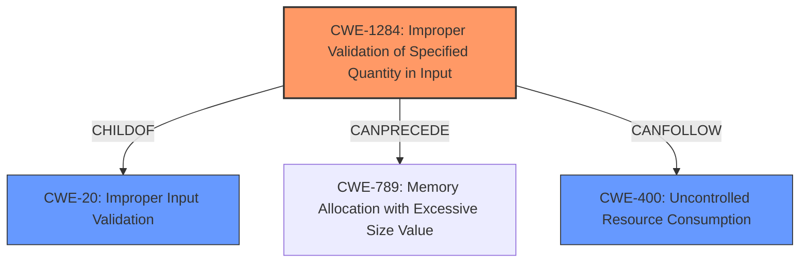

# Raw Analyzer Response for CVE-2021-44769

# Summary
| CWE ID  | CWE Name                                                        | Confidence | CWE Abstraction Level | CWE Vulnerability Mapping Label | CWE-Vulnerability Mapping Notes |
| :-------- | :-------------------------------------------------------------- | :--------- | :-------------------- | :------------------------------ | :------------------------------ |
| CWE-1284  | Improper Validation of Specified Quantity in Input              | 0.85       | Base                  | Primary CWE                  | Allowed                       |
| CWE-20    | Improper Input Validation                                       | 0.65       | Class                 | Secondary CWE                     | Discouraged                    |
| CWE-400    | Uncontrolled Resource Consumption                                       | 0.65       | Class                 | Secondary CWE                    | Discouraged                    |

## Evidence and Confidence

*   **Confidence Score:** 0.75
*   **Evidence Strength:** MEDIUM

## Relationship Analysis
The primary weakness, CWE-1284, is a child of CWE-20, reflecting that improper validation of a specified quantity is a specific type of improper input validation. CWE-1284 can precede CWE-789 (Memory Allocation with Excessive Size Value), indicating a potential chain where improper quantity validation leads to excessive memory allocation. CWE-400 is a more general resource consumption issue and does not give enough specificity to the vulnerability. The abstraction levels influenced the decision, favoring the more specific Base level CWE-1284 over the higher-level Class CWE-20.

## Vulnerability Chain
The vulnerability chain starts with **improper input validation** (CWE-1284), which leads to a denial-of-service (DoS) condition. Although the chain does not specify how the improper validation leads to DoS, we can infer that the **improper input validation** allows an attacker to control a quantity-related parameter used in TLS certificate generation. This unchecked parameter might lead to resource exhaustion (CWE-400) due to excessive computation or memory allocation, or it could lead to other issues like integer overflows. The final impact is the DoS.

## Summary of Analysis
The initial assessment focused on the **improper input validation** mentioned in the vulnerability description. The description states: "An **improper input validation** vulnerability in the TLS certificate generation function allows an attacker to cause a Denial-of-Service (DoS) condition which can only be reverted via a factory reset."

The "CVE Reference Links Content Summary" section confirms this: "The vulnerability stems from **improper input validation** in the TLS certificate generation function of the Baseboard Management Controller (BMC) firmware," and the "Weaknesses/Vulnerabilities Present" are listed as "**improper input validation**."

The Retriever Results suggest CWE-20 (Improper Input Validation) as a candidate. However, the more specific CWE-1284 (Improper Validation of Specified Quantity in Input) is also listed and is more appropriate given that TLS certificate generation involves specifying quantities (e.g., key size, validity period).

CWE-20 is discouraged because it is high-level and often misused. CWE-1284 is a base-level CWE, making it a better fit. The relationship analysis shows that CWE-1284 is a child of CWE-20, which means that it is a more specific type of input validation.

CWE-400 (Uncontrolled Resource Consumption) is also considered as the **improper input validation** could lead to resource exhaustion and DoS.

Therefore, the primary CWE is CWE-1284 because the vulnerability lies in the **improper validation of a specified quantity** within the TLS certificate generation function. A secondary CWE is CWE-400, as **improper input validation** can lead to uncontrolled resource consumption resulting in a DoS.

Relevant CWE Information:

# Enhanced Context (25 CWEs)
The following CWEs were identified as potentially relevant to this vulnerability:

## CWE-664: Improper Control of a Resource Through its Lifetime
**Abstraction Level**: Pillar
**Similarity Score**: 0.77
**Source**: dense

**Description**:
The product does not maintain or incorrectly maintains control over a resource throughout its lifetime of creation, use, and release.

**Mapping Guidance**:
- Usage: Discouraged
- Rationale: This CWE entry is high-level when lower-level children are available.

## CWE-1289: Improper Validation of Unsafe Equivalence in Input
**Abstraction Level**: Base
**Similarity Score**: 0.76
**Source**: dense

**Description**:
The product receives an input value that is used as a resource identifier or other type of reference, but it does not validate or incorrectly validates that the input is equivalent to a potentially-unsafe value.

**Mapping Guidance**:
- Usage: Allowed
- Rationale: This CWE entry is at the Base level of abstraction, which is a preferred level of abstraction for mapping to the root causes of vulnerabilities.

## CWE-1220: Insufficient Granularity of Access Control
**Abstraction Level**: Base
**Similarity Score**: 0.76
**Source**: dense

**Description**:
The product implements access controls via a policy or other feature with the intention to disable or restrict accesses (reads and/or writes) to assets in a system from untrusted agents. However, implemented access controls lack required granularity, which renders the control policy too broad because it allows accesses from unauthorized agents to the security-sensitive assets.

**Mapping Guidance**:
- Usage: Allowed
- Rationale: This CWE entry is at the Base level of abstraction, which is a preferred level of abstraction for mapping to the root causes of vulnerabilities.

## CWE-691: Insufficient Control Flow Management
**Abstraction Level**: Pillar
**Similarity Score**: 0.76
**Source**: dense

**Description**:
The code does not sufficiently manage its control flow during execution, creating conditions in which the control flow can be modified in unexpected ways.

**Mapping Guidance**:
- Usage: Discouraged
- Rationale: This CWE entry is extremely high-level, a Pillar. However, classification research is limited for weaknesses of this type, so there can be gaps or organizational difficulties within CWE that force use of this weakness, even at such a high level of abstraction.

## CWE-653: Improper Isolation or Compartmentalization
**Abstraction Level**: Class
**Similarity Score**: 0.75
**Source**: dense

**Description**:
The product does not properly compartmentalize or isolate functionality, processes, or resources that require different privilege levels, rights, or permissions.

**Mapping Guidance**:
- Usage: Allowed
- Rationale: This CWE entry is at the Base level of abstraction, which is a preferred level of abstraction for mapping to the root causes of vulnerabilities.

## CWE-274: Improper Handling of Insufficient Privileges
**Abstraction Level**: Base
**Similarity Score**: 0.75
**Source**: dense

**Description**:
The product does not handle or incorrectly handles when it has insufficient privileges to perform an operation, leading to resultant weaknesses.

**Mapping Guidance**:
- Usage: Discouraged
- Rationale: This CWE entry could be deprecated in a future version of CWE.

## CWE-668: Exposure of Resource to Wrong Sphere
**Abstraction Level**: Class
**Similarity Score**: 0.75
**Source**: dense

**Description**:
The product exposes a resource to the wrong control sphere, providing unintended actors with inappropriate access to the resource.

**Mapping Guidance**:
- Usage: Discouraged
- Rationale: CWE-668 is high-level and is often misused as a catch-all when lower-level CWE IDs might be applicable. It is sometimes used for low-information vulnerability reports [REF-1287]. It is a level-1 Class (i.e., a child of a Pillar). It is not useful for trend analysis.

## CWE-404: Improper Resource Shutdown or Release
**Abstraction Level**: Class
**Similarity Score**: 0.75
**Source**: dense

**Description**:
The product does not release or incorrectly releases a resource before it is made available for re-use.

**Mapping Guidance**:
- Usage: Allowed-with-Review
- Rationale: This CWE entry is a Class and might have Base-level children that would be more appropriate

## CWE-280: Improper Handling of Insufficient Permissions or Privileges
**Abstraction Level**: Base
**Similarity Score**: 0.74
**Source