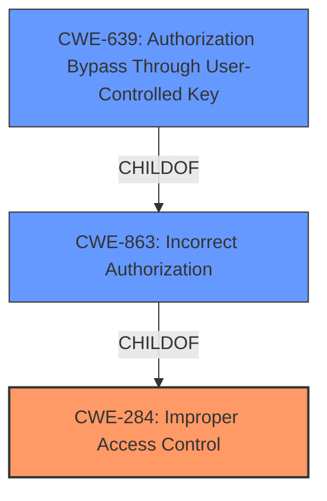

# Raw Analyzer Response for CVE-2021-44776

# Summary
| CWE ID | CWE Name | Confidence | CWE Abstraction Level | CWE Vulnerability Mapping Label | CWE-Vulnerability Mapping Notes |
|---|---|---|---|---|---|
| CWE-284 | Improper Access Control | 0.8 | Pillar | Primary | Discouraged |
| CWE-863 | Incorrect Authorization | 0.7 | Class | Secondary | Allowed-with-Review |
| CWE-639 | Authorization Bypass Through User-Controlled Key | 0.6 | Base | Secondary | Allowed |

## Evidence and Confidence

*   **Confidence Score:** 0.7
*   **Evidence Strength:** MEDIUM

## Relationship Analysis
The primary CWE selected is CWE-284, "Improper Access Control," which is a high-level pillar. While this aligns with the general description of **broken access control**, it's discouraged due to its broad nature. Therefore, I've included more specific CWEs as secondary candidates. CWE-863 "Incorrect Authorization" is a child of CWE-284, representing a more refined classification. CWE-639 "Authorization Bypass Through User-Controlled Key" is a base CWE and a child of CWE-863, offering an even more granular view of the **broken access control**, where the key used for authorization is user-controlled, leading to a bypass.

## Vulnerability Chain
The chain starts with a **broken access control** (**rootcause**), leading to an attacker being able to arbitrarily change the security access rights to KVM and Virtual Media functionalities (**impact**).

## Summary of Analysis
Initially, the description points to **broken access control**, suggesting CWE-284. The CVE Reference Links Content Summary confirms the **root cause** as a lack of proper authorization checks, which could map to either CWE-863 or CWE-639. However, the provided information doesn't specify that the access is controlled through a user-controlled key, making CWE-639 less certain.

The evidence from the vulnerability description is: "A **broken access control** vulnerability in the SubNet_handler_func function of spx_restservice allows an attacker to arbitrarily change the security access rights to KVM and Virtual Media functionalities." The CVE Reference Links Content Summary supports this by stating: "The primary weakness is the lack of proper authorization checks within the `SubNet_handler_func`."

Given the high-level nature of CWE-284 and the lack of specific evidence for CWE-639, CWE-863 presents a more appropriate balance. While CWE-284 is discouraged, it serves as a starting point before refining the analysis. CWE-863 provides a better description of the actual weakness. CWE-639 is considered because the attacker is modifying the access rights.

Relevant CWE Information:
## CWE-284: Improper Access Control
**Abstraction:** Pillar
**Status:** Incomplete

### Description
The product does not restrict or incorrectly restricts access to a resource from an unauthorized actor.

### Extended Description
Access control involves the use of several protection mechanisms such as:

  - Authentication (proving the identity of an actor)

  - Authorization (ensuring that a given actor can access a resource), and

  - Accountability (tracking of activities that were performed)

When any mechanism is not applied or otherwise fails, attackers can compromise the security of the product by gaining privileges, reading sensitive information, executing commands, evading detection, etc.

### Mapping Guidance
**Usage:** Discouraged
**Rationale:** CWE-284 is extremely high-level, a Pillar. Its name, "Improper Access Control," is often misused in low-information vulnerability reports or by active use of the OWASP Top Ten, such as "A01:2021-Broken Access Control". It is not useful for trend analysis.
**Comments:** Consider using descendants of CWE-284 that are more specific to the kind of access control involved, such as those involving authorization (Missing Authorization (CWE-862), Incorrect Authorization (CWE-863), Incorrect Permission Assignment for Critical Resource (CWE-732), etc.); authentication (Missing Authentication (CWE-306) or Weak Authentication (CWE-1390)); Incorrect User Management (CWE-286); Improper Restriction of Communication Channel to Intended Endpoints (CWE-923); etc.

## CWE-863: Incorrect Authorization
**Abstraction:** Class
**Description:**
The product performs an authorization check when an actor attempts to access a resource or perform an action, but it does not correctly perform the check.

### Mapping Guidance
**Usage:** Allowed-with-Review
**Rationale:** This CWE entry is a Class and might have Base-level children that would be more appropriate

## CWE-639: Authorization Bypass Through User-Controlled Key
**Abstraction:** Base

### Description
The system's authorization functionality does not prevent one user from gaining access to another user's data or record by modifying the key value identifying the data.

### Mapping Guidance
**Usage:** Allowed
**Rationale:** This CWE entry is at the Base level of abstraction, which is a preferred level of abstraction for mapping to the root causes of vulnerabilities.