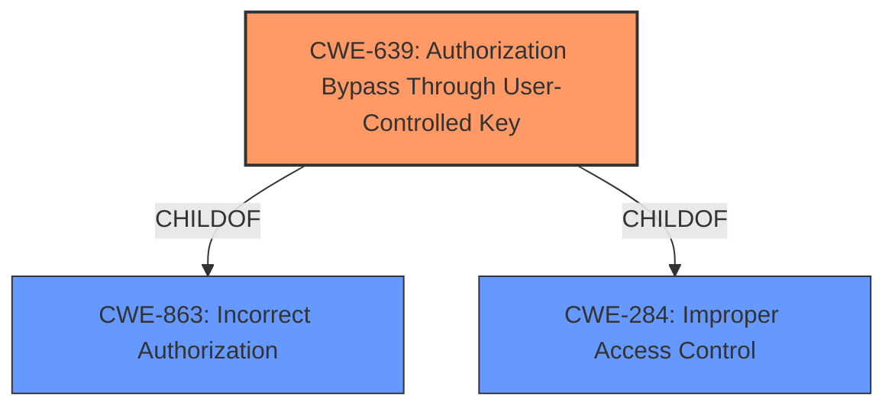

# Raw Analyzer Response for CVE-2021-44838

# Summary
| CWE ID | CWE Name | Confidence | CWE Abstraction Level | CWE Vulnerability Mapping Label | CWE-Vulnerability Mapping Notes |
|---|---|---|---|---|---|
| CWE-639 | Authorization Bypass Through User-Controlled Key | 1.0 | Base | Allowed | Primary CWE |

## Evidence and Confidence

*   **Confidence Score:** 1.0
*   **Evidence Strength:** HIGH

## Relationship Analysis
The primary CWE selected is CWE-639, which is a Base level CWE. CWE-639 is a child of CWE-863 (Incorrect Authorization) and CWE-284 (Improper Access Control). Given the available information, CWE-639 offers the most specific and accurate description of the vulnerability compared to its parents.

## Vulnerability Chain
The vulnerability chain consists of the **lack of proper access control validation** on the `/risque/risque/ajax-details` endpoint, leading to a user being able to **access risks of other companies** by manipulating the `id` parameter in a POST request.

## Summary of Analysis
The initial assessment, confirmed by the retriever results and supporting evidence, points to CWE-639 as the most appropriate classification. The analysis is based on the provided evidence, specifically the "CVE Reference Links Content Summary" and "Vulnerability Description Key Phrases".

The "CVE Reference Links Content Summary" states: "The application **lacks proper access control validation** on the `/risque/risque/ajax-details` endpoint, allowing users to **access risk details of other companies by manipulating the `id` parameter** in a POST request."

The "Vulnerability Description Key Phrases" indicates: "**impact:** access risks of other companies" and "**vector:** POST request".

CWE-639 (Authorization Bypass Through User-Controlled Key) directly addresses the root cause: "The system's authorization functionality does not prevent one user from gaining access to another user's data or record by manipulating the key value identifying the data." This aligns perfectly with the vulnerability description where a user can access other companies' risks by manipulating the `id` parameter.

CWE-285 (Improper Authorization), CWE-862 (Missing Authorization), and CWE-863 (Incorrect Authorization) were considered but are less specific. CWE-639 provides a more precise description of the vulnerability mechanism.

CWE-79 (Improper Neutralization of Input During Web Page Generation ('Cross-site Scripting')) and CWE-89 (Improper Neutralization of Special Elements used in an SQL Command ('SQL Injection')) are related to input validation but do not accurately describe the **authorization bypass** issue.

CWE-200 (Exposure of Sensitive Information to an Unauthorized Actor) describes the impact but not the root cause.

CWE-639 is at the Base level of abstraction and offers the best fit for this vulnerability, describing the specific weakness of **bypassing authorization through a user-controlled key**.

Relevant CWE Information:

# Enhanced Context (25 CWEs)

## CWE-639: Authorization Bypass Through User-Controlled Key
**Abstraction:** Base
**Similarity Score**: 0.77 (dense), 7446.22 (sparse)

**Description**:
The system's authorization functionality does not prevent one user from gaining access to another user's data or record by modifying the key value identifying the data.

**Mapping Guidance**:
- Usage: Allowed
- Rationale: This CWE entry is at the Base level of abstraction, which is a preferred level of abstraction for mapping to the root causes of vulnerabilities.