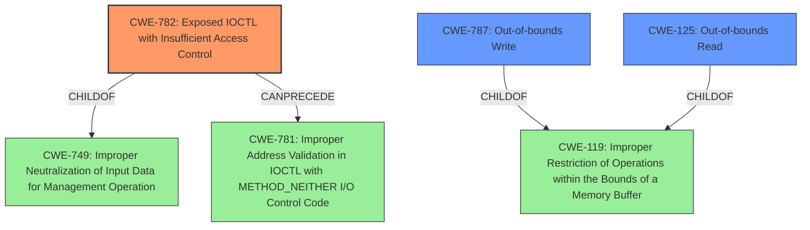

# Analysis Report for CVE-2021-44852

# Vulnerability Analysis Report: CVE-2021-44852

## Description


## Analysis (with Relationship Data)

# Summary
| CWE ID | CWE Name | Confidence | CWE Abstraction Level | CWE Vulnerability Mapping Label | CWE-Vulnerability Mapping Notes |
|---|---|---|---|---|---|
| CWE-782 | Exposed IOCTL with Insufficient Access Control | 1.0 | Variant | Allowed | Primary CWE |
| CWE-787 | Out-of-bounds Write | 0.8 | Base | Allowed | Secondary CWE |
| CWE-125 | Out-of-bounds Read | 0.8 | Base | Allowed | Secondary CWE |

## Evidence and Confidence

*   **Confidence Score:** 0.9
*   **Evidence Strength:** HIGH

## Relationship Analysis
The primary CWE is CWE-782, which indicates that the IOCTLs are exposed without proper access control. The secondary CWEs (CWE-787 and CWE-125) represent the potential consequences when these exposed IOCTLs are exploited. CWE-782 is a variant of CWE-749 (Improper Neutralization of Input Data for Management Operation) and can precede CWE-781 (Improper Address Validation in IOCTL with METHOD_NEITHER I/O Control Code). Both CWE-787 and CWE-125 are children of CWE-119 (Improper Restriction of Operations within the Bounds of a Memory Buffer). The selection was influenced by the specific details of the vulnerability.



## Vulnerability Chain
The vulnerability chain starts with **insufficient access control** on the IOCTLs (CWE-782). This allows a low-integrity process to interact with the driver, leading to arbitrary physical memory reads (CWE-125) and writes (CWE-787). Ultimately, it allows for arbitrary code execution.

## Summary of Analysis
The initial assessment considered the "Retriever Results" and the provided "Complete CWE Specifications." The primary concern is that a low-integrity process can access IOCTLs that should be restricted. The "CVE Reference Links Content Summary" clearly states that the driver is installed with an **insufficient DACL**, allowing low-integrity processes to interact with it. This points directly to CWE-782 (Exposed IOCTL with Insufficient Access Control). The IOCTLs then allow reading (CWE-125) and writing (CWE-787) to arbitrary memory locations, culminating in arbitrary code execution.

The selection of CWE-782 is based on the root cause: the **lack of proper access control** on the IOCTLs. This allows unauthorized access and leads to further exploitation. The relationship graph reinforces this, showing CWE-782 as a child of CWE-749, which is a more general class related to improper neutralization of input data for management operations. The secondary CWEs, CWE-787 and CWE-125, are selected due to the **arbitrary read/write** capabilities achieved through the exposed IOCTLs. They are children of CWE-119 (Improper Restriction of Operations within the Bounds of a Memory Buffer), but chosen because they are more specific than CWE-119 itself.

The final selected CWEs provide the optimal level of specificity, addressing both the root cause (CWE-782) and the immediate consequences (CWE-787, CWE-125) of the vulnerability.

Relevant CWE Information:

# Enhanced Context (25 CWEs)
The following CWEs were identified as potentially relevant to this vulnerability:

## CWE-782: Exposed IOCTL with Insufficient Access Control
**Abstraction Level**: Variant
**Similarity Score**: 0.77
**Source**: dense

**Description**:
The product implements an IOCTL with functionality that should be restricted, but it does not properly enforce access control for the IOCTL.

**Mapping Guidance**:
- Usage: Allowed
- Rationale: This CWE entry is at the Variant level of abstraction, which is a preferred level of abstraction for mapping to the root causes of vulnerabilities.

## CWE-131: Incorrect Calculation of Buffer Size
This CWE was not selected because the vulnerability does not involve an incorrect calculation of a buffer size.

## CWE-125: Out-of-bounds Read
**Abstraction Level**: Base
**Similarity Score**: 0.76
**Source**: dense

**Description**:
The product reads data past the end, or before the beginning, of the intended buffer.

**Mapping Guidance**:
- Usage: Allowed
- Rationale: This CWE entry is at the Base level of abstraction, which is a preferred level of abstraction for mapping to the root causes of vulnerabilities.

## CWE-805: Buffer Access with Incorrect Length Value
This CWE was not selected because the primary issue isn't an incorrect length value, but the ability to read/write arbitrary physical memory.

## CWE-119: Improper Restriction of Operations within the Bounds of a Memory Buffer
This CWE was considered, but CWE-787 and CWE-125 are more specific child elements of CWE-119.

## CWE-191: Integer Underflow (Wrap or Wraparound)
This CWE was not selected because the vulnerability does not involve integer underflow.

## CWE-667: Improper Locking
This CWE was not selected because the vulnerability is not related to improper locking.

## CWE-126: Buffer Over-read
This CWE was not selected because CWE-125 already covers the out-of-bounds read aspect of the vulnerability.

## CWE-823: Use of Out-of-range Pointer Offset
This CWE was not selected because the vulnerability doesn't specifically involve out-of-range pointer offsets.

## CWE-908: Use of Uninitialized Resource
This CWE was not selected because the core issue is not the use of uninitialized resources.

## CWE-362: Concurrent Execution using Shared Resource with Improper Synchronization ('Race Condition')
This CWE was not selected because there is no evidence to suggest the presence of race condition.

## CWE-367: Time-of-check Time-of-use (TOCTOU) Race Condition
This CWE was not selected because there is no evidence to suggest the presence of TOCTOU race condition.

## CWE-822: Untrusted Pointer Dereference
This CWE was not selected because the core issue is not about untrusted pointer dereference.

## CWE-787: Out-of-bounds Write
**Abstraction Level**: base
**Similarity Score**: 4.33
**Source**: graph

**Description**:
CWE-787: Out-of-bounds Write

**Mapping Guidance**:
- Usage: Allowed
- Rationale: This CWE entry is at the Base level of abstraction, which is a preferred level of abstraction for mapping to the root causes of vulnerabilities.

## CWE-476: NULL Pointer Dereference
This CWE was not selected because the vulnerability doesn't involve null pointer dereference.

## CWE-781: Improper Address Validation in IOCTL with METHOD_NEITHER I/O Control Code
**Abstraction Level**: variant
**Similarity Score**: 3.88
**Source**: graph

**Description**:
CWE-781: Improper Address Validation in IOCTL with METHOD_NEITHER I/O Control Code

## CWE-416: Use After Free
This CWE was not selected because the vulnerability doesn't involve use-after-free.

## CWE-123: Write-what-where Condition
This CWE was not selected because CWE-787 already addresses the out-of-bounds write condition.

## CWE-131: Incorrect Calculation of Buffer Size
This CWE was not selected because the vulnerability does not involve an incorrect calculation of a buffer size.

## CWE-805: Buffer Access with Incorrect Length Value
This CWE was not selected because the primary issue isn't an incorrect length value, but the ability to read/write arbitrary physical memory.

## CWE-386


## CWE Relationship Analysis

Current CWEs represent these abstraction levels: .


### Vulnerability Chain Analysis

**Chain starting from CWE-908:**
- 908 (Use of Uninitialized Resource) - ROOT


**Chain starting from CWE-749:**
- 749 (Exposed Dangerous Method or Function) - ROOT


### CWE Relationship Diagram

```mermaid
graph TD
    classDef primary fill:#f96,stroke:#333,stroke-width:2px
    classDef secondary fill:#69f,stroke:#333
    classDef tertiary fill:#9e9,stroke:#333
```


*Report generated on 2025-03-31 12:25:38*
