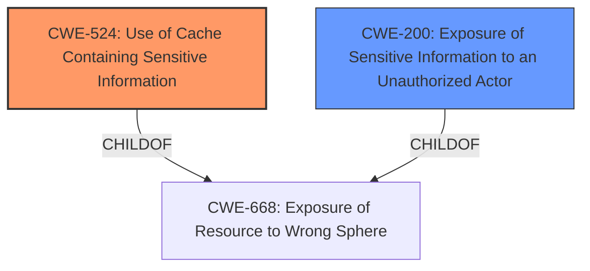

# Analysis for CVE-2021-44854

# Summary
| CWE ID | CWE Name | Confidence | CWE Abstraction Level | CWE Vulnerability Mapping Label | CWE-Vulnerability Mapping Notes |
|---|---|---|---|---|---|
| CWE-524 | Use of Cache Containing Sensitive Information | 0.9 | Base | Allowed | Primary CWE: The REST API publicly caches results from private wikis, exposing sensitive information. |
| CWE-200 | Exposure of Sensitive Information to an Unauthorized Actor | 0.7 | Class | Discouraged | Secondary CWE: General information exposure due to insecure caching. |

## Evidence and Confidence

*   **Confidence Score:** 0.8
*   **Evidence Strength:** HIGH

## Relationship Analysis
The primary CWE is CWE-524, which is a Base level weakness describing the use of a cache containing sensitive information. It is a ChildOf CWE-668 (Exposure of Resource to Wrong Sphere), a more general Class-level weakness. CWE-200 is a high level weakness that is discouraged due to being frequently misused, but it is included as a secondary CWE due to the impact of the vulnerability.

## Vulnerability Chain
The vulnerability chain starts with the **insecure caching** of data from private wikis by the REST API. This leads to **exposure of sensitive information**, such as page titles, to unauthorized users. The root cause is the **incorrect configuration** or implementation of the caching mechanism, which fails to distinguish between public and private content.

## Summary of Analysis
The primary weakness is CWE-524 (Use of Cache Containing Sensitive Information) because the root cause of the vulnerability is that the REST API publicly caches results from private wikis. This allows unauthorized users to access sensitive information. The evidence is that "The REST API publicly caches results from private wikis." and "The primary vulnerability is the improper caching mechanism that doesn't respect the privacy settings of wikis. Public caches were storing information from private wikis."

CWE-200 (Exposure of Sensitive Information to an Unauthorized Actor) is included as a secondary CWE because it describes the general impact of the vulnerability, which is that sensitive information is exposed to unauthorized users. However, CWE-200 is a high-level Class and is discouraged, so it is only included as a secondary CWE.

The selected CWEs are at the optimal level of specificity because CWE-524 is a Base level weakness that accurately describes the root cause of the vulnerability, and CWE-200 is a Class level weakness that describes the general impact of the vulnerability.