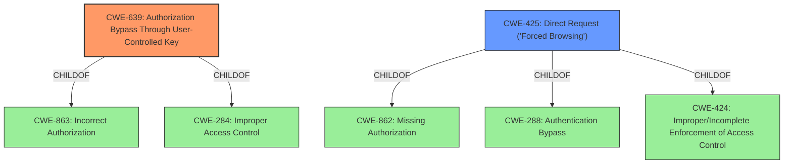

# Enhanced Analysis for CVE-2021-44949

# Summary
| CWE ID | CWE Name | Confidence | CWE Abstraction Level | CWE Vulnerability Mapping Label | CWE-Vulnerability Mapping Notes |
|---|---|---|---|---|---|
| CWE-639 | Authorization Bypass Through User-Controlled Key | 0.7 | Base | Allowed | Primary CWE |
| CWE-425 | Direct Request ('Forced Browsing') | 0.6 | Base | Allowed | Secondary Candidate CWE |

## Evidence and Confidence

*   **Confidence Score:** 0.7
*   **Evidence Strength:** MEDIUM

## Relationship Analysis
The primary relationship influencing the decision is that both CWE-639 and CWE-425 are base-level CWEs, providing a specific description of the vulnerability. CWE-639 is a child of CWE-863 and CWE-284, indicating a more general authorization issue. CWE-425 is a child of CWE-862, CWE-288, and CWE-424, showing it is related to missing authorization and direct access to resources.



## Vulnerability Chain
The vulnerability chain starts with the **weakness** of allowing retrieval of usernames via `/users.php?mode=profile&uid=`. This leads to the exposure of sensitive information, enabling attackers to attempt logins and trigger IP-based lockouts, resulting in a denial of service.

## Summary of Analysis
The initial analysis identified a potential access control issue where usernames can be retrieved via the `/users.php?mode=profile&uid=` endpoint. While the glFusion team deemed the issue invalid due to the intentional IP-based lockout mechanism, the underlying **weakness** of exposing usernames and the potential for abuse exists.

The decision to map to CWE-639 and CWE-425 is based on the evidence provided in the "CVE Reference Links Content Summary" section, which highlights the **root cause** being the ability to retrieve usernames. This aligns with CWE-639, "Authorization Bypass Through User-Controlled Key," because an attacker can use a user ID (the key) to access another user's username, effectively bypassing authorization. It also aligns with CWE-425, "Direct Request ('Forced Browsing')," as an attacker can directly request user profiles using the `uid` parameter.

These CWEs are at the optimal level of specificity because they directly address the **root cause** of the vulnerability. Other CWEs, such as CWE-79 (Cross-site Scripting) and CWE-94 (Code Injection), were considered but deemed less relevant as they do not directly address the access control issue. CWE-287 (Improper Authentication) is too high-level and doesn't specify the nature of the bypass.

Relevant CWE Information:

# Enhanced Context (25 CWEs)
The following CWEs were identified as potentially relevant to this vulnerability:

## CWE-639: Authorization Bypass Through User-Controlled Key
**Abstraction Level**: Base
**Similarity Score**: 0.76
**Source**: dense

**Description**:
The system's authorization functionality does not prevent one user from gaining access to another user's data or record by modifying the key value identifying the data.

**Mapping Guidance**:
- Usage: Allowed
- Rationale: This CWE entry is at the Base level of abstraction, which is a preferred level of abstraction for mapping to the root causes of vulnerabilities.

## CWE-425: Direct Request ('Forced Browsing')
**Abstraction Level**: Base
**Similarity Score**: 0.76
**Source**: dense

**Description**:
The web application does not adequately enforce appropriate authorization on all restricted URLs, scripts, or files.

**Mapping Guidance**:
- Usage: Allowed
- Rationale: This CWE entry is at the Base level of abstraction, which is a preferred level of abstraction for mapping to the root causes of vulnerabilities.

## CWE-639: Authorization Bypass Through User-Controlled Key
**Abstraction Level**: Base
**Similarity Score**: 7888.78
**Source**: sparse

**Description**:
The system's authorization functionality does not prevent one user from gaining access to another user's data or record by modifying the key value identifying the data.

**Mapping Guidance**:
- Usage: Allowed
- Rationale: This CWE entry is at the Base level of abstraction, which is a preferred level of abstraction for mapping to the root causes of vulnerabilities.


## CWE Relationship Analysis

Current CWEs represent these abstraction levels: .


### Vulnerability Chain Analysis

**Chain starting from CWE-862:**
- 862 (Missing Authorization) - ROOT


**Chain starting from CWE-425:**
- 425 (Direct Request ('Forced Browsing')) - ROOT


### CWE Relationship Diagram

```mermaid
graph TD
    classDef primary fill:#f96,stroke:#333,stroke-width:2px
    classDef secondary fill:#69f,stroke:#333
    classDef tertiary fill:#9e9,stroke:#333
```