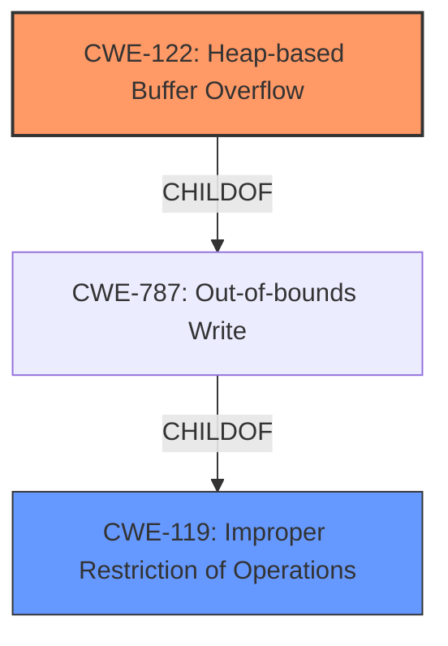

# Analysis Report for CVE-2021-44956

# Vulnerability Analysis Report: CVE-2021-44956

## Description


## Analysis (with Relationship Data)

# Summary
| CWE ID  | CWE Name  | Confidence | CWE Abstraction Level | CWE Vulnerability Mapping Label | CWE-Vulnerability Mapping Notes |
|---|---|---|---|---|---|
| CWE-122 | Heap-based Buffer Overflow | 1.0 | Variant | Allowed | Primary CWE |
| CWE-119 | Improper Restriction of Operations within the Bounds of a Memory Buffer | 0.6 | Class | Discouraged | Secondary Candidate |

## Evidence and Confidence

*   **Confidence Score:** 0.8
*   **Evidence Strength:** HIGH

## Relationship Analysis
The primary relationship that impacted the CWE selection was the parent-child relationship between CWE-119 and CWE-122. CWE-122 is a variant of CWE-787 (Out-of-bounds Write), which in turn is a child of CWE-119. The evidence strongly points to a heap-based buffer overflow, thus justifying the selection of the more specific CWE-122 over the more general CWE-119. The "Retriever Results" also suggested CWE-119.



## Vulnerability Chain
The vulnerability chain starts with the **improper handling of a crafted JPEG file**, leading to the **heap-based buffer overflow** in the `jfif_decode` function, and finally resulting in a **Denial of Service (DoS)**.

## Summary of Analysis
The initial assessment identified CWE-122 (Heap-based Buffer Overflow) as the primary candidate due to the explicit mention of "**Heap based buffer overflow**" in the "Vulnerability Description Key Phrases" and the "CVE Reference Links Content Summary." The summary further supports this with specific details: "The vulnerability lies in the `jfif_decode` function... arises from insufficient boundary checks when accessing memory buffers `yuv_datbuf[1]` and `yuv_datbuf[2]`... out-of-bounds reads occur at `jfif.c:552:31` and `jfif.c:552:38`... try to access memory locations outside the allocated regions." This detailed evidence provides high confidence in the selection of CWE-122.

CWE-119 (Improper Restriction of Operations within the Bounds of a Memory Buffer) was considered as a broader classification, but the specific nature of the heap-based overflow makes CWE-122 a more accurate and specific choice. The mapping guidance for CWE-119 discourages its use when more specific CWEs are available.

Other CWEs were considered but deemed less relevant. CWE-190 (Integer Overflow or Wraparound) and CWE-193 (Off-by-one Error) were considered but the root cause is a buffer overflow, not an integer issue. CWE-125 (Out-of-bounds Read) is a possible consequence of the overflow, but CWE-122 better represents the actual vulnerability. CWE-129 (Improper Validation of Array Index) was also considered, but there is no explicit evidence of an array index being the direct cause of the overflow.
The selected CWEs are at the optimal level of specificity, with CWE-122 accurately describing the heap-based buffer overflow and its location.


## CWE Relationship Analysis

Current CWEs represent these abstraction levels: .


### Vulnerability Chain Analysis

**Chain starting from CWE-190:**
- 190 (Integer Overflow or Wraparound) - ROOT


**Chain starting from CWE-193:**
- 193 (Off-by-one Error) - ROOT


### CWE Relationship Diagram

```mermaid
graph TD
    classDef primary fill:#f96,stroke:#333,stroke-width:2px
    classDef secondary fill:#69f,stroke:#333
    classDef tertiary fill:#9e9,stroke:#333
```


*Report generated on 2025-03-31 04:47:16*
