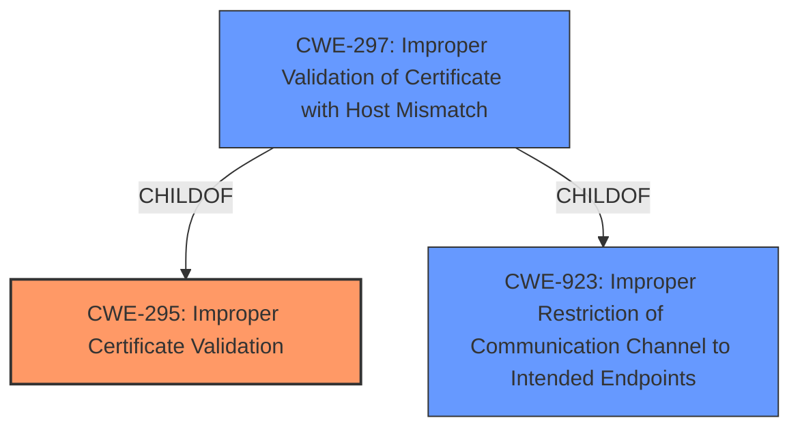

# Raw Analyzer Response for CVE-2021-45035

# Summary
| CWE ID | CWE Name | Confidence | CWE Abstraction Level | CWE Vulnerability Mapping Label | CWE-Vulnerability Mapping Notes |
|---|---|---|---|---|---|
| CWE-295 | Improper Certificate Validation | 1.0 | Base | Allowed | Primary CWE |
| CWE-297 | Improper Validation of Certificate with Host Mismatch | 0.7 | Variant | Allowed | Secondary Candidate |
| CWE-923 | Improper Restriction of Communication Channel to Intended Endpoints | 0.6 | Class | Allowed-with-Review | Secondary Candidate |

## Evidence and Confidence

*   **Confidence Score:** 0.9
*   **Evidence Strength:** HIGH

## Relationship Analysis
The primary CWE is CWE-295, which indicates a general failure to validate a certificate. CWE-297 is a variant of CWE-295 focusing on hostname mismatch, which is a more specific type of certificate validation failure. CWE-923 is a broader class related to improper restriction of communication channels, which certificate validation aims to achieve. The hierarchical relationship influenced the decision, with CWE-295 as the core issue and CWE-297 as a potential refinement if hostname mismatch is explicitly confirmed.

## Vulnerability Chain
The vulnerability chain starts with the **failure to correctly check the certificate of authenticity by default** (CWE-295). This leads to a potential Man-in-the-Middle (MITM) attack, allowing an attacker to **obtain the users credentials** (impact).

## Summary of Analysis
Initially, the vulnerability description states that the application **does not correctly check the certificate of authenticity by default**. The "CVE Reference Links Content Summary" confirms this by stating, "The vulnerability stems from a **lack of default server certificate verification**...the client would connect to the server **without verifying the server's certificate**." This aligns directly with CWE-295 (Improper Certificate Validation).

The retriever results also show CWE-295 as the top candidate.

The relationship analysis suggests that CWE-297 (Improper Validation of Certificate with Host Mismatch) could be a more specific variant if there was evidence of a hostname mismatch issue, but the current description doesn't explicitly state this. Therefore, CWE-295 is a more appropriate base level.

CWE-923 (Improper Restriction of Communication Channel to Intended Endpoints) is a broader classification. While relevant, it's less specific than CWE-295, which directly addresses the certificate validation **weakness**.

Therefore, the primary CWE is CWE-295 due to the **lack of certificate verification**. A secondary candidate is CWE-297 if the vulnerability is specifically related to hostname mismatch. CWE-923 is also a secondary candidate as it addresses communication channel security, but it is too generic.

Relevant CWE Information:

# Enhanced Context (25 CWEs)
The following CWEs were identified as potentially relevant to this vulnerability:

## CWE-303: Incorrect Implementation of Authentication Algorithm
**Abstraction Level**: Base
**Similarity Score**: 0.78
**Source**: dense

**Description**:
The requirements for the product dictate the use of an established authentication algorithm, but the implementation of the algorithm is incorrect.

**Mapping Guidance**:
- Usage: Allowed
- Rationale: This CWE entry is at the Base level of abstraction, which is a preferred level of abstraction for mapping to the root causes of vulnerabilities.

**CWE-303 Justification:**
This CWE was not chosen because the **rootcause** is not related to the implementation of an authentication algorithm, but instead relates to the certificate validation process, or the lack of such.

## CWE-1289: Improper Validation of Unsafe Equivalence in Input
**Abstraction Level**: Base
**Similarity Score**: 0.77
**Source**: dense

**Description**:
The product receives an input value that is used as a resource identifier or other type of reference, but it does not validate or incorrectly validates that the input is equivalent to a potentially-unsafe value.

**Mapping Guidance**:
- Usage: Allowed
- Rationale: This CWE entry is at the Base level of abstraction, which is a preferred level of abstraction for mapping to the root causes of vulnerabilities.

**CWE-1289 Justification:**
CWE-1289 was not selected because the vulnerability isn't about validating equivalence of input to potentially unsafe values.

## CWE-807: Reliance on Untrusted Inputs in a Security Decision
**Abstraction Level**: Base
**Similarity Score**: 0.77
**Source**: dense

**Description**:
The product uses a protection mechanism that relies on the existence or values of an input, but the input can be modified by an untrusted actor in a way that bypasses the protection mechanism.

**Mapping Guidance**:
- Usage: Allowed
- Rationale: This CWE entry is at the Base level of abstraction, which is a preferred level of abstraction for mapping to the root causes of vulnerabilities.

**CWE-807 Justification:**
This was not selected because the vulnerability is not about relying on untrusted inputs in a security decision.

## CWE-295: Improper Certificate Validation
**Abstraction Level**: Base
**Similarity Score**: 0.77
**Source**: dense

**Description**:
The product does not validate, or incorrectly validates, a certificate.

**Mapping Guidance**:
- Usage: Allowed
- Rationale: This CWE entry is at the Base level of abstraction, which is a preferred level of abstraction for mapping to the root causes of vulnerabilities.

**CWE-295 Justification:**
This CWE was selected because the vulnerability relates to the product **not correctly checking the certificate of authenticity by default.**

## CWE-345: Insufficient Verification of Data Authenticity
**Abstraction Level**: Class
**Similarity Score**: 0.77
**Source**: dense

**Description**:
The product does not sufficiently verify the origin or authenticity of data, in a way that causes it to accept invalid data.

**Mapping Guidance**:
- Usage: Discouraged
- Rationale: This CWE entry is a level-1 Class (i.e., a child of a Pillar). It might have lower-level children that would be more appropriate

**CWE-345 Justification:**
This was not selected because CWE-295 is a more specific child of this CWE.

## CWE-297: Improper Validation of Certificate with Host Mismatch
**Abstraction Level**: Variant
**Similarity Score**: 0.76
**Source**: dense

**Description**:
The product communicates with a host that provides a certificate, but the product does not properly ensure that the certificate is actually associated with that host.

**Mapping Guidance**:
- Usage: Allowed
- Rationale: This CWE entry is at the Variant level of abstraction, which is a preferred level of abstraction for mapping to the root causes of vulnerabilities.

**CWE-297 Justification:**
CWE-297 was selected as a secondary candidate because the **rootcause** could be related to the host mismatch. This is only a possibility because this is not explicitly stated.

## CWE-639: Authorization Bypass Through User-Controlled Key
**Abstraction Level**: Base
**Similarity Score**: 0.76
**Source**: dense

**Description**:
The system's authorization functionality does not prevent one user from gaining access to another user's data or record by modifying the key value identifying the data.

**Mapping Guidance**:
- Usage: Allowed
- Rationale: This CWE entry is at the Base level of abstraction, which is a preferred level of abstraction for mapping to the root causes of vulnerabilities.

**CWE-639 Justification:**
This was not selected because the vulnerability is not about authorization bypass.

## CWE-1390: Weak Authentication
**Abstraction Level**: Class
**Similarity Score**: 0.76
**Source**: dense

**Description**:
The product uses an authentication mechanism to restrict access to specific users or identities, but the mechanism does not sufficiently prove that the claimed identity is correct.

**Mapping Guidance**:
- Usage: Allowed-with-Review
- Rationale: This CWE entry is a Class and might have Base-level children that would be more appropriate

**CWE-1390 Justification:**
This was not selected because the **rootcause** is not related to weak authentication, but instead, to the certificate validation process, or the lack of such.

## CWE-472: External Control of Assumed-Immutable Web Parameter
**Abstraction Level**: Base
**Similarity