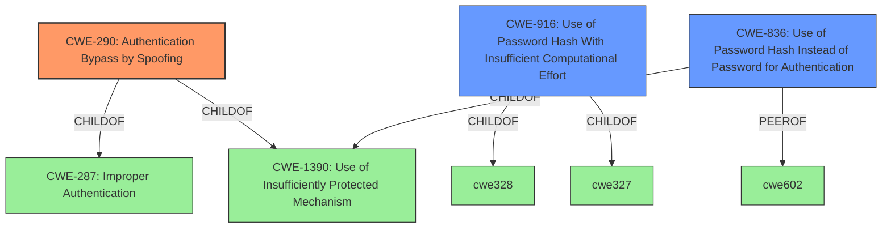

# Analysis for CVE-2021-45036

# Summary
| CWE ID | CWE Name | Confidence | CWE Abstraction Level | CWE Vulnerability Mapping Label | CWE-Vulnerability Mapping Notes |
|---|---|---|---|---|---|
| CWE-290 | Authentication Bypass by Spoofing | 1.0 | Base | Allowed | Primary CWE |
| CWE-916 | Use of Password Hash With Insufficient Computational Effort | 0.7 | Base | Allowed | Secondary Candidate |
| CWE-836 | Use of Password Hash Instead of Password for Authentication | 0.7 | Base | Allowed | Secondary Candidate |

## Evidence and Confidence

*   **Confidence Score:** 0.9
*   **Evidence Strength:** HIGH

## Relationship Analysis
The primary CWE selected is CWE-290 (Authentication Bypass by Spoofing), which is a base-level CWE. The analysis also considered CWE-916 (Use of Password Hash With Insufficient Computational Effort) and CWE-836 (Use of Password Hash Instead of Password for Authentication), both base-level CWEs.

CWE-290 is a child of CWE-287 (Improper Authentication) and CWE-1390 (Use of Insufficiently Protected Mechanism). This hierarchical relationship reinforces that the vulnerability stems from an authentication flaw.

## Vulnerability Chain
The vulnerability chain begins with the **improper authentication** mechanism, leading to the ability to **spoof** a user's identity, ultimately resulting in **unauthorized access** and potential compromise of confidentiality and integrity.

## Summary of Analysis
The initial analysis focused on identifying the root cause of the vulnerability. The description indicates that an attacker with knowledge of a victim's username and **hashed password** can spoof the victim's ID against the server. This clearly points to an **authentication bypass** issue.

The retriever results suggested CWE-836 (Use of Password Hash Instead of Password for Authentication) and CWE-290 (Authentication Bypass by Spoofing) as top candidates. After reviewing the CWE specifications, CWE-290 was selected as the primary CWE because it directly addresses the **authentication bypass by spoofing**.

CWE-916 (Use of Password Hash With Insufficient Computational Effort) and CWE-836 (Use of Password Hash Instead of Password for Authentication) were considered because the attacker requires the **hashed password** to conduct the spoofing attack. These were classified as secondary because the core issue is the **authentication bypass** itself, not necessarily the weakness of the hash, though a weak hash could contribute to the overall vulnerability.

The final decision is based on the evidence that the application **does not properly verify the identity of the client, making it possible for an attacker to impersonate another user.**

*Evidence:* "The root cause is an **authentication bypass**. Specifically, Velneo vClient version 28.1.3 allows an attacker to spoof a victim's user ID against the server. This is possible if the attacker has knowledge of the victim's username and hashed password."

The selected CWEs are at the base level of specificity, providing a clear and accurate representation of the vulnerability.

Relevant CWE Information:

**CWE-290: Authentication Bypass by Spoofing**
The product allows an attacker to bypass authentication by spoofing a user identity. This is possible because the product does not properly validate the authenticity of the user. The impact is unauthorized access to the system. This is the primary weakness because the core issue is the bypass of authentication through spoofing. Confidence: 1.0

**CWE-916: Use of Password Hash With Insufficient Computational Effort**
The product uses a password hash with insufficient computational effort. This makes it easier for an attacker to crack the password and gain access to the system. While this could be a contributing factor, the core issue is the authentication bypass, not the weakness of the hash itself. The hashed password is not sufficient to establish a secure session with the server. Confidence: 0.7

**CWE-836: Use of Password Hash Instead of Password for Authentication**
The product uses the password hash instead of the actual password for authentication. This allows an attacker to bypass authentication by replaying a stolen hash. While this is a potential issue, the primary weakness is the authentication bypass itself. Confidence: 0.7

CWEs considered but not used:

CWE-798 (Use of Hard-coded Credentials) was not selected because there is no evidence of hard-coded credentials being used. The vulnerability relies on exploiting the existing authentication mechanism with knowledge of a user's username and hashed password.

CWE-259 (Use of Hard-coded Password) was not selected because the vulnerability is not caused by a hard-coded password but by the **improper implementation of the authentication process**.

CWE-550 (Server-generated Error Message Containing Sensitive Information) was not selected because the vulnerability doesn't involve the exposure of sensitive information through error messages.