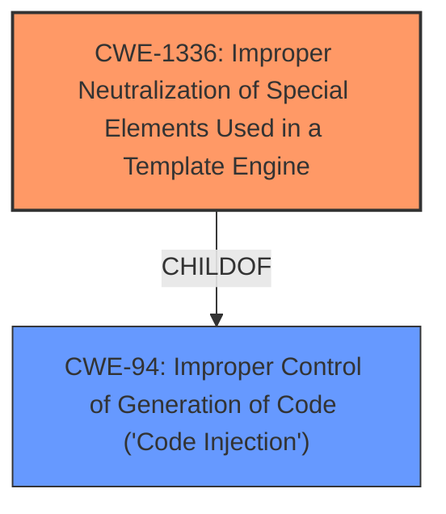

# Enhanced Analysis for CVE-2021-45116

# Summary
| CWE ID | CWE Name | Confidence | CWE Abstraction Level | CWE Vulnerability Mapping Label | CWE-Vulnerability Mapping Notes |
|---|---|---|---|---|---|
| CWE-1336 | Improper Neutralization of Special Elements Used in a Template Engine | 0.8 | Base | Allowed | Primary CWE |

## Evidence and Confidence

*   **Confidence Score:** 0.8
*   **Evidence Strength:** HIGH

## Relationship Analysis
The primary CWE selected is CWE-1336, which is a Base level CWE. It is related to CWE-94 (Improper Control of Generation of Code ('Code Injection')), as it is a child of CWE-94. This means that CWE-1336 is a more specific type of code injection that occurs within a template engine. The relationship indicates that the vulnerability involves the injection of special elements into a template engine, leading to potential code execution or information disclosure.



## Vulnerability Chain
The vulnerability chain starts with the **improper neutralization** of special elements used in a template engine (CWE-1336). This leads to the potential for information disclosure or unintended method calls, as mentioned in the vulnerability description. The chain can be summarized as follows:

1.  **Root Cause:** Improper Neutralization of Special Elements in Template Engine (CWE-1336)
2.  **Impact:** Information Disclosure, Unintended Method Calls

## Summary of Analysis
The analysis is based on the provided evidence, which includes the vulnerability description and the CVE reference links content summary. The vulnerability description states that the `dictsort` template filter in Django is vulnerable to information disclosure or unintended method calls due to leveraging the Django Template Languages variable resolution logic. The CVE reference links content summary confirms that the vulnerability stems from the `dictsort` template filter leveraging Django Template Language's variable resolution logic and the lack of proper input validation and sanitization.

The retriever results list CWE-1336 as the top candidate, with a score of 0.333. The CWE description matches the vulnerability description, as it states that the product uses a template engine to insert or process externally-influenced input, but it does not neutralize or incorrectly neutralizes special elements or syntax that can be interpreted as template expressions or other code directives when processed by the engine. The mapping guidance for CWE-1336 states that it is a Base level CWE and that the usage is Allowed.

The selected CWE is at the optimal level of specificity, as it accurately represents the weakness described in the vulnerability description. The vulnerability involves the injection of special elements into a template engine, which is exactly what CWE-1336 describes.

Relevant CWE Information:

# Enhanced Context (25 CWEs)
The following CWEs were identified as potentially relevant to this vulnerability:

## CWE-1336: Improper Neutralization of Special Elements Used in a Template Engine
**Abstraction Level**: Base
**Similarity Score**: 0.333
**Source**: sparse

**Description**:
The product uses a template engine to insert or process externally-influenced input, but it does not neutralize or incorrectly neutralizes special elements or syntax that can be interpreted as template expressions or other code directives when processed by the engine.

**Mapping Guidance**:
- Usage: Allowed
- Rationale: This CWE entry is at the Base level of abstraction, which is a preferred level of abstraction for mapping to the root causes of vulnerabilities.

### Supporting Evidence

*   **Vulnerability Description Key Phrases:** "**rootcause:** **leverage the Django Template Languages variable resolution logic**"
*   **CVE Reference Links Content Summary:** "The `dictsort` filter was vulnerable to information disclosure and unintended method calls when passed a specially crafted key due to how it resolved variables. This suggests a **lack of proper input validation** and sanitization within the template filter's variable resolution logic."

### Additional Considerations
CWE-79 (Improper Neutralization of Input During Web Page Generation ('Cross-site Scripting')) and CWE-917 (Improper Neutralization of Special Elements used in an Expression Language Statement ('Expression Language Injection')) were considered, but they were not selected because they are not as specific as CWE-1336. CWE-79 is a more general weakness that involves the improper neutralization of input during web page generation, while CWE-917 is specific to expression language injection. The vulnerability in question involves the injection of special elements into a template engine, which is best described by CWE-1336.


## CWE Relationship Analysis

Current CWEs represent these abstraction levels: .


### Vulnerability Chain Analysis

**Chain starting from CWE-79:**
- 79 (Improper Neutralization of Input During Web Page Generation ('Cross-site Scripting')) - ROOT


**Chain starting from CWE-94:**
- 94 (Improper Control of Generation of Code ('Code Injection')) - ROOT


### CWE Relationship Diagram

```mermaid
graph TD
    classDef primary fill:#f96,stroke:#333,stroke-width:2px
    classDef secondary fill:#69f,stroke:#333
    classDef tertiary fill:#9e9,stroke:#333
```