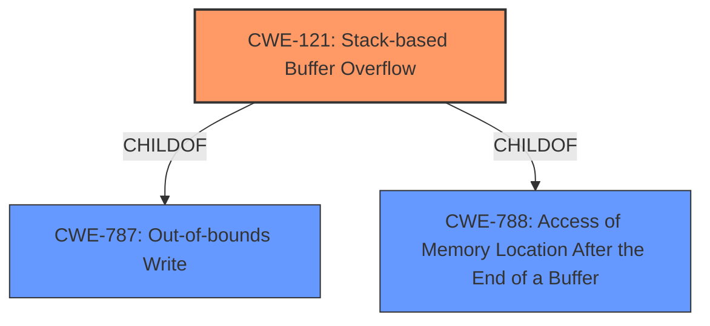

# Enhanced Analysis for CVE-2021-45258

# Summary
| CWE ID  | CWE Name                    | Confidence | CWE Abstraction Level | CWE Vulnerability Mapping Label | CWE-Vulnerability Mapping Notes |
| :-------- | :-------------------------- | :--------- | :-------------------- | :------------------------------ | :------------------------------ |
| CWE-121   | Stack-based Buffer Overflow | 1.0        | Variant               | Primary                         | Allowed                         |

## Evidence and Confidence

*   **Confidence Score:** 1.0
*   **Evidence Strength:** HIGH

## Relationship Analysis
The primary relationship identified is that CWE-121 (Stack-based Buffer Overflow) is a variant (more specific type) of CWE-787 (Out-of-bounds Write) and CWE-788. The vulnerability description specifically mentions a **stack overflow**, making CWE-121 the most appropriate and specific choice.



## Vulnerability Chain
The vulnerability chain is straightforward:

1.  Root Cause: **Stack overflow** in the `gf_bifs_dec_proto_list` function.
2.  Impact: Segmentation fault and application crash.

## Summary of Analysis
The analysis is based on the provided evidence which includes the vulnerability description and the CVE reference summary. The vulnerability description explicitly states that a **stack overflow** exists in the `gf_bifs_dec_proto_list` function. The CVE reference summary confirms this by stating that the root cause is a **stack overflow** and the impact is a segmentation fault and application crash.

The graph relationships confirm that CWE-121 is a specific type of out-of-bounds write, making it the most appropriate choice.

The selection of CWE-121 is at the optimal level of specificity because it directly reflects the nature of the vulnerability as a **stack overflow**.

Relevant CWE Information:

# Enhanced Context (25 CWEs)

## CWE-121: Stack-based Buffer Overflow
**Abstraction:** Variant
**Status:** Draft

### Description
A stack-based buffer overflow condition is a condition where the buffer being overwritten is allocated on the stack (i.e., is a local variable or, rarely, a parameter to a function).

### Mapping Guidance
**Usage:** Allowed
**Rationale:** This CWE entry is at the Variant level of abstraction, which is a preferred level of abstraction for mapping to the root causes of vulnerabilities.

**Technical Explanation:**
The vulnerability is a **stack overflow** due to improper handling of data within the `gf_bifs_dec_proto_list()` function. This matches the CWE-121 description, which defines a stack-based buffer overflow as a condition where a buffer on the stack is overwritten.
**Security Implications:**
A stack-based buffer overflow can allow an attacker to overwrite return addresses, function pointers, or other critical data on the stack, leading to arbitrary code execution. In this case, the immediate impact is a segmentation fault and application crash.
**Relationship to Other CWEs:**
CWE-121 is a variant of CWE-787 (Out-of-bounds Write). This means that it is a specific type of out-of-bounds write that occurs on the stack.
**Primary/Secondary:**
CWE-121 is the primary weakness.
**MITRE Mapping Guidance:**
The MITRE mapping guidance allows for the use of CWE-121 and states that it is at the Variant level of abstraction, which is preferred.

**CWEs Considered but Not Used and Why:**

*   **CWE-190 (Integer Overflow or Wraparound):** While integer overflows can sometimes lead to buffer overflows, the description does not suggest any integer overflow issues. The direct cause is a **stack overflow**, not an integer overflow.
*   **CWE-125 (Out-of-bounds Read):** The vulnerability is a **stack overflow**, which involves writing past the end of a buffer, not reading.
*   **CWE-674 (Uncontrolled Recursion):** The vulnerability description does not mention uncontrolled recursion.
*   **CWE-770 (Allocation of Resources Without Limits or Throttling):** The vulnerability description does not mention any resource allocation issues.
*   **CWE-122 (Heap-based Buffer Overflow):** The vulnerability is specifically a **stack overflow**, not a heap overflow.
*   **CWE-128 (Wrap-around Error):** Similar to integer overflow, this is not the direct cause of the **stack overflow**.
*   **CWE-119 (Improper Restriction of Operations within the Bounds of a Memory Buffer):** This is a more general class of weakness. CWE-121 is a more specific variant that better describes the vulnerability.
*   **CWE-197 (Numeric Truncation Error):** The vulnerability description does not suggest any numeric truncation errors.
*   **CWE-1284 (Improper Validation of Specified Quantity in Input):** There is no indication of improper validation of input quantities in the description.


## CWE Relationship Analysis

Current CWEs represent these abstraction levels: .


### Vulnerability Chain Analysis

**Chain starting from CWE-190:**
- 190 (Integer Overflow or Wraparound) - ROOT


**Chain starting from CWE-121:**
- 121 (Stack-based Buffer Overflow) - ROOT


### CWE Relationship Diagram

```mermaid
graph TD
    classDef primary fill:#f96,stroke:#333,stroke-width:2px
    classDef secondary fill:#69f,stroke:#333
    classDef tertiary fill:#9e9,stroke:#333
```