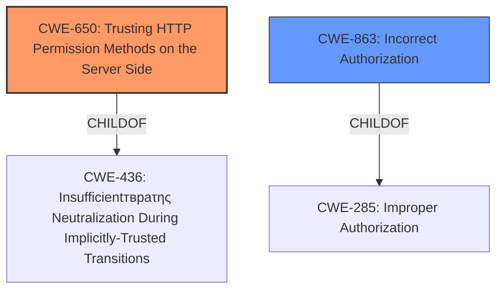

# Analysis for CVE-2021-45327

# Summary
| CWE ID | CWE Name | Confidence | CWE Abstraction Level | CWE Vulnerability Mapping Label | CWE-Vulnerability Mapping Notes |
|---|---|---|---|---|---|
| CWE-650 | Trusting HTTP Permission Methods on the Server Side | 0.9 | Variant | Allowed | Primary CWE |
| CWE-863 | Incorrect Authorization | 0.7 | Class | Allowed-with-Review | Secondary Candidate |

## Evidence and Confidence

*   **Confidence Score:** 0.8
*   **Evidence Strength:** HIGH

## Relationship Analysis
The primary CWE, CWE-650, is a Variant of CWE-436 (Insufficientтвраτης Neutralization During Implicitly-Trusted Transitions). This means that CWE-650 represents a specific case of a broader class of vulnerabilities where an application trusts certain transitions or actions without proper validation or authorization.

CWE-863 is a Class-level CWE, which means it's a higher-level categorization. It describes a situation where authorization checks are performed, but they are done incorrectly. CWE-863 is a child of CWE-285 (Improper Authorization), further highlighting the hierarchical relationship.

The selection of CWE-650 as the primary CWE is based on its specificity to the vulnerability description, which explicitly mentions "Trusting HTTP Permission Methods on the Server Side".

## Vulnerability Chain
The vulnerability chain starts with the **Trusting HTTP Permission Methods on the Server Side** (CWE-650), leading to potential **Incorrect Authorization** (CWE-863) and ultimately resulting in arbitrary code execution. The initial flaw is the server's assumption that HTTP GET requests are safe and don't cause state changes. This leads to the system not properly checking permissions, and finally allows a malicious user to execute arbitrary code.

## Summary of Analysis
The initial analysis focused on identifying the root cause of the vulnerability and mapping it to the most appropriate CWE. The vulnerability description clearly states the issue of **Trusting HTTP Permission Methods on the Server Side**, which directly corresponds to CWE-650. The CVE Reference Links Content Summary further confirms this by highlighting the use of GET requests for actions that should have used POST requests, making the application susceptible to CSRF attacks.

The retriever results also support this mapping, with CWE-650 being the top combined result.

CWE-863 (Incorrect Authorization) was considered as a secondary CWE because the trusting of HTTP methods leads to authorization checks being bypassed or performed incorrectly.

The selection of CWE-650 is based on direct evidence from the vulnerability description and supporting evidence from the CVE Reference Links Content Summary. The hierarchical relationship analysis further confirms that CWE-650 is the most specific and appropriate CWE for this vulnerability.

The confidence in this assessment is high due to the clear and explicit evidence provided in the vulnerability description and supporting documentation. The selected CWEs are at the optimal level of specificity, with CWE-650 being a Variant and CWE-863 being a Class.