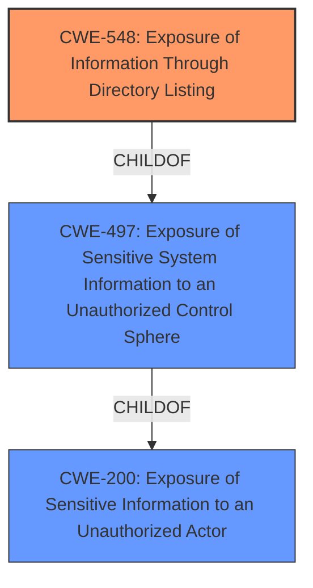

# Analysis Report for CVE-2021-45421

# Vulnerability Analysis Report: CVE-2021-45421

## Description


## Analysis (with Relationship Data)

# Summary
| CWE ID | CWE Name | Confidence | CWE Abstraction Level | CWE Vulnerability Mapping Label | CWE-Vulnerability Mapping Notes |
|---|---|---|---|---|---|
| CWE-548 | Exposure of Information Through Directory Listing | 1.0 | Variant | Allowed | Primary CWE |
| CWE-200 | Exposure of Sensitive Information to an Unauthorized Actor | 0.7 | Class | Discouraged | Secondary Candidate |

## Evidence and Confidence

*   **Confidence Score:** 0.9
*   **Evidence Strength:** HIGH

## Relationship Analysis
The primary CWE is CWE-548, which is a variant of CWE-497 (Exposure of Sensitive System Information to an Unauthorized Control Sphere), which in turn is a child of CWE-200 (Exposure of Sensitive Information to an Unauthorized Actor). This indicates a hierarchical relationship where CWE-548 is the most specific and appropriate choice.



## Vulnerability Chain
The chain of events is as follows: The web server is misconfigured, leading to directory listing being enabled, which results in information disclosure. The root cause is the misconfiguration, and the impact is information disclosure.

## Summary of Analysis
The initial analysis correctly identified the **information disclosure via directory listing** as the core issue. The evidence from the "CVE Reference Links Content Summary" confirms this, stating, "The web server is configured to allow directory listing, which exposes the file structure of the server," and "CWE-548: Exposure of Information Through Directory Listing. The webserver lists the files present in the directories."

CWE-548 is the most specific CWE that accurately describes the vulnerability, as it directly addresses the exposure of information through directory listing. CWE-200 is too general, and while related, doesn't pinpoint the specific mechanism of exposure. The relationship analysis reinforces this, with CWE-548 being a variant of more general CWEs. The choice of CWE-548 is at the optimal level of specificity, aligning with the provided evidence and the goal of identifying the most precise root cause.

Relevant CWE Information:

# Enhanced Context (25 CWEs)
The following CWEs were identified as potentially relevant to this vulnerability:

## CWE-668: Exposure of Resource to Wrong Sphere
**Abstraction Level**: Class
**Similarity Score**: 0.78
**Source**: dense

**Description**:
The product exposes a resource to the wrong control sphere, providing unintended actors with inappropriate access to the resource.

**Mapping Guidance**:
- Usage: Discouraged
- Rationale: CWE-668 is high-level and is often misused as a catch-all when lower-level CWE IDs might be applicable. It is sometimes used for low-information vulnerability reports [REF-1287]. It is a level-1 Class (i.e., a child of a Pillar). It is not useful for trend analysis.

## CWE-548: Exposure of Information Through Directory Listing
**Abstraction Level:** Variant
**Status:** Draft

### Description
A directory listing is inappropriately exposed, yielding potentially sensitive information to attackers.

### Extended Description
A directory listing provides an attacker with the complete index of all the resources located inside of the directory. The specific risks and consequences vary depending on which files are listed and accessible.

### Alternative Terms
None

### Relationships
ChildOf -> CWE-497

### Mapping Guidance
**Usage:** Allowed
**Rationale:** This CWE entry is at the Variant level of abstraction, which is a preferred level of abstraction for mapping to the root causes of vulnerabilities.
**Comments:** Carefully read both the name and description to ensure that this mapping is an appropriate fit. Do not try to 'force' a mapping to a lower-level Base/Variant simply to comply with this preferred level of abstraction.
**Reasons:**
- Acceptable-Use

### Final Conclusion:
The vulnerability is best described by CWE-548 (Confidence: 1.0). CWE-200 was considered but deemed too general (Confidence: 0.7).

---
Here's the technical explanation for each selected CWE:

*   **CWE-548: Exposure of Information Through Directory Listing**
    *   **Match:** The vulnerability description explicitly states that the product is affected by **information disclosure via directory listing**. This aligns perfectly with the description of CWE-548, which is "A directory listing is inappropriately exposed, yielding potentially sensitive information to attackers."
    *   **Security Implications:** Attackers can gain access to the server's directory structure, potentially revealing sensitive files and information that can be used for further exploitation.
    *   **Relationships:** CWE-548 is a variant of CWE-497 (Exposure of Sensitive System Information to an Unauthorized Control Sphere), indicating a hierarchical relationship.
    *   **Mapping Guidance:** The usage is "Allowed," and the rationale states that it is at the Variant level of abstraction, which is preferred.
    *   **Primary/Secondary:** This is the primary CWE because it directly describes the vulnerability.

*   **CWE-200: Exposure of Sensitive Information to an Unauthorized Actor**
    *   **Match:** While the vulnerability results in **information disclosure**, CWE-200 is a more general category. The "CVE Reference Links Content Summary" mentions that the directory listing "can aid in finding other potential exploitation vectors," which could lead to the exposure of sensitive information.
    *   **Security Implications:** Sensitive information can be exposed to unauthorized actors, leading to potential data breaches or further attacks.
    *   **Relationships:** CWE-200 is a class-level CWE, and CWE-548 is a more specific child through CWE-497.
    *   **Mapping Guidance:** The usage is "Discouraged" because it's too general and there are more specific options available.
    *   **Primary/Secondary:** This is a secondary CWE because it describes the general impact but not the root cause.


## CWE Relationship Analysis

Current CWEs represent these abstraction levels: .


### Vulnerability Chain Analysis

**Chain starting from CWE-548:**
- 548 (Exposure of Information Through Directory Listing) - ROOT


**Chain starting from CWE-200:**
- 200 (Exposure of Sensitive Information to an Unauthorized Actor) - ROOT


### CWE Relationship Diagram

```mermaid
graph TD
    classDef primary fill:#f96,stroke:#333,stroke-width:2px
    classDef secondary fill:#69f,stroke:#333
    classDef tertiary fill:#9e9,stroke:#333
```


*Report generated on 2025-03-31 04:06:07*
