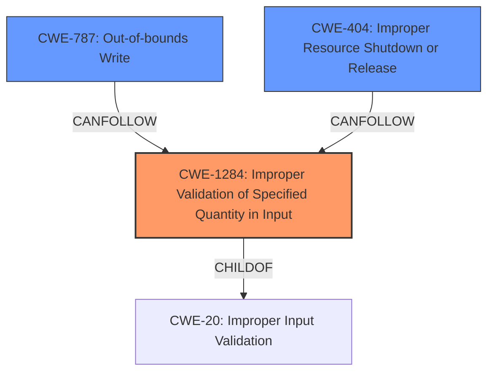

# Analysis for CVE-2021-45462

# Summary
| CWE ID | CWE Name | Confidence | CWE Abstraction Level | CWE Vulnerability Mapping Label | CWE-Vulnerability Mapping Notes |
|---|---|---|---|---|---|
| CWE-1284 | Improper Validation of Specified Quantity in Input | 0.9 | Base | Allowed | Primary CWE |
| CWE-787 | Out-of-bounds Write | 0.6 | Base | Allowed | Secondary Candidate |
| CWE-404 | Improper Resource Shutdown or Release | 0.4 | Class | Allowed-with-Review | Secondary Candidate |

## Evidence and Confidence

*   **Confidence Score:** 0.7
*   **Evidence Strength:** HIGH

## Relationship Analysis
The primary CWE selected is CWE-1284, which indicates a **lack of validation of input**. This is a base level CWE and accurately reflects the **root cause** described in the vulnerability. CWE-787 is a potential child of CWE-119, which describes improper restriction of operations within the bounds of a memory buffer, and is a potential result of the **insufficient input validation** from CWE-1284. CWE-404 is a more general class of weakness, and may be appropriate if the crash is due to improper resource release.

## Vulnerability Chain
The vulnerability chain starts with **improper input validation** (**CWE-1284**), leading to a crash. The crafted packet with a zero-length field bypasses sanity checks. This can cause a denial-of-service (**impact**), which may be triggered by the **improper resource shutdown or release** (**CWE-404**) of the user plane function. It is possible the **insufficient input validation** may lead to an **out-of-bounds write** (**CWE-787**).

## Summary of Analysis
The initial assessment strongly points to **CWE-1284 (Improper Validation of Specified Quantity in Input)** as the primary weakness. This is supported by the CVE Reference Links Content Summary, which explicitly states, "The primary weakness is the failure to properly validate the length field in the GTP-U header." The crafted packet is a vector, and the **lack of validation** is the **root cause**. The **impact** is the crash, and this may be due to **improper resource release** or **out-of-bounds write**.

The selection of CWE-1284 is based on the evidence that the software **fails to validate the length** of the GTP-U packet. This aligns directly with the CWE description: "The product receives input that is expected to specify a quantity (such as size or length), but it does not validate or incorrectly validates that the quantity has the required properties."

The graph relationships show that CWE-1284 is a child of CWE-20 (Improper Input Validation), making it a more specific and appropriate choice.

Other CWEs were considered but deemed less suitable:

*   CWE-787 (Out-of-bounds Write): This is a potential consequence of the **improper input validation**, but not the root cause itself. It's possible the crash occurs because a write goes out of bounds, but that is not explicitly stated.
*   CWE-404 (Improper Resource Shutdown or Release): The crash may be a result of a resource being improperly released. However, it is not the root cause.
*   CWE-476 (NULL Pointer Dereference): It's possible the invalid length leads to a NULL pointer, but that is not explicitly stated.
*   CWE-190 (Integer Overflow or Wraparound): The length field could cause an integer overflow, but not explicitly stated.

The chosen CWE is at the optimal level of specificity because it directly addresses the root cause (lack of input validation). A more general CWE like CWE-20 would be too broad, while a more specific CWE like CWE-787 would focus on a potential consequence rather than the underlying problem.