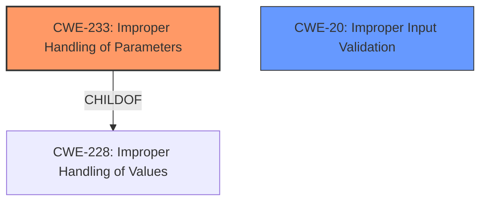

# Analysis for CVE-2021-45477

# Summary
| CWE ID | CWE Name | Confidence | CWE Abstraction Level | CWE Vulnerability Mapping Label | CWE-Vulnerability Mapping Notes |
|---|---|---|---|---|---|
| CWE-233 | Improper Handling of Parameters | 0.8 | Base | Allowed | Primary CWE |
| CWE-20 | Improper Input Validation | 0.5 | Class | Discouraged | Secondary Candidate |

## Evidence and Confidence

*   **Confidence Score:** 0.8
*   **Evidence Strength:** MEDIUM

## Relationship Analysis
The primary CWE, CWE-233, is a Base level weakness and a child of CWE-228. CWE-20 is a Class level weakness, and is often misused when lower-level CWEs could be used instead.

## Vulnerability Chain
The vulnerability chain starts with **Improper Handling of Parameters** (CWE-233), which leads to the ability to collect data as provided by users.

## Summary of Analysis
The initial analysis strongly points towards CWE-233 as the primary weakness due to the vulnerability description highlighting "**Improper Handling of Parameters**" as the root cause. The description states "Collect Data as Provided by Users" is the impact.
The retriever results also list CWE-233 as the top candidate CWE.

The Complete CWE Specifications for CWE-233 states "The product does not properly handle when the expected number of parameters, fields, or arguments is not provided in input, or if those parameters are undefined."
The Complete CWE Specifications for CWE-20 states "The product receives input or data, but it does not validate or incorrectly validates that the input has the properties that are required to process the data safely and correctly."

CWE-233 is a more direct match for the stated root cause "**Improper Handling of Parameters**". CWE-20 is too general and the mapping guidance discourages its use. Therefore, I am selecting CWE-233 as the primary CWE.

Relevant CWE Information:

# Enhanced Context (25 CWEs)

## CWE-233: Improper Handling of Parameters
**Abstraction:** Base
**Status:** Incomplete

### Description
The product does not properly handle when the expected number of parameters, fields, or arguments is not provided in input, or if those parameters are undefined.

### Extended Description
Not provided

### Alternative Terms
None

### Relationships
ChildOf -> CWE-228

### Mapping Guidance
**Usage:** Allowed
**Rationale:** This CWE entry is at the Base level of abstraction, which is a preferred level of abstraction for mapping to the root causes of vulnerabilities.
**Comments:** Carefully read both the name and description to ensure that this mapping is an appropriate fit. Do not try to 'force' a mapping to a lower-level Base/Variant simply to comply with this preferred level of abstraction.
**Reasons:**
- Acceptable-Use