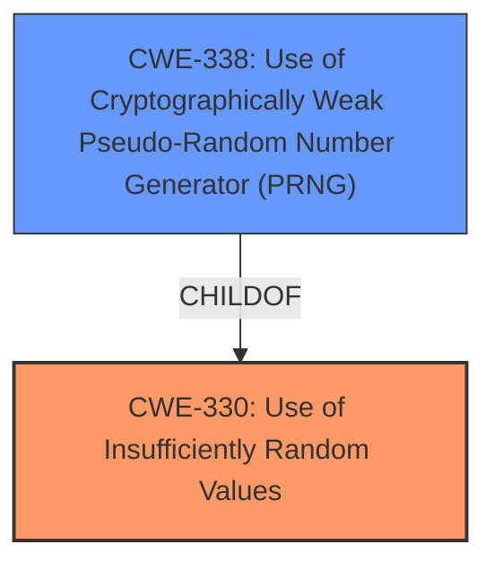

# Enhanced Analysis for CVE-2021-45488

# Summary
| CWE ID | CWE Name | Confidence | CWE Abstraction Level | CWE Vulnerability Mapping Label | CWE-Vulnerability Mapping Notes |
|---|---|---|---|---|---|
| CWE-330 | Use of Insufficiently Random Values | 0.9 | Class | Primary | Allowed |
| CWE-338 | Use of Cryptographically Weak Pseudo-Random Number Generator (PRNG) | 0.8 | Base | Secondary | Allowed |

## Evidence and Confidence

*   **Confidence Score:** 0.9
*   **Evidence Strength:** HIGH

## Relationship Analysis
The primary CWE selected is CWE-330 (Use of Insufficiently Random Values), which is a Class-level CWE. A more specific Base-level CWE, CWE-338 (Use of Cryptographically Weak Pseudo-Random Number Generator (PRNG)), was also considered and included as a secondary CWE. CWE-338 is a child of CWE-330, representing a more specific case of the general weakness.



## Vulnerability Chain
The vulnerability chain starts with the **weakness** in the TCP ISN generation algorithm, specifically the **use of insufficiently random values**. This leads to an **information leak**, which is the impact.

## Summary of Analysis
The analysis is based on the provided evidence, which includes the vulnerability description and the CVE reference links content summary.

The "Vulnerability Description Key Phrases" section highlights the component (**TCP ISN (ISS) generation algorithm**) and the impact (**information leak**).

The "CVE Reference Links Content Summary" provides more details about the root cause: "IP ID randomization was not enabled by default and the randomization algorithms were not strong enough. The TCP ISS random generation had an information leak." The weaknesses listed include "Weak randomization algorithms" and "Information leak in TCP ISS random generation."

The Retriever Results list CWE-330 (Use of Insufficiently Random Values) and CWE-338 (Use of Cryptographically Weak Pseudo-Random Number Generator (PRNG)) as the top candidates.

CWE-330 is a Class-level CWE, and its description matches the vulnerability: "The product uses insufficiently random numbers or values in a security context that depends on unpredictable numbers." The "Mapping Guidance" for CWE-330 suggests examining its children for a better fit.

CWE-338 is a Base-level CWE and a child of CWE-330. Its description is "The product uses a Pseudo-Random Number Generator (PRNG) in a security context, but the PRNG's algorithm is not cryptographically strong." This is a more specific case of CWE-330 and is also relevant to the vulnerability.

CWE-340 (Generation of Predictable Numbers or Identifiers) was considered but deemed less appropriate than CWE-330 because the issue is not just predictable numbers, but the use of insufficiently random numbers. The description for CWE-330 fits the vulnerability description and the root cause in "CVE Reference Links Content Summary" better.

The selected CWEs are at an appropriate level of specificity. CWE-330 represents the general **weakness**, while CWE-338 identifies the specific type of **weakness** in the PRNG.

Relevant CWE Information:

# Enhanced Context (25 CWEs)
The following CWEs were identified as potentially relevant to this vulnerability:

## CWE-330: Use of Insufficiently Random Values
**Abstraction Level**: Class
**Similarity Score**: 0.78
**Source**: dense

**Description**:
The product uses insufficiently random numbers or values in a security context that depends on unpredictable numbers.

**Mapping Guidance**:
- Usage: Discouraged
- Rationale: This CWE entry is a level-1 Class (i.e., a child of a Pillar). It might have lower-level children that would be more appropriate

## CWE-338: Use of Cryptographically Weak Pseudo-Random Number Generator (PRNG)
**Abstraction Level**: Base
**Similarity Score**: 6431.29
**Source**: sparse

**Description**:
The product uses a Pseudo-Random Number Generator (PRNG) in a security context, but the PRNG's algorithm is not cryptographically strong.

**Mapping Guidance**:
- Usage: Allowed
- Rationale: This CWE entry is at the Base level of abstraction, which is a preferred level of abstraction for mapping to the root causes of vulnerabilities.

## CWE-340: Generation of Predictable Numbers or Identifiers
**Abstraction Level**: Class
**Similarity Score**: 6122.11
**Source**: sparse

**Description**:
The product uses a scheme that generates numbers or identifiers that are more predictable than required.

**Mapping Guidance**:
- Usage: Allowed-with-Review
- Rationale: This CWE entry is a Class and might have Base-level children that would be more appropriate


## CWE Relationship Analysis

Current CWEs represent these abstraction levels: .


### Vulnerability Chain Analysis

**Chain starting from CWE-340:**
- 340 (Generation of Predictable Numbers or Identifiers) - ROOT


**Chain starting from CWE-338:**
- 338 (Use of Cryptographically Weak Pseudo-Random Number Generator (PRNG)) - ROOT


### CWE Relationship Diagram

```mermaid
graph TD
    classDef primary fill:#f96,stroke:#333,stroke-width:2px
    classDef secondary fill:#69f,stroke:#333
    classDef tertiary fill:#9e9,stroke:#333
```