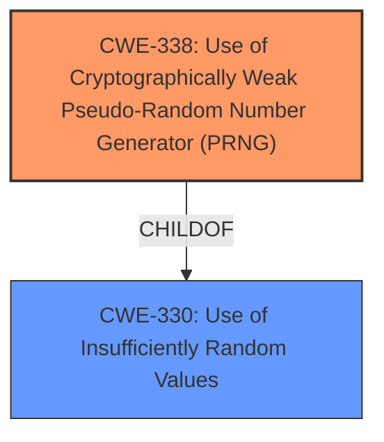

# Enhanced Analysis for CVE-2021-45489

# Summary
| CWE ID | CWE Name | Confidence | CWE Abstraction Level | CWE Vulnerability Mapping Label | CWE-Vulnerability Mapping Notes |
|---|---|---|---|---|---|
| CWE-338 | Use of Cryptographically Weak Pseudo-Random Number Generator (PRNG) | 1.0 | Base | Primary | Allowed |
| CWE-330 | Use of Insufficiently Random Values | 0.7 | Class | Secondary | Discouraged |

## Evidence and Confidence

*   **Confidence Score:** 0.9
*   **Evidence Strength:** HIGH

## Relationship Analysis
The primary CWE is CWE-338, which is a Base level CWE, a child of CWE-330. The vulnerability description clearly states a **weak cryptographic PRNG** is used, making CWE-338 the most specific and appropriate choice. While CWE-330 is a parent Class of CWE-338, it's less specific and therefore a secondary consideration.



## Vulnerability Chain
The chain of events is as follows:
1.  Root Cause: **Weak cryptographic PRNG** (CWE-338)
2.  Impact: Predictable IPv6 Flow Labels, leading to potential data exfiltration.

## Summary of Analysis
The initial assessment, based on the vulnerability description and retriever results, strongly indicates CWE-338 as the primary weakness. The description mentions a **weak cryptographic PRNG**, aligning perfectly with CWE-338's definition. The "CVE Reference Links Content Summary" further supports this by stating the IPv6 flow label generation algorithm was weak.

The retriever results list CWE-338 as the top combined result, further reinforcing the selection. The relationship analysis confirms that CWE-338 is a child of CWE-330, making it a more specific and preferred choice.

I am confident in this assessment because it is supported by the vulnerability description, key phrases, CVE reference summary, and retriever results.

Relevant CWE Information:

*   **CWE-338: Use of Cryptographically Weak Pseudo-Random Number Generator (PRNG)**
    *   The product uses a Pseudo-Random Number Generator (PRNG) in a security context, but the PRNG's algorithm is not cryptographically strong.
    *   This aligns perfectly with the vulnerability description stating a **weak cryptographic PRNG** is used.
    *   The security implication is that the generated numbers are predictable, weakening the security of any cryptographic operations using those numbers.
    *   This is a Base level CWE and a child of CWE-330.
    *   The Mapping Guidance allows this CWE to be used.
*   **CWE-330: Use of Insufficiently Random Values**
    *   The product uses insufficiently random numbers or values in a security context that depends on unpredictable numbers.
    *   This is a Class level CWE and a parent of CWE-338.
    *   While related, it is less specific than CWE-338, as it doesn't explicitly mention a weak PRNG.
    *   The Mapping Guidance discourages its use if a more specific child is available.
*   **CWE-335: Incorrect Usage of Seeds in Pseudo-Random Number Generator (PRNG)** - This was considered, but the evidence doesn't point to incorrect seed usage, but rather the weakness of the PRNG algorithm itself.
*   **CWE-341: Predictable from Observable State** - This was considered, but the vulnerability focuses more on the algorithm's weakness rather than predictability from observable state.
*   **CWE-1240: Use of a Cryptographic Primitive with a Risky Implementation** - This was considered, but CWE-338 more accurately reflects the core issue of a weak PRNG.
*   **CWE-332: Insufficient Entropy in PRNG** - Although related, the description focuses on the weakness of the algorithm, not necessarily insufficient entropy.


## CWE Relationship Analysis

Current CWEs represent these abstraction levels: .


### Vulnerability Chain Analysis

**Chain starting from CWE-335:**
- 335 (Incorrect Usage of Seeds in Pseudo-Random Number Generator (PRNG)) - ROOT


**Chain starting from CWE-330:**
- 330 (Use of Insufficiently Random Values) - ROOT


### CWE Relationship Diagram

```mermaid
graph TD
    classDef primary fill:#f96,stroke:#333,stroke-width:2px
    classDef secondary fill:#69f,stroke:#333
    classDef tertiary fill:#9e9,stroke:#333
```