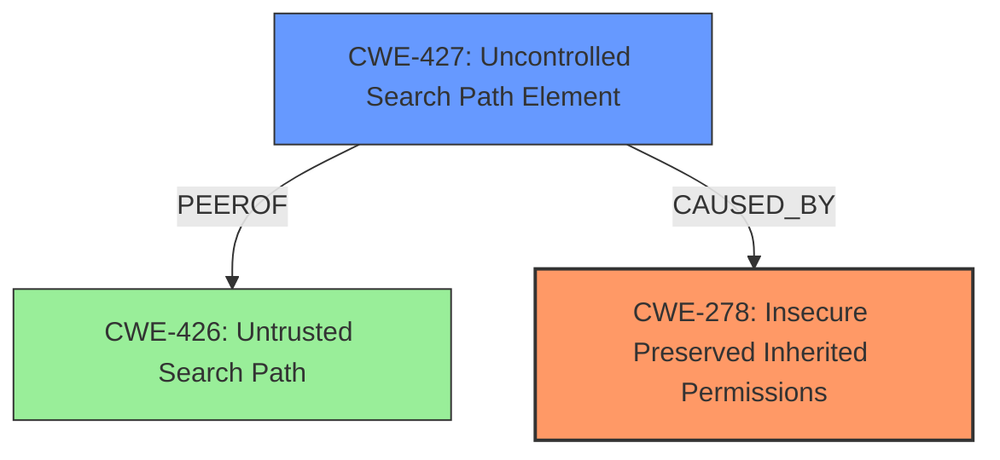

# Analysis for CVE-2021-45492

```markdown
# Summary
| CWE ID    | CWE Name                                                                 | Confidence | CWE Abstraction Level | CWE Vulnerability Mapping Label | CWE-Vulnerability Mapping Notes |
| --------- | ------------------------------------------------------------------------ | ---------- | --------------------- | ------------------------------- | ------------------------------- |
| CWE-278   | Insecure Preserved Inherited Permissions                                 | 1.0        | Variant               | Primary                         | Allowed                       |
| CWE-427   | Uncontrolled Search Path Element                                         | 0.9        | Base                  | Secondary                       | Allowed                       |

## Evidence and Confidence

*   **Confidence Score:** 0.95
*   **Evidence Strength:** HIGH

## Relationship Analysis
The primary weakness is the **insecure preservation of inherited permissions**, which directly leads to **uncontrolled search path** issues and **DLL hijacking**.



## Vulnerability Chain
The vulnerability chain starts with the **failure to set explicit permissions** during installation, leading to **insecure inherited permissions** on the `C:\Sage\Sage300\Runtime` directory. This directory's presence as the first entry in the system-wide PATH allows unprivileged users to perform **DLL search-order hijacking**, ultimately resulting in **privilege escalation** to SYSTEM.

## Summary of Analysis
The analysis is based on the provided vulnerability description and the associated keyphrases. The primary root cause is the **failure to set explicit permissions**, resulting in **CWE-278: Insecure Preserved Inherited Permissions**. The location of the directory in the system PATH allows for **CWE-427: Uncontrolled Search Path Element**, facilitating **DLL hijacking** and **privilege escalation**.

The vulnerability description explicitly states that the installer **fails to set explicit permissions**, leading to the directory inheriting weak permissions. This aligns directly with **CWE-278**: "In Sage 300 ERP (formerly accpac) through 6.8.x, the installer configures the C\Sage\Sage300\Runtime directory to be the first entry in the system-wide PATH environment variable. However, this directory is writable by unprivileged users because the Sage installer **fails to set explicit permissions** and therefore inherits weak permissions from the C\ folder."

The secondary weakness, **CWE-427**, is chosen because the inherited insecure permissions on the directory in the system PATH allow attackers to introduce malicious DLLs. The vulnerability description states: "Because entries in the system-wide PATH variable are included in the search order for DLLs, an attacker could perform **DLL search-order hijacking** to escalate their privileges to SYSTEM."

I considered several other CWEs, including **CWE-732: Incorrect Permission Assignment for Critical Resource**, but it was rejected because the vulnerability is not about explicitly assigning incorrect permissions, but about **failing to set explicit permissions** and inheriting insecure ones.

**CWE-276: Incorrect Default Permissions** was also considered, but the issue isn't simply about default permissions; it's about the insecure inheritance due to the **failure to set explicit permissions**.

Relevant CWE Information:

# Enhanced Context (25 CWEs)
The following CWEs were identified as potentially relevant to this vulnerability:

## CWE-427: Uncontrolled Search Path Element
**Abstraction Level**: Base
**Similarity Score**: 0.75
**Source**: dense

**Description**:
The product uses a fixed or controlled search path to find resources, but one or more locations in that path can be under the control of unintended actors.

**Mapping Guidance**:
- Usage: Allowed
- Rationale: This CWE entry is at the Base level of abstraction, which is a preferred level of abstraction for mapping to the root causes of vulnerabilities.


## CWE-278: Insecure Preserved Inherited Permissions
**Abstraction Level**: Variant
**Similarity Score**: 0.74
**Source**: dense

**Description**:
A product inherits a set of insecure permissions for an object, e.g. when copying from an archive file, without user awareness or involvement.

**Mapping Guidance**:
- Usage: Allowed
- Rationale: This CWE entry is at the Variant level of abstraction, which is a preferred level of abstraction for mapping to the root causes of vulnerabilities.


## CWE-276: Incorrect Default Permissions
**Abstraction Level**: Base
**Similarity Score**: 0.73
**Source**: dense

**Description**:
During installation, installed file permissions are set to allow anyone to modify those files.

**Mapping Guidance**:
- Usage: Allowed
- Rationale: This CWE entry is at the Base level of abstraction, which is a preferred level of abstraction for mapping to the root causes of vulnerabilities.


## CWE-266: Incorrect Privilege Assignment
**Abstraction Level**: Base
**Similarity Score**: 0.73
**Source**: dense

**Description**:
A product incorrectly assigns a privilege to a particular actor, creating an unintended sphere of control for that actor.

**Mapping Guidance**:
- Usage: Allowed
- Rationale: This CWE entry is at the Base level of abstraction, which is a preferred level of abstraction for mapping to the root causes of vulnerabilities.


## CWE-668: Exposure of Resource to Wrong Sphere
**Abstraction Level**: Class
**Similarity Score**: 0.72
**Source**: dense

**Description**:
The product exposes a resource to the wrong control sphere, providing unintended actors with inappropriate access to the resource.

**Mapping Guidance**:
- Usage: Discouraged
- Rationale: CWE-668 is high-level and is often misused as a catch-all when lower-level CWE IDs might be applicable. It is sometimes used for low-information vulnerability reports [REF-1287]. It is a level-1 Class (i.e., a child of a Pillar). It is not useful for trend analysis.


## CWE-267: Privilege Defined With Unsafe Actions
**Abstraction Level**: Base
**Similarity Score**: 0.72
**Source**: dense

**Description**:
A particular privilege, role, capability, or right can be used to perform unsafe actions that were not intended, even when it is assigned to the correct entity.

**Mapping Guidance**:
- Usage: Allowed
- Rationale: This CWE entry is at the Base level of abstraction, which is a preferred level of abstraction for mapping to the root causes of vulnerabilities.


## CWE-59: Improper Link Resolution Before File Access ('Link Following')
**Abstraction Level**: Base
**Similarity Score**: 0.71
**Source**: dense

**Description**:
The product attempts to access a file based on the filename, but it does not properly prevent that filename from identifying a link or shortcut that resolves to an unintended resource.

**Mapping Guidance**:
- Usage: Allowed
- Rationale: This CWE entry is at the Base level of abstraction, which is a preferred level of abstraction for mapping to the root causes of vulnerabilities.


## CWE-280: Improper Handling of Insufficient Permissions or Privileges 
**Abstraction Level**: Base
**Similarity Score**: 0.71
**Source**: dense

**Description**:
The product does not handle or incorrectly handles when it has insufficient privileges to access resources or functionality as specified by their permissions. This may cause it to follow unexpected code paths that may leave the product in an invalid state.

**Mapping Guidance**:
- Usage: Allowed
- Rationale: This CWE entry is at the Base level of abstraction, which is a preferred level of abstraction for mapping to the root causes of vulnerabilities.


## CWE-274: Improper Handling of Insufficient Privileges
**Abstraction Level**: Base
**Similarity Score**: 0.71
**Source**: dense

**Description**:
The product does not handle or incorrectly handles when it has insufficient privileges to perform an operation, leading to resultant weaknesses.

**Mapping Guidance**:
- Usage: Discouraged
- Rationale: This CWE entry could be deprecated in a future version of CWE.


## CWE-497: Exposure of Sensitive System Information to an Unauthorized Control Sphere
**Abstraction Level**: Base
**Similarity Score**: 0.71
**Source**: dense

**Description**:
The product does not properly prevent sensitive system-level information from being accessed by unauthorized actors who do not have the same level of access to the underlying system as the product does.

**Mapping Guidance**:
- Usage: Allowed
- Rationale: This CWE entry is at the Base level of abstraction, which is a preferred level of abstraction for mapping to the root causes of vulnerabilities.


## CWE-278: Insecure Preserved Inherited Permissions
**Abstraction Level**: Variant
**Similarity Score