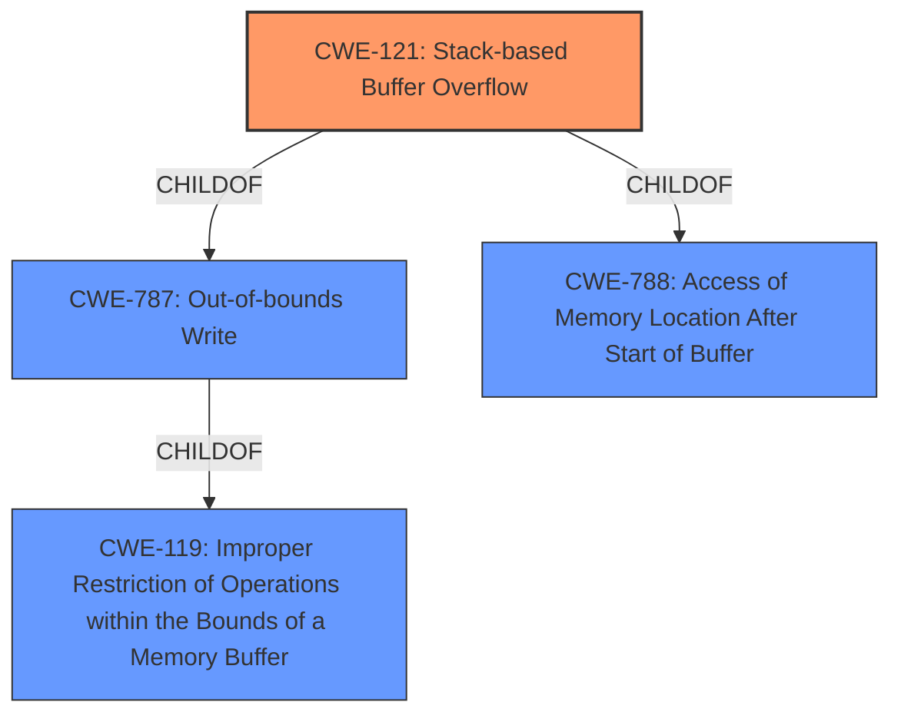

# Raw Analyzer Response for CVE-2021-45604

# Summary
| CWE ID | CWE Name | Confidence | CWE Abstraction Level | CWE Vulnerability Mapping Label | CWE-Vulnerability Mapping Notes |
|---|---|---|---|---|---|
| CWE-121 | Stack-based Buffer Overflow | 1.0 | Variant | Allowed | Primary CWE |
| CWE-119 | Improper Restriction of Operations within the Bounds of a Memory Buffer | 0.7 | Class | Discouraged | Secondary Candidate |

## Evidence and Confidence

*   **Confidence Score:** 1.0
*   **Evidence Strength:** HIGH

## Relationship Analysis
The primary CWE is CWE-121, which is a variant of CWE-787 (Out-of-bounds Write) and CWE-119 (Improper Restriction of Operations within the Bounds of a Memory Buffer). The relationships clearly indicate a hierarchy where CWE-121 is a more specific case of a buffer overflow occurring on the stack.

## Vulnerability Chain
The vulnerability chain starts with the **stack-based buffer overflow** condition and can lead to various impacts such as denial of service.

## Summary of Analysis
The initial analysis strongly suggests CWE-121 (Stack-based Buffer Overflow) as the primary CWE, given the explicit mention of "**stack-based buffer overflow**" in the vulnerability description. The NETGEAR advisory clearly states that the root cause is a **stack-based buffer overflow**, affecting multiple devices. The CVSS score indicates a high impact on availability, suggesting a potential denial-of-service.

CWE-119 (Improper Restriction of Operations within the Bounds of a Memory Buffer) was considered, but the explicit mention of "stack-based" makes CWE-121 a more specific and appropriate choice. While CWE-119 is a parent of CWE-121, the provided evidence clearly points to the stack as the location of the buffer overflow, making CWE-121 the more accurate mapping.

Relevant CWE Information:

# Enhanced Context (25 CWEs)

## Vulnerability Description
Certain NETGEAR devices are affected by a **stack-based buffer overflow** by an authenticated user. This affects CBR750 before 3.2.18.2, D6220 before 1.0.0.68, D6400 before 1.0.0.102, D8500 before 1.0.3.60, LAX20 before 1.1.6.28, MK62 before 1.0.6.116, MR60 before 1.0.6.116, MS60 before 1.0.6.116, R6300v2 before 1.0.4.50, R6400 before 1.0.1.68, R6400v2 before 1.0.4.118, R6700v3 before 1.0.4.118, R6900P before 1.3.3.140, R7000 before 1.0.11.116, R7000P before 1.3.3.140, R7850 before 1.0.5.68, R7900 before 1.0.4.38, R7900P before 1.4.2.84, R7960P before 1.4.2.84, R8000 before 1.0.4.68, R8000P before 1.4.2.84, RAX15 before 1.0.3.96, RAX20 before 1.0.3.96, RAX200 before 1.0.4.120, RAX35v2 before 1.0.3.96, RAX40v2 before 1.0.3.96, RAX43 before 1.0.3.96, RAX45 before 1.0.3.96, RAX50 before 1.0.3.96, RAX75 before 1.0.4.120, RAX80 before 1.0.4.120, RBK752 before 3.2.17.12, RBK852 before 3.2.17.12, RBR750 before 3.2.17.12, RBR850 before 3.2.17.12, RBS750 before 3.2.17.12, RBS850 before 3.2.17.12, RS400 before 1.5.1.80, and XR1000 before 1.0.0.58.

## CWE-121: Stack-based Buffer Overflow
**Explanation:** The vulnerability description clearly states a "**stack-based buffer overflow**". This aligns directly with CWE-121, which specifies a buffer overflow condition where the buffer being overwritten is allocated on the stack. Exploitation can lead to arbitrary code execution or denial of service. The security implications are significant, as an attacker can potentially gain control of the affected device.

## CWE-119: Improper Restriction of Operations within the Bounds of a Memory Buffer
**Explanation:** While CWE-119 is a broader class encompassing buffer overflows, the specific mention of "stack-based" in the vulnerability description makes CWE-121 a more precise mapping. CWE-119 is a parent of CWE-121. CWE-119 is often misused in low-information reports.

## Other CWEs Considered and Rejected:

*   CWE-787: Out-of-bounds Write - While related, CWE-121 is a more specific variant that describes the location of the overflow on the stack.
*   CWE-122: Heap-based Buffer Overflow - This is the opposite of what is described in the vulnerability (stack vs heap).
*   CWE-190: Integer Overflow or Wraparound - There is no mention of integer overflow in the description.
*   CWE-78: Improper Neutralization of Special Elements used in an OS Command ('OS Command Injection') - The vulnerability does not involve command injection.
*   CWE-400: Uncontrolled Resource Consumption - The vulnerability is a buffer overflow, not a resource consumption issue.
*   CWE-77: Improper Neutralization of Special Elements used in a Command ('Command Injection') - The vulnerability is a buffer overflow, not a command injection.

The choice of CWE-121 is based directly on the provided evidence and represents the most specific and accurate classification of the **stack-based buffer overflow** vulnerability.