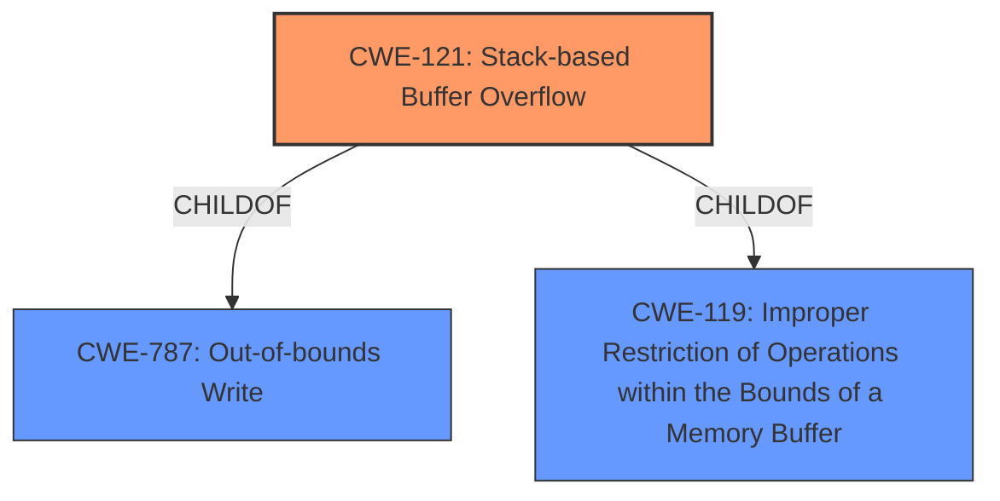

# Analysis Report for CVE-2021-45638

# Vulnerability Analysis Report: CVE-2021-45638

## Description


## Analysis (with Relationship Data)

# Summary
| CWE ID | CWE Name | Confidence | CWE Abstraction Level | CWE Vulnerability Mapping Label | CWE-Vulnerability Mapping Notes |
|---|---|---|---|---|---|
| CWE-121 | Stack-based Buffer Overflow | 1.0 | Variant | Allowed | Primary CWE |

## Evidence and Confidence

*   **Confidence Score:** 1.0
*   **Evidence Strength:** HIGH

## Relationship Analysis
The primary relationship influencing the selection is the direct match of "**stack-based buffer overflow**" in the vulnerability description to CWE-121. CWE-121 is a Variant of CWE-787 (Out-of-bounds Write) and CWE-119 (Improper Restriction of Operations within the Bounds of a Memory Buffer). While CWE-119 is a broader category, CWE-121 provides a more specific classification of the vulnerability's location on the stack.



## Vulnerability Chain
The vulnerability chain is straightforward: a **stack-based buffer overflow** allows an unauthenticated attacker to potentially execute arbitrary code. The root cause is the **stack-based buffer overflow** (CWE-121), and the impact is potential remote code execution.

## Summary of Analysis
The primary assessment is based on the explicit mention of "**stack-based buffer overflow**" in the vulnerability description. The phrase "**stack-based buffer overflow**" matches directly with the description of CWE-121. The evidence is strong, as the vulnerability description clearly states the type of buffer overflow. The graph relationships support this decision, as CWE-121 is a specific type of buffer overflow, making it a more precise classification than its parent CWE-119.

The choice of CWE-121 is at the optimal level of specificity because it accurately reflects the vulnerability's location on the stack, as stated in the description.

Relevant CWE Information:

# Enhanced Context (25 CWEs)
The following CWEs were identified as potentially relevant to this vulnerability:

## CWE-131: Incorrect Calculation of Buffer Size
**Abstraction Level**: Base
**Similarity Score**: 0.77
**Source**: dense

**Description**:
The product does not correctly calculate the size to be used when allocating a buffer, which could lead to a buffer overflow.

**Why it was not selected**: While an incorrect calculation of buffer size could *lead* to a buffer overflow, the provided description does not mention this. The description only states the presence of a **stack-based buffer overflow**.

## CWE-191: Integer Underflow (Wrap or Wraparound)
**Abstraction Level**: Base
**Similarity Score**: 0.77
**Source**: dense

**Description**:
The product subtracts one value from another, such that the result is less than the minimum allowable integer value, which produces a value that is not equal to the correct result.

**Why it was not selected**: Integer underflow is not mentioned or implied in the provided vulnerability description.

## CWE-126: Buffer Over-read
**Abstraction Level**: Variant
**Similarity Score**: 0.77
**Source**: dense

**Description**:
The product reads from a buffer using buffer access mechanisms such as indexes or pointers that reference memory locations after the targeted buffer.

**Why it was not selected**: The description focuses on the *overflow* (write), not an over-read.

## CWE-805: Buffer Access with Incorrect Length Value
**Abstraction Level**: Base
**Similarity Score**: 0.76
**Source**: dense

**Description**:
The product uses a sequential operation to read or write a buffer, but it uses an incorrect length value that causes it to access memory that is outside of the bounds of the buffer.

**Why it was not selected**: While an incorrect length value *could* contribute to the overflow, it's not explicitly mentioned. The core issue is the presence of a **stack-based buffer overflow**.

## CWE-124: Buffer Underwrite ('Buffer Underflow')
**Abstraction Level**: Base
**Similarity Score**: 0.76
**Source**: dense

**Description**:
The product writes to a buffer using an index or pointer that references a memory location prior to the beginning of the buffer.

**Why it was not selected**: The description focuses on an *overflow*, not an underflow.

## CWE-125: Out-of-bounds Read
**Abstraction Level**: Base
**Similarity Score**: 0.76
**Source**: dense

**Description**:
The product reads data past the end, or before the beginning, of the intended buffer.

**Why it was not selected**: The description focuses on an *overflow* (write), not an out-of-bounds read.

## CWE-193: Off-by-one Error
**Abstraction Level**: Base
**Similarity Score**: 0.75
**Source**: dense

**Description**:
A product calculates or uses an incorrect maximum or minimum value that is 1 more, or 1 less, than the correct value.

**Why it was not selected**: While an off-by-one error *could* contribute to a buffer overflow, it's not explicitly mentioned.

## CWE-119: Improper Restriction of Operations within the Bounds of a Memory Buffer
**Abstraction Level**: Class
**Similarity Score**: 0.75
**Source**: dense

**Description**:
The product performs operations on a memory buffer, but it reads from or writes to a memory location outside the buffer's intended boundary. This may result in read or write operations on unexpected memory locations that could be linked to other variables, data structures, or internal program data.

**Why it was not selected**: Although relevant, CWE-119 is too general. The description specifically mentions a *stack-based* buffer overflow, making CWE-121 a more precise fit. Also, the mapping guidance discourages using CWE-119 when more specific CWEs are available.

## CWE-129: Improper Validation of Array Index
**Abstraction Level**: Variant
**Similarity Score**: 0.75
**Source**: dense

**Description**:
The product uses untrusted input when calculating or using an array index, but the product does not validate or incorrectly validates the index to ensure the index references a valid position within the array.

**Why it was not selected**: While improper validation of an array index could *lead* to a buffer overflow, it is not explicitly mentioned in the vulnerability description.

## CWE-130: Improper Handling of Length Parameter Inconsistency
**Abstraction Level**: Base
**Similarity Score**: 0.75
**Source**: dense

**Description**:
The product parses a formatted message or structure, but it does not handle or incorrectly handles a length field that is inconsistent with the actual length of the associated data.

**Why it was not selected**: This is not explicitly mentioned in the vulnerability description.

## CWE-190: Integer Overflow or Wraparound
**Abstraction Level**: Base
**Similarity Score**: 8004.34
**Source**: sparse

**Description**:
The product performs a calculation that can
         produce an integer overflow or wraparound when the logic
         assumes that the resulting value will always be larger than
         the original value. This occurs when an integer value is
         incremented to a value that is too large to store in the
         associated representation. When this occurs, the value may
         become a very small or negative number.

**Why it was not selected**: Integer overflow is not mentioned or implied in the provided vulnerability description.

## CWE-125: Out-of-bounds Read
**Abstraction Level**: Base
**Similarity Score**: 7460.02
**Source**: sparse

**Description**:
The product reads data past the end, or before the beginning, of the intended buffer.

**Why it was not selected**: The description focuses on the *overflow* (write), not an out-of-bounds read.

## CWE-1284: Improper Validation of Specified Quantity in Input
**Abstraction Level**: Base
**Similarity Score**: 7351.25
**Source**: sparse

**Description**:
The product receives input that is expected to specify a quantity (such as size or length), but it does not validate or incorrectly validates that the quantity has the required properties.

**Why it was not selected**: This is not explicitly mentioned in the vulnerability description.

## CWE-119: Improper Restriction of Operations within the Bounds of a Memory Buffer
**Abstraction Level**: Class
**Similarity Score**: 7327.28
**Source**: sparse

**Description


## CWE Relationship Analysis

Current CWEs represent these abstraction levels: .


### Vulnerability Chain Analysis

**Chain starting from CWE-131:**
- 131 (Incorrect Calculation of Buffer Size) - ROOT


**Chain starting from CWE-190:**
- 190 (Integer Overflow or Wraparound) - ROOT


### CWE Relationship Diagram

```mermaid
graph TD
    classDef primary fill:#f96,stroke:#333,stroke-width:2px
    classDef secondary fill:#69f,stroke:#333
    classDef tertiary fill:#9e9,stroke:#333
```


*Report generated on 2025-03-30 20:54:20*
