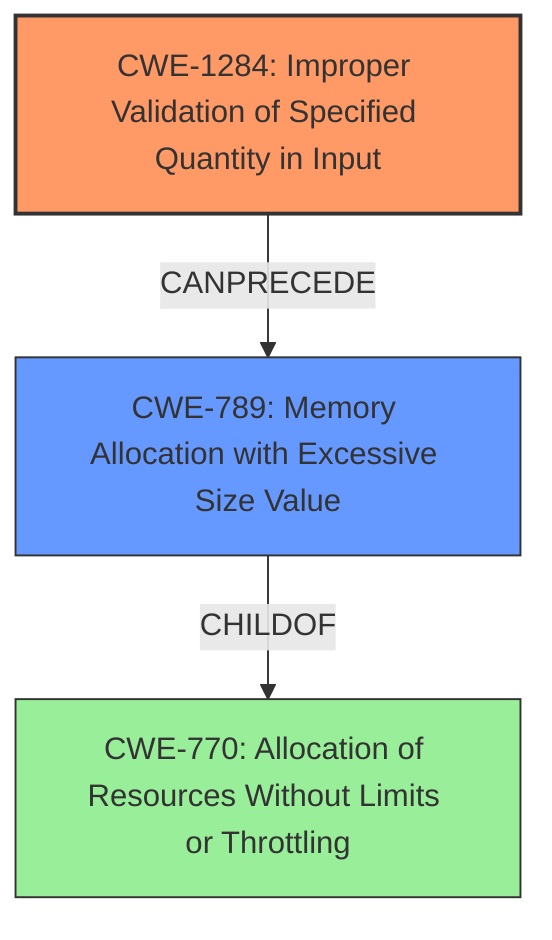

# Analysis Report for CVE-2021-45687

# Vulnerability Analysis Report: CVE-2021-45687

## Description


## Analysis (with Relationship Data)

# Summary
| CWE ID | CWE Name | Confidence | CWE Abstraction Level | CWE Vulnerability Mapping Label | CWE-Vulnerability Mapping Notes |
|---|---|---|---|---|---|
| CWE-1284 | Improper Validation of Specified Quantity in Input | 0.8 | Base | Allowed | Primary CWE |
| CWE-789 | Memory Allocation with Excessive Size Value | 0.7 | Variant | Allowed | Secondary Candidate |

## Evidence and Confidence

*   **Confidence Score:** 0.75
*   **Evidence Strength:** MEDIUM

## Relationship Analysis
The primary relationship impacting the decision is the CANPRECEDE relationship between CWE-1284 and CWE-789. The **improper validation** of the input's quantity can lead to **excessive memory allocation**, which then becomes exploitable. Also, CWE-789 is a child of CWE-770 (Allocation of Resources Without Limits or Throttling), suggesting a broader class of resource exhaustion vulnerabilities.



## Vulnerability Chain
The vulnerability chain starts with the **lack of sufficient validation** during deserialization (CWE-1284). This can lead to the allocation of an excessive amount of memory (CWE-789), ultimately resulting in memory corruption or a panic. A missing link in the chain, based on the description, is a specific memory corruption CWE, such as CWE-787 (Out-of-bounds Write), but there is no evidence to support the selection of that CWE.

## Summary of Analysis
The analysis is primarily based on the CVE Reference Links Content Summary, which highlights the **lack of sufficient validation** in `serde::Deserialize` implementations.

The key evidence is:

*   "The vulnerability stems from the **lack of sufficient validation** in the `serde::Deserialize` implementations"
*   "The `Deserialize` implementations do not properly validate the input data during deserialization. This allows for the creation of invalid struct states."
*   "The use of `std::str::from_utf8_unchecked()` with invalid input data can lead to memory corruption or other undefined behavior."

CWE-1284 (Improper Validation of Specified Quantity in Input) is selected as the primary CWE because the vulnerability involves a failure to validate the input data's quantity, leading to an exploitable state.

CWE-789 (Memory Allocation with Excessive Size Value) is a secondary CWE since the **lack of validation** can then cause the allocation of large amounts of memory.

The selected CWEs are at the optimal level of specificity, with CWE-1284 being a Base level and CWE-789 being a Variant level, which are the preferred abstraction levels.

Relevant CWE Information:

# Enhanced Context (25 CWEs)

## CWE-131: Incorrect Calculation of Buffer Size
**Abstraction Level**: Base
**Similarity Score**: 0.77

**Description**:
The product does not correctly calculate the size to be used when allocating a buffer, which could lead to a buffer overflow.

**Mapping Guidance**:
- Usage: Allowed
- Rationale: This CWE entry is at the Base level of abstraction, which is a preferred level of abstraction for mapping to the root causes of vulnerabilities.

*Not Selected*: There's no clear evidence that the buffer size calculation is incorrect; rather, the validation of the quantity of input leading to memory allocation is missing.

## CWE-789: Memory Allocation with Excessive Size Value
**Abstraction Level**: Variant
**Similarity Score**: 0.77

**Description**:
The product allocates memory based on an untrusted, large size value, but it does not ensure that the size is within expected limits, allowing arbitrary amounts of memory to be allocated.

**Mapping Guidance**:
- Usage: Allowed
- Rationale: This CWE entry is at the Variant level of abstraction, which is a preferred level of abstraction for mapping to the root causes of vulnerabilities.

*Selected as a Secondary CWE*: This is a direct consequence of the **improper validation** and contributes to the overall vulnerability impact.

## CWE-404: Improper Resource Shutdown or Release
**Abstraction Level**: Class
**Similarity Score**: 0.77

**Description**:
The product does not release or incorrectly releases a resource before it is made available for re-use.

**Mapping Guidance**:
- Usage: Allowed-with-Review
- Rationale: This CWE entry is a Class and might have Base-level children that would be more appropriate

*Not Selected*: The description doesn't mention any resource shutdown or release issues.

## CWE-667: Improper Locking
**Abstraction Level**: Class
**Similarity Score**: 0.77

**Description**:
The product does not properly acquire or release a lock on a resource, leading to unexpected resource state changes and behaviors.

**Mapping Guidance**:
- Usage: Allowed-with-Review
- Rationale: This CWE entry is a Class and might have Base-level children that would be more appropriate

*Not Selected*: There's no mention of locking or concurrency issues in the provided information.

## CWE-405: Asymmetric Resource Consumption (Amplification)
**Abstraction Level**: Class
**Similarity Score**: 0.76

**Description**:
The product does not properly control situations in which an adversary can cause the product to consume or produce excessive resources without requiring the adversary to invest equivalent work or otherwise prove authorization, i.e., the adversary's influence is "asymmetric."

**Mapping Guidance**:
- Usage: Allowed-with-Review
- Rationale: This CWE entry is a Class and might have Base-level children that would be more appropriate

*Not Selected*: While resource consumption is a consequence, the primary issue is the **lack of validation**.

## CWE-1289: Improper Validation of Unsafe Equivalence in Input
**Abstraction Level**: Base
**Similarity Score**: 0.76

**Description**:
The product receives an input value that is used as a resource identifier or other type of reference, but it does not validate or incorrectly validates that the input is equivalent to a potentially-unsafe value.

**Mapping Guidance**:
- Usage: Allowed
- Rationale: This CWE entry is at the Base level of abstraction, which is a preferred level of abstraction for mapping to the root causes of vulnerabilities.

*Not Selected*: While the input is not validated, the description better fits the quantity aspect rather than equivalence to an unsafe value.

## CWE-1325: Improperly Controlled Sequential Memory Allocation
**Abstraction Level**: Base
**Similarity Score**: 0.76

**Description**:
The product manages a group of objects or resources and performs a separate memory allocation for each object, but it does not properly limit the total amount of memory that is consumed by all of the combined objects.

**Mapping Guidance**:
- Usage: Allowed
- Rationale: This CWE entry is at the Base level of abstraction, which is a preferred level of abstraction for mapping to the root causes of vulnerabilities.

*Not Selected*: The description does not clearly describe improperly controlled sequential memory allocation.

## CWE-226: Sensitive Information in Resource Not Removed Before Reuse
**Abstraction Level**: Base
**Similarity Score**: 0.76

**Description**:
The product releases a resource such as memory or a file so that it can be made available for reuse, but it does not clear or "zeroize" the information contained in the resource before the product performs a critical state transition or makes the resource available for reuse by other entities.

**Mapping Guidance**:
- Usage: Allowed
- Rationale: This CWE entry is at the Base level of abstraction, which is a preferred level of abstraction for mapping to the root causes of vulnerabilities.

*Not Selected*: The description does not describe sensitive information handling.

## CWE-125: Out-of-bounds Read
**Abstraction Level**: Base
**Similarity Score**: 0.76

**Description**:
The product reads data past the end, or before the beginning, of the intended buffer.

**Mapping Guidance**:
- Usage: Allowed
- Rationale: This CWE entry is at the Base level of abstraction, which is a preferred level of abstraction for mapping to the root causes of vulnerabilities.

*Not Selected*: The primary issue is **lack of validation** during deserialization, which then results in potential for memory corruption or panics, but there is no explicit evidence for out-of-bounds read.

## CWE-130: Improper Handling of Length Parameter Inconsistency
**Abstraction Level**: Base
**Similarity Score**: 0.76

**Description**:
The product parses a formatted message or structure, but it does


## CWE Relationship Analysis

Current CWEs represent these abstraction levels: .


### Vulnerability Chain Analysis

**Chain starting from CWE-131:**
- 131 (Incorrect Calculation of Buffer Size) - ROOT


**Chain starting from CWE-1325:**
- 1325 (Improperly Controlled Sequential Memory Allocation) - ROOT


### CWE Relationship Diagram

```mermaid
graph TD
    classDef primary fill:#f96,stroke:#333,stroke-width:2px
    classDef secondary fill:#69f,stroke:#333
    classDef tertiary fill:#9e9,stroke:#333
```


*Report generated on 2025-03-30 19:53:59*
