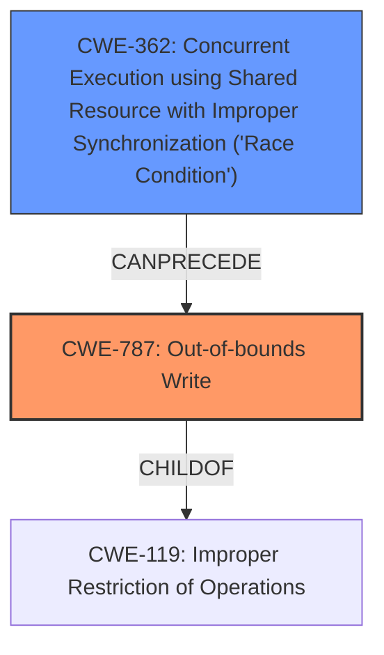

# Raw Analyzer Response for CVE-2021-45710

# Summary
| CWE ID | CWE Name | Confidence | CWE Abstraction Level | CWE Vulnerability Mapping Label | CWE-Vulnerability Mapping Notes |
|---|---|---|---|---|---|
| CWE-787 | Out-of-bounds Write | 0.9 | Base | Allowed | Primary CWE. The vulnerability involves **memory corruption** due to a **data race**, which can lead to writing outside the intended memory bounds. |
| CWE-362 | Concurrent Execution using Shared Resource with Improper Synchronization ('Race Condition') | 0.8 | Class | Allowed-with-Review | Secondary CWE. The root cause is a **data race** condition when concurrently accessing the `oneshot` channel. |

## Evidence and Confidence

*   **Confidence Score:** 0.85
*   **Evidence Strength:** HIGH

## Relationship Analysis
The primary CWE, CWE-787 [CWE-787: Out-of-bounds Write], is a child of CWE-119 [CWE-119: Improper Restriction of Operations within the Bounds of a Memory Buffer]. The secondary CWE, CWE-362 [CWE-362: Concurrent Execution using Shared Resource with Improper Synchronization ('Race Condition')], highlights the race condition aspect of the vulnerability. CWE-362 [CWE-362: Concurrent Execution using Shared Resource with Improper Synchronization ('Race Condition')] can precede CWE-416 [CWE-416: Use After Free] or CWE-476 [CWE-476: NULL Pointer Dereference], but in this case, it directly leads to memory corruption and out-of-bounds write.

## Vulnerability Chain
The vulnerability chain starts with a **data race** (CWE-362 [CWE-362: Concurrent Execution using Shared Resource with Improper Synchronization ('Race Condition')]) in the `tokio::sync::oneshot` channel due to concurrent calls to `oneshot::Sender::send` and `oneshot::Receiver` after closing the receiver. This leads to **memory corruption** (CWE-787 [CWE-787: Out-of-bounds Write]) due to writing to unintended memory locations.

## Summary of Analysis
Initially, the vulnerability description points to a **data race and memory corruption**. The CVE Reference Links Content Summary provides more specific details, indicating that the data race occurs when a `tokio::sync::oneshot` channel is closed and, concurrently, `oneshot::Sender::send` is called while the corresponding `oneshot::Receiver` is being awaited or calling `try_recv`. The **data race** leads to **memory corruption**.

The Retriever Results list CWE-787 [CWE-787: Out-of-bounds Write] as the top candidate, with a score of 1.000, and CWE-362 [CWE-362: Concurrent Execution using Shared Resource with Improper Synchronization ('Race Condition')] as the second candidate. Given the description and the retriever results, CWE-787 [CWE-787: Out-of-bounds Write] accurately represents the **memory corruption** aspect, while CWE-362 [CWE-362: Concurrent Execution using Shared Resource with Improper Synchronization ('Race Condition')] captures the root cause of the **data race**.

CWE-787 [CWE-787: Out-of-bounds Write] is a Base level CWE and is preferred. CWE-362 [CWE-362: Concurrent Execution using Shared Resource with Improper Synchronization ('Race Condition')] is a Class level CWE, but it is included because it describes the root cause of the vulnerability, which is a race condition.

Relevant CWE Information:

# Enhanced Context (25 CWEs)

## CWE-366: Race Condition within a Thread
**Abstraction Level**: Base
**Similarity Score**: 0.78
**Source**: dense

**Description**:
If two threads of execution use a resource simultaneously, there exists the possibility that resources may be used while invalid, in turn making the state of execution undefined.

**Mapping Guidance**:
- Usage: Allowed
- Rationale: This CWE entry is at the Base level of abstraction, which is a preferred level of abstraction for mapping to the root causes of vulnerabilities.

## CWE-367: Time-of-check Time-of-use (TOCTOU) Race Condition
**Abstraction Level**: Base
**Similarity Score**: 0.78
**Source**: dense

**Description**:
The product checks the state of a resource before using that resource, but the resource's state can change between the check and the use in a way that invalidates the results of the check. This can cause the product to perform invalid actions when the resource is in an unexpected state.

**Mapping Guidance**:
- Usage: Allowed
- Rationale: This CWE entry is at the Base level of abstraction, which is a preferred level of abstraction for mapping to the root causes of vulnerabilities.

## CWE-667: Improper Locking
**Abstraction Level**: Class
**Similarity Score**: 0.78
**Source**: dense

**Description**:
The product does not properly acquire or release a lock on a resource, leading to unexpected resource state changes and behaviors.

**Mapping Guidance**:
- Usage: Allowed-with-Review
- Rationale: This CWE entry is a Class and might have Base-level children that would be more appropriate

## CWE-404: Improper Resource Shutdown or Release
**Abstraction Level**: Class
**Similarity Score**: 0.77
**Source**: dense

**Description**:
The product does not release or incorrectly releases a resource before it is made available for re-use.

**Mapping Guidance**:
- Usage: Allowed-with-Review
- Rationale: This CWE entry is a Class and might have Base-level children that would be more appropriate

## CWE-362: Concurrent Execution using Shared Resource with Improper Synchronization ('Race Condition')
**Abstraction Level**: Class
**Similarity Score**: 0.77
**Source**: dense

**Description**:
The product contains a concurrent code sequence that requires temporary, exclusive access to a shared resource, but a timing window exists in which the shared resource can be modified by another code sequence operating concurrently.

**Mapping Guidance**:
- Usage: Allowed-with-Review
- Rationale: This CWE entry is a Class and might have Base-level children that would be more appropriate

## CWE-131: Incorrect Calculation of Buffer Size
**Abstraction Level**: Base
**Similarity Score**: 0.77
**Source**: dense

**Description**:
The product does not correctly calculate the size to be used when allocating a buffer, which could lead to a buffer overflow.

**Mapping Guidance**:
- Usage: Allowed
- Rationale: This CWE entry is at the Base level of abstraction, which is a preferred level of abstraction for mapping to the root causes of vulnerabilities.

## CWE-226: Sensitive Information in Resource Not Removed Before Reuse
**Abstraction Level**: Base
**Similarity Score**: 0.77
**Source**: dense

**Description**:
The product releases a resource such as memory or a file so that it can be made available for reuse, but it does not clear or "zeroize" the information contained in the resource before the product performs a critical state transition or makes the resource available for reuse by other entities.

**Mapping Guidance**:
- Usage: Allowed
- Rationale: This CWE entry is at the Base level of abstraction, which is a preferred level of abstraction for mapping to the root causes of vulnerabilities.

## CWE-703: Improper Check or Handling of Exceptional Conditions
**Abstraction Level**: Pillar
**Similarity Score**: 0.77
**Source**: dense

**Description**:
The product does not properly anticipate or handle exceptional conditions that rarely occur during normal operation of the product.

**Mapping Guidance**:
- Usage: Discouraged
- Rationale: This CWE entry is extremely high-level, a Pillar.

## CWE-125: Out-of-bounds Read
**Abstraction Level**: Base
**Similarity Score**: 0.76
**Source**: dense

**Description**:
The product reads data past the end, or before the beginning, of the intended buffer.

**Mapping Guidance**:
- Usage: Allowed
- Rationale: This CWE entry is at the Base level of abstraction, which is a preferred level of abstraction for mapping to the root causes of vulnerabilities.

## CWE-754: Improper Check for Unusual or Exceptional Conditions
**Abstraction Level**: Class
**Similarity Score**: 0.76
**Source**: dense

**Description**:
The product does not check or incorrectly checks for unusual