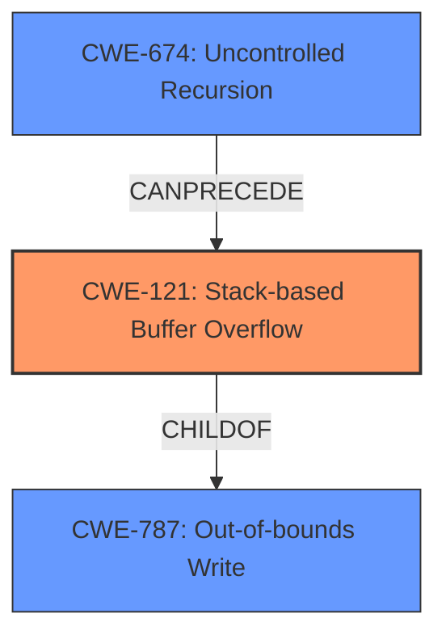

# Analysis Report for CVE-2021-45832

# Vulnerability Analysis Report: CVE-2021-45832

## Description


## Analysis (with Relationship Data)

# Summary
| CWE ID | CWE Name | Confidence | CWE Abstraction Level | CWE Vulnerability Mapping Label | CWE-Vulnerability Mapping Notes |
|---|---|---|---|---|---|
| CWE-121 | Stack-based Buffer Overflow | 1.0 | Variant | Allowed | Primary CWE |
| CWE-674 | Uncontrolled Recursion | 0.7 | Class | Allowed-with-Review | Secondary CWE |
| CWE-787 | Out-of-bounds Write | 0.6 | Base | Allowed | Secondary CWE |

## Evidence and Confidence

*   **Confidence Score:** 0.8
*   **Evidence Strength:** HIGH

## Relationship Analysis
The primary weakness is a stack-based buffer overflow (CWE-121), which is a variant of a more general out-of-bounds write (CWE-787). Uncontrolled recursion (CWE-674) contributes to the stack overflow by repeatedly calling functions without proper termination, leading to stack exhaustion. The hierarchical relationship is that CWE-121 is a child of CWE-787. CWE-674 can lead to conditions where a stack-based buffer overflow is more likely to occur. I selected CWE-121 as it is the most specific and accurate representation of the vulnerability given the description.



## Vulnerability Chain
The vulnerability chain starts with the **uncontrolled recursion** (CWE-674) in the error handling of the HDF5 library. This leads to excessive growth of the stack, which eventually triggers a **stack-based buffer overflow** (CWE-121) due to the recursive calls to `H5E_printf_stack` and `H5E__push_stack` without proper termination conditions. The final impact is a denial of service.

## Summary of Analysis
The initial assessment identified the **stack-based buffer overflow** as the primary weakness, supported by the vulnerability description. The CVE Reference Links Content Summary further clarified the root cause and mechanism, highlighting the recursive calls contributing to the overflow.

The graph relationships show that CWE-121 is a specific type of out-of-bounds write (CWE-787), and uncontrolled recursion (CWE-674) can precede the overflow.

The selected CWEs are at the optimal level of specificity. CWE-121 directly describes the vulnerability, while CWE-674 and CWE-787 provide additional context about the root cause and broader category of the weakness, respectively.

The supporting evidence from the vulnerability description includes: "A **Stack-based Buffer Overflow** Vulnerability exists in HDF5 1.13.1-1 at at hdf5/src/H5Eint.c, which causes a Denial of Service (context-dependent)." The CVE Reference Links Content Summary states that the vulnerability is triggered by a stack overflow within the `H5E_printf_stack` function and recursive calls to `H5E_printf_stack` and `H5E__push_stack` functions without proper termination conditions.

Relevant CWE Information:

# Enhanced Context (25 CWEs)
The following CWEs were identified as potentially relevant to this vulnerability:

## CWE-124: Buffer Underwrite ('Buffer Underflow')
**Abstraction Level**: Base
**Similarity Score**: 0.76
**Source**: dense

**Description**:
The product writes to a buffer using an index or pointer that references a memory location prior to the beginning of the buffer.

**Mapping Guidance**:
- Usage: Allowed
- Rationale: This CWE entry is at the Base level of abstraction, which is a preferred level of abstraction for mapping to the root causes of vulnerabilities.

*Rationale for not selecting:* This CWE describes an underwrite, but the vulnerability is an overflow.

## CWE-191: Integer Underflow (Wrap or Wraparound)
**Abstraction Level**: Base
**Similarity Score**: 0.75
**Source**: dense

**Description**:
The product subtracts one value from another, such that the result is less than the minimum allowable integer value, which produces a value that is not equal to the correct result.

**Mapping Guidance**:
- Usage: Allowed
- Rationale: This CWE entry is at the Base level of abstraction, which is a preferred level of abstraction for mapping to the root causes of vulnerabilities.

*Rationale for not selecting:* This CWE describes an integer underflow, which is not directly related to the buffer overflow.

## CWE-131: Incorrect Calculation of Buffer Size
**Abstraction Level**: Base
**Similarity Score**: 0.75
**Source**: dense

**Description**:
The product does not correctly calculate the size to be used when allocating a buffer, which could lead to a buffer overflow.

**Mapping Guidance**:
- Usage: Allowed
- Rationale: This CWE entry is at the Base level of abstraction, which is a preferred level of abstraction for mapping to the root causes of vulnerabilities.

*Rationale for not selecting:* While an incorrect buffer size calculation could contribute to a buffer overflow, the primary issue is uncontrolled recursion leading to stack exhaustion and subsequent overflow. There is no evidence of an incorrect calculation.

## CWE-805: Buffer Access with Incorrect Length Value
**Abstraction Level**: Base
**Similarity Score**: 0.75
**Source**: dense

**Description**:
The product uses a sequential operation to read or write a buffer, but it uses an incorrect length value that causes it to access memory that is outside of the bounds of the buffer.

**Mapping Guidance**:
- Usage: Allowed
- Rationale: This CWE entry is at the Base level of abstraction, which is a preferred level of abstraction for mapping to the root causes of vulnerabilities.

*Rationale for not selecting:* This CWE is related to using an incorrect length value, but the primary cause is the uncontrolled recursion leading to stack exhaustion and a subsequent overflow.

## CWE-193: Off-by-one Error
**Abstraction Level**: Base
**Similarity Score**: 0.74
**Source**: dense

**Description**:
A product calculates or uses an incorrect maximum or minimum value that is 1 more, or 1 less, than the correct value.

**Mapping Guidance**:
- Usage: Allowed
- Rationale: This CWE entry is at the Base level of abstraction, which is a preferred level of abstraction for mapping to the root causes of vulnerabilities.

*Rationale for not selecting:* This CWE describes an off-by-one error, which is not the primary cause of the stack-based buffer overflow.

## CWE-680: Integer Overflow to Buffer Overflow
**Abstraction Level**: Compound
**Similarity Score**: 0.73
**Source**: dense

**Description**:
The product performs a calculation to determine how much memory to allocate, but an integer overflow can occur that causes less memory to be allocated than expected, leading to a buffer overflow.

**Mapping Guidance**:
- Usage: Discouraged
- Rationale: This CWE entry is a named chain, which combines multiple weaknesses.

*Rationale for not selecting:* There is no evidence of an integer overflow in the description. The stack-based buffer overflow is caused by uncontrolled recursion.

## CWE-126: Buffer Over-read
**Abstraction Level**: Variant
**Similarity Score**: 0.73
**Source**: dense

**Description**:
The product reads from a buffer using buffer access mechanisms such as indexes or pointers that reference memory locations after the targeted buffer.

**Mapping Guidance**:
- Usage: Allowed
- Rationale: This CWE entry is at the Variant level of abstraction, which is a preferred level of abstraction for mapping to the root causes of vulnerabilities.

*Rationale for not selecting:* This CWE describes an over-read, but the vulnerability is an overflow (write).

## CWE-125: Out-of-bounds Read
**Abstraction Level**: Base
**Similarity Score**: 0.73
**Source**: dense

**Description**:
The product reads data past the end, or before the beginning, of the intended buffer.

**Mapping Guidance**:
- Usage: Allowed
- Rationale: This CWE entry is at the Base level of abstraction, which is a preferred level of abstraction for mapping to the root causes of vulnerabilities.

*Rationale for not selecting:* This CWE describes an out-of-bounds read, but the vulnerability is an overflow (write).

## CWE-1325: Improperly Controlled Sequential Memory Allocation
**Abstraction Level**: Base
**Similarity Score**: 0.73
**Source**: dense

**Description**:
The product manages a group of objects or resources and performs a separate memory allocation for each object, but it does not properly limit the total amount of


## CWE Relationship Analysis

Current CWEs represent these abstraction levels: .


### Vulnerability Chain Analysis

**Chain starting from CWE-131:**
- 131 (Incorrect Calculation of Buffer Size) - ROOT


**Chain starting from CWE-1325:**
- 1325 (Improperly Controlled Sequential Memory Allocation) - ROOT


### CWE Relationship Diagram

```mermaid
graph TD
    classDef primary fill:#f96,stroke:#333,stroke-width:2px
    classDef secondary fill:#69f,stroke:#333
    classDef tertiary fill:#9e9,stroke:#333
```


*Report generated on 2025-03-31 08:17:39*
