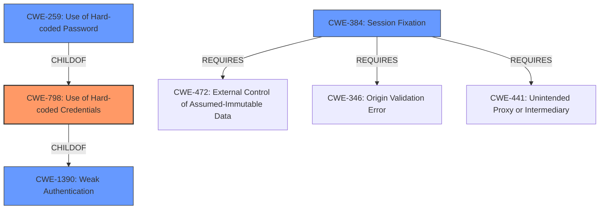

# Raw Analyzer Response for CVE-2021-45841

# Summary
| CWE ID | CWE Name | Confidence | CWE Abstraction Level | CWE Vulnerability Mapping Label | CWE-Vulnerability Mapping Notes |
|---|---|---|---|---|---|
| CWE-798 | Use of Hard-coded Credentials | 0.9 | Base | Allowed | Primary CWE |
| CWE-259 | Use of Hard-coded Password | 0.7 | Variant | Allowed | Secondary Candidate |
| CWE-384 | Session Fixation | 0.6 | Compound | Allowed | Secondary Candidate |
| CWE-1390 | Weak Authentication | 0.5 | Class | Allowed-with-Review | Secondary Candidate |

## Evidence and Confidence

*   **Confidence Score:** 0.7
*   **Evidence Strength:** HIGH

## Relationship Analysis
The primary CWE is CWE-798 (**Use of Hard-coded Credentials**), which is a base class. CWE-259 (**Use of Hard-coded Password**) is a variant of CWE-798, representing a more specific case. CWE-1390 (**Weak Authentication**) is a class that CWE-798 can fall under. CWE-384 (**Session Fixation**) can be caused by **improper** generation of session tokens. The relationships between these CWEs help to refine the classification based on the available information.

## Vulnerability Chain
The vulnerability chain starts with the **use of hard-coded credentials** (CWE-798) or a **null/empty hash** for the guest user. This allows an attacker to **self-sign session cookies**, leading to **authentication bypass** and the ability to **login as guest**.

## Summary of Analysis
The initial assessment focused on the vulnerability description indicating that an attacker can **self-sign session cookies** by knowing the target's MAC address and the user's password hash, and guest users can be abused using a null/empty hash. The retriever results pointed to CWE-798 (**Use of Hard-coded Credentials**) and CWE-259 (**Use of Hard-coded Password**), as well as CWE-1390 (**Weak Authentication**) and CWE-384 (**Session Fixation**).

The CVE Reference Links Content Summary reveals the application uses a weak custom encryption function (`tos_encrypt_str`) with a **hardcoded key** to generate session tokens, allowing an attacker to craft a valid session token for any user, especially the guest user which by default has a null password hash. Given the root cause is the **use of hard-coded credentials** for session token generation, CWE-798 is the most appropriate primary classification.

CWE-259 (**Use of Hard-coded Password**) is a more specific variant of CWE-798, but since the credentials are used to sign cookies, it is not exactly a password, so CWE-798 is still better.

CWE-384 (**Session Fixation**) is also considered because the attacker is effectively fixing the session by crafting the cookies. However, the root cause is the **hard-coded key** and **null password hash**, not the session fixation itself.

CWE-1390 (**Weak Authentication**) is a general class, and a more specific CWE is preferred, so CWE-798 is a better fit.

The selected CWEs are at the optimal level of specificity because they accurately reflect the underlying weaknesses contributing to the vulnerability. CWE-798 directly addresses the **use of hard-coded credentials**, while CWE-259 and CWE-384 provide additional context.

Relevant CWE Information:

## Enhanced Context (25 CWEs)
The following CWEs were identified as potentially relevant to this vulnerability:

## CWE-303: Incorrect Implementation of Authentication Algorithm
**Abstraction Level**: Base
**Similarity Score**: 0.80
**Source**: dense

**Description**:
The requirements for the product dictate the use of an established authentication algorithm, but the implementation of the algorithm is incorrect.

**Mapping Guidance**:
- Usage: Allowed
- Rationale: This CWE entry is at the Base level of abstraction, which is a preferred level of abstraction for mapping to the root causes of vulnerabilities.

## CWE-1391: Use of Weak Credentials
**Abstraction Level**: Class
**Similarity Score**: 0.79
**Source**: dense

**Description**:
The product uses weak credentials (such as a default key or hard-coded password) that can be calculated, derived, reused, or guessed by an attacker.

**Mapping Guidance**:
- Usage: Allowed-with-Review
- Rationale: This CWE entry is a Class and might have Base-level children that would be more appropriate

## CWE-288: Authentication Bypass Using an Alternate Path or Channel
**Abstraction Level**: Base
**Similarity Score**: 0.79
**Source**: dense

**Description**:
The product requires authentication, but the product has an alternate path or channel that does not require authentication.

**Mapping Guidance**:
- Usage: Allowed
- Rationale: This CWE entry is at the Base level of abstraction, which is a preferred level of abstraction for mapping to the root causes of vulnerabilities.

## CWE-798: Use of Hard-coded Credentials
**Abstraction Level**: Base
**Similarity Score**: 0.79
**Source**: dense

**Description**:
The product contains hard-coded credentials, such as a password or cryptographic key.

**Mapping Guidance**:
- Usage: Allowed
- Rationale: This CWE entry is at the Base level of abstraction, which is a preferred level of abstraction for mapping to the root causes of vulnerabilities.

## CWE-1390: Weak Authentication
**Abstraction Level**: Class
**Similarity Score**: 0.78
**Source**: dense

**Description**:
The product uses an authentication mechanism to restrict access to specific users or identities, but the mechanism does not sufficiently prove that the claimed identity is correct.

**Mapping Guidance**:
- Usage: Allowed-with-Review
- Rationale: This CWE entry is a Class and might have Base-level children that would be more appropriate

## CWE-807: Reliance on Untrusted Inputs in a Security Decision
**Abstraction Level**: Base
**Similarity Score**: 0.78
**Source**: dense

**Description**:
The product uses a protection mechanism that relies on the existence or values of an input, but the input can be modified by an untrusted actor in a way that bypasses the protection mechanism.

**Mapping Guidance**:
- Usage: Allowed
- Rationale: This CWE entry is at the Base level of abstraction, which is a preferred level of abstraction for mapping to the root causes of vulnerabilities.

## CWE-294: Authentication Bypass by Capture-replay
**Abstraction Level**: Base
**Similarity Score**: 0.78
**Source**: dense

**Description**:
A capture-replay flaw exists when the design of the product makes it possible for a malicious user to sniff network traffic and bypass authentication by replaying it to the server in question to the same effect as the original message (or with minor changes).

**Mapping Guidance**:
- Usage: Allowed
- Rationale: This CWE entry is at the Base level of abstraction, which is a preferred level of abstraction for mapping to the root causes of vulnerabilities.

## CWE-302: Authentication Bypass by Assumed-Immutable Data
**Abstraction Level**: Base
**Similarity Score**: 0.78
**Source**: dense

**Description**:
The authentication scheme or implementation uses key data elements that are assumed to be immutable, but can be controlled or modified by the attacker.

**Mapping Guidance**:
- Usage: Allowed
- Rationale: This CWE entry is at the Base level of abstraction, which is a preferred level of abstraction for mapping to the root causes of vulnerabilities.

## CWE-290: Authentication Bypass by Spoofing
**Abstraction Level**: Base
**Similarity Score**: 0.77
**Source**: dense

**Description**:
This attack-focused weakness is caused by incorrectly implemented authentication schemes that are subject to spoofing attacks.

**Mapping Guidance**: