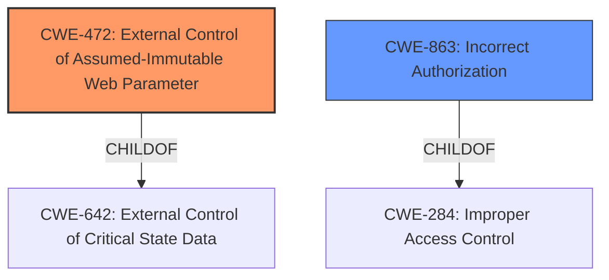

# Analysis for CVE-2021-45896

# Summary
| CWE ID | CWE Name | Confidence | CWE Abstraction Level | CWE Vulnerability Mapping Label | CWE-Vulnerability Mapping Notes |
|---|---|---|---|---|---|
| CWE-472 | External Control of Assumed-Immutable Web Parameter | 0.9 | Base | Primary | Allowed |
| CWE-863 | Incorrect Authorization | 0.6 | Class | Secondary | Allowed-with-Review |

## Evidence and Confidence

*   **Confidence Score:** 0.9
*   **Evidence Strength:** HIGH

## Relationship Analysis
The primary relationship that influenced the decision was the direct match of CWE-472 to the vulnerability description, especially the emphasis on client-side checks without server-side verification. CWE-863 was considered because authorization was not performed correctly.

## Vulnerability Chain
The vulnerability chain starts with the **lack of server-side validation** of the `is_ctc_admin` parameter. This leads to **external control of an assumed-immutable web parameter (CWE-472)**, resulting in **privilege escalation**.

## Summary of Analysis
The initial assessment focused on the **root cause** of the vulnerability, which is the server's failure to validate the user's privileges based on the `is_ctc_admin` parameter. The "CVE Reference Links Content Summary" states: "The authentication/authorization mechanism relies solely on client-side checks. The server does not validate the user's privileges." This statement strongly supports the selection of CWE-472, as it directly addresses the issue of **external control of assumed-immutable web parameters**.

The graph relationships helped in understanding that CWE-472 is a specific type of weakness related to the broader category of external control of critical state data (CWE-642), but is the more precise fit.

The selected CWE is at the optimal level of specificity (Base) because it directly represents the **root cause** weakness, and it is supported by clear evidence in the vulnerability description.

Relevant CWE Information:

# Enhanced Context (25 CWEs)
The following CWEs were identified as potentially relevant to this vulnerability:

## CWE-472: External Control of Assumed-Immutable Web Parameter
**Abstraction Level**: Base
**Similarity Score**: 0.78
**Source**: dense

**Description**:
The web application does not sufficiently verify inputs that are assumed to be immutable but are actually externally controllable, such as hidden form fields.

**Mapping Guidance**:
- Usage: Allowed
- Rationale: This CWE entry is at the Base level of abstraction, which is a preferred level of abstraction for mapping to the root causes of vulnerabilities.

## CWE-863: Incorrect Authorization
**Abstraction Level**: Class
**Similarity Score**: 5826.79
**Source**: sparse

**Description**:
The product performs an authorization check when an actor attempts to access a resource or perform an action, but it does not correctly perform the check.

**Mapping Guidance**:
- Usage: Allowed-with-Review
- Rationale: This CWE entry is a Class and might have Base-level children that would be more appropriate

---

### CWE-472: External Control of Assumed-Immutable Web Parameter
*   **Technical Explanation:** The vulnerability occurs because the application relies on the client-side to determine the user's administrative status (`is_ctc_admin`). By modifying this parameter, an attacker can bypass access controls without the server's verification.
*   **Security Implications:** This allows an attacker to escalate their privileges to super-admin, granting them unauthorized access to sensitive functionalities and configurations.
*   **Relationship Analysis:** CWE-472 is a base-level CWE, providing a specific description of the flaw.
*   **Mapping Guidance Influence:** The MITRE mapping guidance designates CWE-472 as "Allowed," reinforcing its suitability as a primary CWE.
*   **Supporting Evidence:** "The authentication/authorization mechanism relies solely on client-side checks. The server does not validate the user's privileges."
*   **Confidence:** 0.9

### CWE-863: Incorrect Authorization
*   **Technical Explanation:** Although the primary issue is the lack of server-side validation, CWE-863 is a secondary consideration as the authorization check is not correctly implemented.
*   **Security Implications:** The impact is unauthorized access to functions and data due to the faulty authorization mechanism.
*   **Relationship Analysis:** CWE-863 is a class-level CWE. It is less specific than CWE-472.
*   **Mapping Guidance Influence:** The MITRE mapping guidance designates CWE-863 as "Allowed-with-Review," suggesting that a more specific CWE might exist.
*   **Supporting Evidence:** "...can elevate their privileges to a super-admin level, which grants access to additional functionality and configuration options that are normally restricted."
*   **Confidence:** 0.6

### Other CWEs Considered But Not Used:
*   **CWE-770: Allocation of Resources Without Limits or Throttling:** While privilege escalation could lead to resource exhaustion, the core issue isn't related to resource allocation, so this CWE was not selected.
*   **CWE-96: Improper Neutralization of Directives in Statically Saved Code ('Static Code Injection'):** This CWE is not applicable, as the vulnerability doesn't involve code injection.
*   **CWE-522: Insufficiently Protected Credentials & CWE-256: Plaintext Storage of a Password:** The vulnerability is not about credential storage or transmission, so these CWEs were not selected.
*   **CWE-78: Improper Neutralization of Special Elements used in an OS Command ('OS Command Injection') & CWE-94: Improper Control of Generation of Code ('Code Injection'):** These CWEs are not applicable, as the vulnerability doesn't involve command or code injection.
*   **CWE-184: Incomplete List of Disallowed Inputs:** This CWE is not applicable, as the vulnerability doesn't involve a denylist or allowlist.
*   **CWE-269: Improper Privilege Management:** This CWE is too general. The issue is not simply that privileges are managed incorrectly, but specifically that a client-controlled parameter determines privilege.