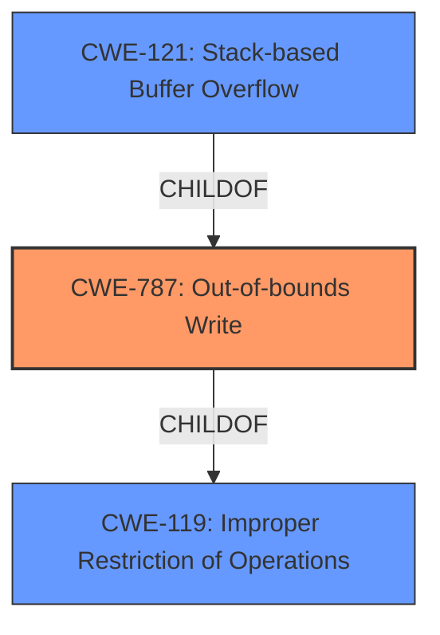

# Analysis Report for CVE-2021-45907

# Vulnerability Analysis Report: CVE-2021-45907

## Description


## Analysis (with Relationship Data)

# Summary
| CWE ID | CWE Name | Confidence | CWE Abstraction Level | CWE Vulnerability Mapping Label | CWE-Vulnerability Mapping Notes |
|---|---|---|---|---|---|
| CWE-787 | Out-of-bounds Write | 1.0 | Base | Allowed | Primary CWE. The vulnerability is a **stack-based buffer overflow**, which occurs when data is written beyond the boundaries of a buffer. |
| CWE-121 | Stack-based Buffer Overflow | 0.8 | Variant | Allowed | Secondary CWE. This is a more specific type of buffer overflow, where the buffer is located on the stack. While the description mentions a **stack-based buffer overflow**, the root cause is still an out-of-bounds write.|
| CWE-119 | Improper Restriction of Operations within the Bounds of a Memory Buffer | 0.6 | Class | Discouraged | Secondary CWE. This is a more general CWE that describes the **improper restriction of operations** within memory buffers. While this is technically true, it is less specific than CWE-787 and CWE-121. |

## Evidence and Confidence

*   **Confidence Score:** 1.0
*   **Evidence Strength:** HIGH

## Relationship Analysis
The primary CWE is CWE-787 (**Out-of-bounds Write**), which is a base-level CWE. CWE-121 (**Stack-based Buffer Overflow**) is a variant of CWE-787, specifying that the overflow occurs on the stack. CWE-119 (**Improper Restriction of Operations within the Bounds of a Memory Buffer**) is a class-level CWE and a parent of CWE-787.



## Vulnerability Chain
The vulnerability chain starts with the **insufficient bounds checking** within the `DecodeLZW` function, leading to an **out-of-bounds write** (CWE-787) on the stack, resulting in a **stack-based buffer overflow** (CWE-121), which ultimately causes a segmentation fault and crashes the application.

## Summary of Analysis
The initial assessment and criticism focused on identifying the root cause and the specific type of buffer overflow. The evidence clearly points to a **stack-based buffer overflow** due to **insufficient bounds checking** when writing to the `suffix` and `str` buffers in the `DecodeLZW` function. The primary CWE, CWE-787, accurately represents the **out-of-bounds write** condition. CWE-121 is included as a secondary CWE to specify the location of the overflow on the stack. CWE-119 is considered but deemed less specific.

The selection of CWE-787 and CWE-121 is based on the following evidence from the vulnerability description and CVE reference:

*   "There is a **stack-based buffer overflow** involving a for loop."
*   "Two **stack-based buffer overflows** exist in the `DecodeLZW` function"
*   "The `DecodeLZW` function has **insufficient bounds checking** when writing to the `suffix` and `str` buffers."

CWE-787 is the most specific and appropriate CWE to describe the root cause of the vulnerability. CWE-121 provides additional context about the location of the buffer overflow.

CWEs considered but not used:

*   CWE-190 (**Integer Overflow or Wraparound**): While integer overflows can sometimes lead to buffer overflows, there is no direct evidence of an integer overflow in this case.
*   CWE-125 (**Out-of-bounds Read**): The vulnerability is related to writing out of bounds, not reading.
*   CWE-193 (**Off-by-one Error**): While an off-by-one error could contribute to a buffer overflow, the primary issue is the lack of bounds checking.
*   CWE-120 (**Buffer Copy without Checking Size of Input**): This CWE is more relevant when a buffer is copied without checking the size of the input, which is not explicitly mentioned in the description.
*   CWE-1284 (**Improper Validation of Specified Quantity in Input**): While related to input validation, the core issue is the **insufficient bounds checking** when writing to the buffer, rather than the validation of the input size itself.


## CWE Relationship Analysis

Current CWEs represent these abstraction levels: .


### Vulnerability Chain Analysis

**Chain starting from CWE-190:**
- 190 (Integer Overflow or Wraparound) - ROOT


**Chain starting from CWE-121:**
- 121 (Stack-based Buffer Overflow) - ROOT


### CWE Relationship Diagram

```mermaid
graph TD
    classDef primary fill:#f96,stroke:#333,stroke-width:2px
    classDef secondary fill:#69f,stroke:#333
    classDef tertiary fill:#9e9,stroke:#333
```


*Report generated on 2025-03-30 17:21:31*
