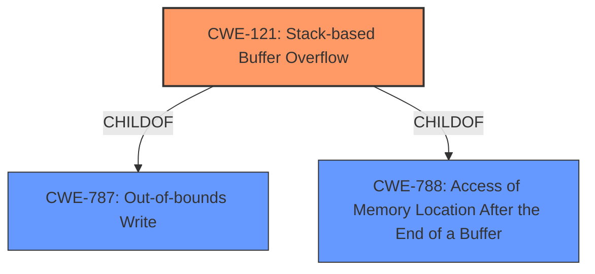

# Analysis for CVE-2021-45908

# Summary
| CWE ID | CWE Name | Confidence | CWE Abstraction Level | CWE Vulnerability Mapping Label | CWE-Vulnerability Mapping Notes |
|---|---|---|---|---|---|
| CWE-121 | Stack-based Buffer Overflow | 1.0 | Variant | Allowed | Primary CWE |
| CWE-787 | Out-of-bounds Write | 0.7 | Base | Allowed | Secondary CWE |

## Evidence and Confidence

*   **Confidence Score:** 0.9
*   **Evidence Strength:** HIGH

## Relationship Analysis
The primary relationship impacting the decision is the ChildOf relationship. CWE-121 (Stack-based Buffer Overflow) is a variant of CWE-787 (Out-of-bounds Write) and CWE-788 (Access of Memory Location After the End of a Buffer). The vulnerability description explicitly mentions a "stack-based buffer overflow," making CWE-121 a more specific and accurate classification than its parent, CWE-787.

## Vulnerability Chain
The vulnerability chain begins with insufficient boundary checks in the `DecodeLZW` function. This leads to out-of-bounds writes within loops, ultimately resulting in a stack-based buffer overflow and a crash.

Insufficient Boundary Checks -> Out-of-bounds Write (CWE-787) -> Stack-based Buffer Overflow (CWE-121) -> Crash

## Summary of Analysis
The initial analysis identified CWE-787 as a potential candidate based on the **"stack-based buffer overflow"** vulnerability description key phrase and the CVE Reference Links Content Summary noting out-of-bounds writes in the `DecodeLZW` function. However, the description explicitly states that the buffer overflow is stack-based. This specificity makes CWE-121 a more accurate choice.

The graph relationships show that CWE-121 is a child of CWE-787. Since the vulnerability is explicitly a stack-based buffer overflow, and CWE-121 is a variant of CWE-787 that specifically describes stack-based overflows, CWE-121 is the more specific and appropriate choice.

The decision to use CWE-121 is based on direct evidence from the vulnerability description (**"stack-based buffer overflow"**) and the relationship analysis showing its specialization within the CWE hierarchy. This provides a more precise classification of the weakness than simply using CWE-787.

Relevant CWE Information:

# Enhanced Context (25 CWEs)

## CWE-124: Buffer Underwrite ('Buffer Underflow')
**Abstraction Level**: Base
**Similarity Score**: 0.78
**Source**: dense

**Description**:
The product writes to a buffer using an index or pointer that references a memory location prior to the beginning of the buffer.
**Rationale**: Not selected as the vulnerability involves writing past the end of the buffer, not before the beginning.

## CWE-191: Integer Underflow (Wrap or Wraparound)
**Abstraction Level**: Base
**Similarity Score**: 0.76
**Source**: dense
**Rationale**: Not selected as there is no evidence of integer underflow.

## CWE-131: Incorrect Calculation of Buffer Size
**Abstraction Level**: Base
**Similarity Score**: 0.76
**Source**: dense
**Rationale**: Not selected as the root cause is insufficient boundary checks rather than incorrect size calculation.

## CWE-805: Buffer Access with Incorrect Length Value
**Abstraction Level**: Base
**Similarity Score**: 0.76
**Source**: dense
**Rationale**: Not selected as the primary issue is writing beyond buffer bounds due to insufficient checks, not necessarily an incorrect length value used for access.

## CWE-680: Integer Overflow to Buffer Overflow
**Abstraction Level**: Compound
**Similarity Score**: 0.75
**Source**: dense
**Rationale**: Not selected as there is no evidence of integer overflow leading to the buffer overflow.

## CWE-126: Buffer Over-read
**Abstraction Level**: Variant
**Similarity Score**: 0.75
**Source**: dense
**Rationale**: Not selected as the vulnerability involves writing past the end of a buffer, not reading.

## CWE-190: Integer Overflow or Wraparound
**Abstraction Level**: Base
**Similarity Score**: 0.74
**Source**: dense
**Rationale**: Not selected as there is no evidence of integer overflow.

## CWE-127: Buffer Under-read
**Abstraction Level**: Variant
**Similarity Score**: 0.74
**Source**: dense
**Rationale**: Not selected as the vulnerability involves writing past the end of a buffer, not reading before the beginning.

## CWE-193: Off-by-one Error
**Abstraction Level**: Base
**Similarity Score**: 0.74
**Source**: dense
**Rationale**: Not selected as the description suggests a larger overflow rather than an off-by-one error.

## CWE-125: Out-of-bounds Read
**Abstraction Level**: Base
**Similarity Score**: 0.74
**Source**: dense
**Rationale**: Not selected as the vulnerability involves writing past the end of a buffer, not reading.

## CWE-190: Integer Overflow or Wraparound
**Abstraction Level**: Base
**Similarity Score**: 6925.16
**Source**: sparse
**Rationale**: Not selected as there is no evidence of integer overflow.

## CWE-125: Out-of-bounds Read
**Abstraction Level**: Base
**Similarity Score**: 6566.88
**Source**: sparse
**Rationale**: Not selected as the vulnerability involves writing past the end of a buffer, not reading.

## CWE-193: Off-by-one Error
**Abstraction Level**: Base
**Similarity Score**: 6425.05
**Source**: sparse
**Rationale**: Not selected as the description suggests a larger overflow rather than an off-by-one error.

## CWE-1284: Improper Validation of Specified Quantity in Input
**Abstraction Level**: Base
**Similarity Score**: 6288.50
**Source**: sparse
**Rationale**: While this could be a contributing factor, the direct cause is the buffer overflow on the stack.

## CWE-119: Improper Restriction of Operations within the Bounds of a Memory Buffer
**Abstraction Level**: Class
**Similarity Score**: 6243.74
**Source**: sparse
**Rationale**: While CWE-119 is a general class for buffer issues, CWE-121 is more specific as it identifies the vulnerability as a stack-based buffer overflow, making it a more accurate choice.

## CWE-128: Wrap-around Error
**Abstraction Level**: base
**Similarity Score**: 5.03
**Source**: graph
**Rationale**: Not selected as there is no evidence of wrap-around error.

## CWE-170: Improper Null Termination
**Abstraction Level**: base
**Similarity Score**: 5.03
**Source**: graph
**Rationale**: Not selected as there is no evidence of improper null termination.

## CWE-120: Buffer Copy without Checking Size of Input ('Classic Buffer Overflow')
**Abstraction Level**: base
**Similarity Score**: 4.82
**Source**: graph
**Rationale**: Not selected as the description doesn't focus on a specific copy operation without size checking, but more generally on **insufficient boundary checks** leading to the overflow.

## CWE-123: Write-what-where Condition
**Abstraction Level**: base
**Similarity Score**: 4.33
**Source**: graph
**Rationale**: Not selected as the attacker has little control over the data written, making a "write-what-where" condition unlikely.

## CWE-1284: Improper Validation of Specified Quantity in Input
**Abstraction Level**: base
**Similarity Score**: 4.33
**Source**: graph
**Rationale**: While this could be a contributing factor, the direct cause is the buffer overflow on the stack.

## CWE-617: Reachable Assertion
**Abstraction Level**: base
**Similarity Score**: 4.33
**Source**: graph
**Rationale**: Not selected as there is no mention of assertions being triggered.

## CWE-195: Signed to Unsigned Conversion Error
**Abstraction Level**: variant
**Similarity Score**: 3.88
**Source**: graph
**Rationale**: Not selected as there is no mention of signed to unsigned conversion errors.

## CWE-463: Deletion of Data Structure Sentinel
**