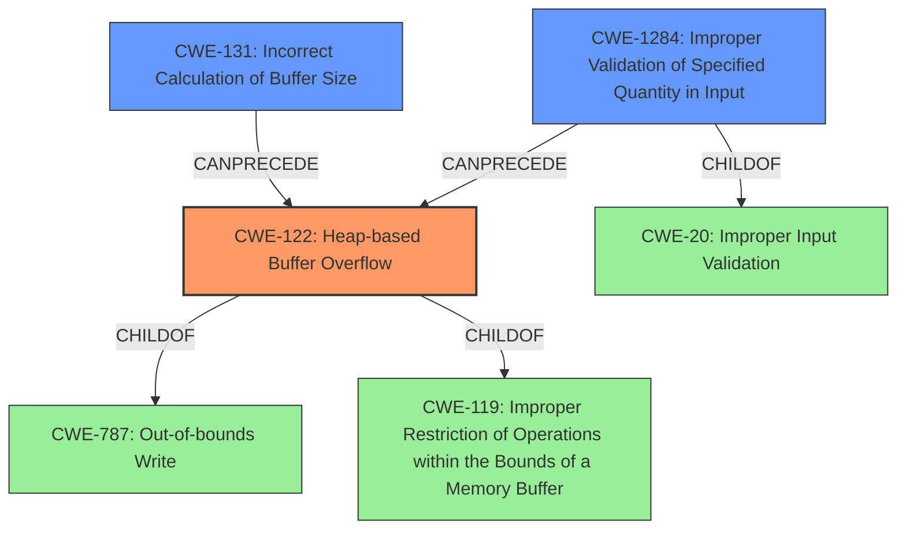

# Analysis for CVE-2021-45909

# Summary
| CWE ID | CWE Name | Confidence | CWE Abstraction Level | CWE Vulnerability Mapping Label | CWE-Vulnerability Mapping Notes |
|---|---|---|---|---|---|
| CWE-122 | Heap-based Buffer Overflow | 1.0 | Variant | Allowed | Primary CWE |
| CWE-131 | Incorrect Calculation of Buffer Size | 0.7 | Base | Allowed | Secondary Candidate |
| CWE-1284 | Improper Validation of Specified Quantity in Input | 0.6 | Base | Allowed | Secondary Candidate |

## Evidence and Confidence

*   **Confidence Score:** 0.9
*   **Evidence Strength:** HIGH

## Relationship Analysis
The primary CWE is CWE-122, a **Variant** of CWE-787 and CWE-119, indicating a specific type of buffer overflow. The secondary CWEs, CWE-131 and CWE-1284, are **Base** level CWEs, suggesting they are potential root causes. The relationships between these CWEs help to form a chain of causation: the **improper calculation of buffer size** (CWE-131) and the **improper validation of quantity** (CWE-1284) can lead to a **heap-based buffer overflow** (CWE-122).

## Vulnerability Chain
The vulnerability chain starts with either:
1.  **CWE-131** (**Incorrect Calculation of Buffer Size**), leading to
2.  **CWE-122** (**Heap-based Buffer Overflow**), which can then lead to
3.  Memory corruption and potentially arbitrary code execution.

OR

1.  **CWE-1284** (**Improper Validation of Specified Quantity in Input**), leading to
2.  **CWE-122** (**Heap-based Buffer Overflow**), which can then lead to
3.  Memory corruption and potentially arbitrary code execution.

## Summary of Analysis
The initial assessment, based on the vulnerability description and CVE details, points towards **CWE-122 (Heap-based Buffer Overflow)** as the primary weakness. The description explicitly mentions a "**heap-based buffer overflow** vulnerability in the DecodeLZW function." The CVE Reference Links Content Summary further supports this by stating the "**Root Cause:** Heap-based buffer overflow in the `DecodeLZW` function."

The evidence is strong that this is a heap based overflow. The CVE description states:
*   "The `DecodeLZW` function writes data to a buffer allocated with `malloc`, but it doesn't validate the size of the data written against the allocated buffer's size."
*   "The size of the allocated buffer is initially calculated based on an image size value (`imagesize * 2`), however, this `imagesize` variable is later overwritten, so the `DecodeLZW` function doesn't have access to the actual allocated buffer size."

This evidence supports the following:
1.  The buffer is allocated on the heap, so it is heap based.
2.  The size is not validated and can be overwritten.

The other CWEs considered were:

*   **CWE-131 (Incorrect Calculation of Buffer Size)**: This is a strong candidate as a contributing factor because the buffer size is initially calculated using `imagesize * 2`, but `imagesize` is later overwritten, leading to an incorrect buffer size. The vulnerability description states: "The size of the allocated buffer is initially calculated based on an image size value (`imagesize * 2`), however, this `imagesize` variable is later overwritten, so the `DecodeLZW` function doesn't have access to the actual allocated buffer size." This suggests that the initial buffer size calculation was incorrect due to the overwritten `imagesize` variable.
*   **CWE-1284 (Improper Validation of Specified Quantity in Input)**: This could also be a contributing factor, as the input image size is not properly validated, leading to the buffer overflow. The description mentions that the `DecodeLZW` function "doesn't validate the size of the data written against the allocated buffer's size." This highlights a lack of validation of the input data size, potentially leading to the overflow.

CWE-122 is chosen as the primary because the description explicitly calls out the heap based buffer overflow.

CWE-119 (Improper Restriction of Operations within the Bounds of a Memory Buffer) was considered but rejected as it is too high-level and the description provides enough evidence to choose CWE-122 (Heap-based Buffer Overflow).

CWE-190 (Integer Overflow or Wraparound) was considered because integer overflows can lead to buffer overflows when they cause less memory to be allocated than expected, however there is no clear evidence of integer overflow, so this was not selected.

CWE-193 (Off-by-one Error) was considered because of the potential for miscalculation of the buffer size, however there is no specific evidence of an off-by-one error, so this was not selected.

CWE-125 (Out-of-bounds Read) was considered but rejected because the primary issue is writing outside the buffer, not reading.