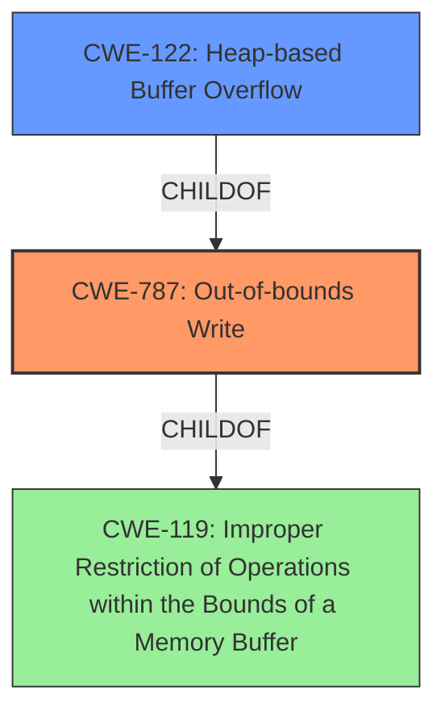

# Analysis Report for CVE-2021-45932

# Vulnerability Analysis Report: CVE-2021-45932

## Description


## Analysis (with Relationship Data)

# Summary
| CWE ID | CWE Name | Confidence | CWE Abstraction Level | CWE Vulnerability Mapping Label | CWE-Vulnerability Mapping Notes |
|---|---|---|---|---|---|
| CWE-787 | Out-of-bounds Write | 1.0 | Base | Allowed | Primary CWE. The vulnerability description explicitly mentions a **heap-based buffer overflow**, and the reference links content summary indicates a **null-dereference WRITE**. |
| CWE-122 | Heap-based Buffer Overflow | 0.7 | Variant | Allowed | Secondary CWE. While CWE-787 is the primary issue, the overflow occurring on the heap is a relevant detail. |
| CWE-119 | Improper Restriction of Operations within the Bounds of a Memory Buffer | 0.5 | Class | Discouraged | Secondary CWE. CWE-119 is a general class of buffer overflows, but CWE-787 and CWE-122 are more specific. |

## Evidence and Confidence

*   **Confidence Score:** 0.9
*   **Evidence Strength:** HIGH

## Relationship Analysis
The primary CWE is CWE-787, which is a base-level CWE describing a general out-of-bounds write. CWE-122, Heap-based Buffer Overflow, is a variant of CWE-787, specifying that the overflow occurs on the heap. CWE-119 is a class-level CWE and a parent of both CWE-787 and other buffer overflow related weaknesses. The relationship between these CWEs helps to narrow down the specific type of buffer overflow.



## Vulnerability Chain
The vulnerability chain involves a **heap-based buffer overflow** (CWE-787, CWE-122) occurring in `MqttDecode_Publish`. The **root cause** is the **improper handling of buffer boundaries** when decoding MQTT packets.

## Summary of Analysis
The initial assessment based on the vulnerability description pointed towards CWE-787 as the primary weakness due to the explicit mention of a **heap-based buffer overflow**. Further review of the provided information, including the "CVE Reference Links Content Summary," confirmed the presence of an out-of-bounds write condition. The retriever results also listed CWE-787 and related buffer overflow CWEs.

The final decision to include CWE-787 as the primary CWE and CWE-122 as a secondary CWE is based on the specific details provided in the vulnerability description. CWE-787 accurately describes the out-of-bounds write condition, while CWE-122 provides additional context about the location of the overflow (heap). CWE-119 is also included, but it's a high-level categorization. The evidence strongly supports these classifications, and the relationships between the CWEs help to clarify the nature of the vulnerability.

The selection of CWE-787 as the primary CWE is further supported by the "CWE for similar CVE Descriptions" section, which lists CWE-787 as the primary match.

CWEs considered but not used:

*   CWE-190: Integer Overflow or Wraparound: While integer overflows can sometimes lead to buffer overflows, there is no direct evidence of this in the vulnerability description.
*   CWE-193: Off-by-one Error: This is a possible contributing factor, but not explicitly stated.
*   CWE-131: Incorrect Calculation of Buffer Size: Similar to off-by-one, this could be a cause, but there is no direct evidence.

The selected CWEs are at the optimal level of specificity, as they accurately describe the vulnerability based on the available evidence.


## CWE Relationship Analysis

Current CWEs represent these abstraction levels: .


### Vulnerability Chain Analysis

**Chain starting from CWE-190:**
- 190 (Integer Overflow or Wraparound) - ROOT


**Chain starting from CWE-131:**
- 131 (Incorrect Calculation of Buffer Size) - ROOT


### CWE Relationship Diagram

```mermaid
graph TD
    classDef primary fill:#f96,stroke:#333,stroke-width:2px
    classDef secondary fill:#69f,stroke:#333
    classDef tertiary fill:#9e9,stroke:#333
```


*Report generated on 2025-03-30 20:58:33*
