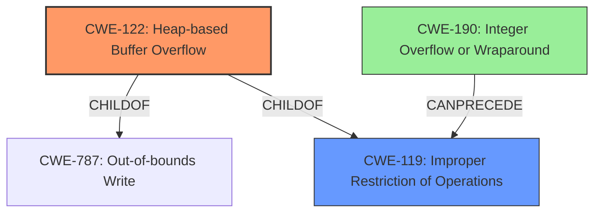

# Analysis Report for CVE-2021-45934

# Vulnerability Analysis Report: CVE-2021-45934

## Description


## Analysis (with Relationship Data)

# Summary
| CWE ID  | CWE Name | Confidence | CWE Abstraction Level | CWE Vulnerability Mapping Label | CWE-Vulnerability Mapping Notes |
|-----------------|-----------------------------------------------------------------------------------|------------------|--------------------------|--------------------------------------|-----------------------------------|
| CWE-122 | Heap-based Buffer Overflow | 1 | Variant | Allowed | Primary CWE |
| CWE-119 | Improper Restriction of Operations within the Bounds of a Memory Buffer | 0.7 | Class | Discouraged | Secondary Candidate |
| CWE-190 | Integer Overflow or Wraparound | 0.5 | Base | Allowed | Secondary Candidate |

## Evidence and Confidence

*   **Confidence Score:** 0.8
*   **Evidence Strength:** HIGH

## Relationship Analysis
The primary CWE is CWE-122, a variant of CWE-787 and CWE-119. CWE-119 is a class-level CWE that is too general but relevant as a parent. CWE-190 is a base-level CWE that can precede CWE-119 and might be related if an integer overflow led to the incorrect calculation of the buffer size, although there is no direct evidence of this in the vulnerability description.



## Vulnerability Chain
The vulnerability chain involves a heap-based buffer overflow due to **insufficient bounds checking** in the `MqttClient_DecodePacket` function. This can lead to overwriting memory on the heap and potentially arbitrary code execution.

## Summary of Analysis
The primary weakness is a **heap-based buffer overflow**. The vulnerability description clearly states this, and the CVE reference link content summary confirms it, mentioning that the vulnerability is a **heap-buffer-overflow** within the `MqttClient_DecodePacket` function.

CWE-122 is the most specific and appropriate CWE because it directly addresses the **heap-based buffer overflow**. CWE-119 is a more general class that applies to improper restriction of operations within memory bounds but is less specific than CWE-122. CWE-190 could be related if the overflow was caused by an integer overflow when calculating the buffer size, but there's no explicit evidence for this.

The assessment is strongly based on the provided evidence, specifically the vulnerability description and the CVE reference link content summary. The graph relationships helped clarify the hierarchical relationships between the CWEs, with CWE-122 being the most specific variant of a buffer overflow.

Relevant CWE Information:

# Enhanced Context (25 CWEs)
The following CWEs were identified as potentially relevant to this vulnerability:

## CWE-191: Integer Underflow (Wrap or Wraparound)
**Abstraction Level**: Base
**Similarity Score**: 0.77
**Source**: dense

## CWE-681: Incorrect Conversion between Numeric Types
**Abstraction Level**: Base
**Similarity Score**: 0.75
**Source**: dense

## CWE-131: Incorrect Calculation of Buffer Size
**Abstraction Level**: Base
**Similarity Score**: 0.75
**Source**: dense

## CWE-124: Buffer Underwrite ('Buffer Underflow')
**Abstraction Level**: Base
**Similarity Score**: 0.74
**Source**: dense

## CWE-805: Buffer Access with Incorrect Length Value
**Abstraction Level**: Base
**Similarity Score**: 0.73
**Source**: dense

## CWE-197: Numeric Truncation Error
**Abstraction Level**: Base
**Similarity Score**: 0.73
**Source**: dense

## CWE-680: Integer Overflow to Buffer Overflow
**Abstraction Level**: Compound
**Similarity Score**: 0.73
**Source**: dense

## CWE-193: Off-by-one Error
**Abstraction Level**: Base
**Similarity Score**: 0.73
**Source**: dense

## CWE-126: Buffer Over-read
**Abstraction Level**: Variant
**Similarity Score**: 0.73
**Source**: dense

## CWE-125: Out-of-bounds Read
**Abstraction Level**: Base
**Similarity Score**: 0.73
**Source**: dense

## CWE-190: Integer Overflow or Wraparound
**Abstraction Level**: Base
**Similarity Score**: 6547.56
**Source**: sparse

## CWE-681: Incorrect Conversion between Numeric Types
**Abstraction Level**: Base
**Similarity Score**: 6224.21
**Source**: sparse

## CWE-125: Out-of-bounds Read
**Abstraction Level**: Base
**Similarity Score**: 6046.89
**Source**: sparse

## CWE-193: Off-by-one Error
**Abstraction Level**: Base
**Similarity Score**: 6017.15
**Source**: sparse

## CWE-197: Numeric Truncation Error
**Abstraction Level**: Base
**Similarity Score**: 6006.55
**Source**: sparse

## CWE-128: Wrap-around Error
**Abstraction Level**: base
**Similarity Score**: 5.03
**Source**: graph

## CWE-170: Improper Null Termination
**Abstraction Level**: base
**Similarity Score**: 5.03
**Source**: graph

## CWE-195: Signed to Unsigned Conversion Error
**Abstraction Level**: variant
**Similarity Score**: 4.53
**Source**: graph

## CWE-1284: Improper Validation of Specified Quantity in Input
**Abstraction Level**: base
**Similarity Score**: 4.33
**Source**: graph

## CWE-617: Reachable Assertion
**Abstraction Level**: base
**Similarity Score**: 4.33
**Source**: graph

## CWE-123: Write-what-where Condition
**Abstraction Level**: base
**Similarity Score**: 3.89
**Source**: graph

## CWE-463: Deletion of Data Structure Sentinel
**Abstraction Level**: base
**Similarity Score**: 3.64
**Source**: graph

## CWE-1339: Insufficient Precision or Accuracy of a Real Number
**Abstraction Level**: base
**Similarity Score**: 3.57
**Source**: graph

## CWE-120: Buffer Copy without Checking Size of Input ('Classic Buffer Overflow')
**Abstraction Level**: base
**Similarity Score**: 3.36
**Source**: graph

## CWE-190: Integer Overflow or Wraparound
**Abstraction Level**: Base
**Similarity Score**: 3.31
**Source**: graph

CWE-120 was considered but rejected because it is more applicable to buffer copy operations without size checking, which is not explicitly stated in the vulnerability description. Other CWEs like CWE-193 (Off-by-one Error), CWE-190 (Integer Overflow or Wraparound), and CWE-681 (Incorrect Conversion between Numeric Types) were also considered as potential contributing factors, but there's no direct evidence to support their inclusion.


## CWE Relationship Analysis

Current CWEs represent these abstraction levels: .


### Vulnerability Chain Analysis

**Chain starting from CWE-119:**
- 119 (Improper Restriction of Operations within the Bounds of a Memory Buffer) - ROOT


**Chain starting from CWE-123:**
- 123 (Write-what-where Condition) - ROOT


### CWE Relationship Diagram

```mermaid
graph TD
    classDef primary fill:#f96,stroke:#333,stroke-width:2px
    classDef secondary fill:#69f,stroke:#333
    classDef tertiary fill:#9e9,stroke:#333
```


*Report generated on 2025-03-30 15:48:02*
