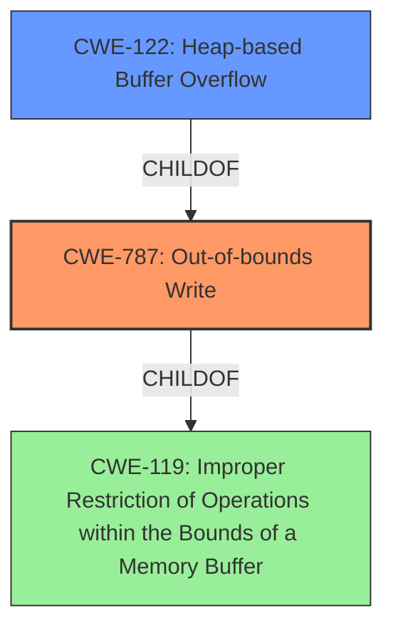

# Enhanced Analysis for CVE-2021-45937

# Summary
| CWE ID    | CWE Name                                                                | Confidence | CWE Abstraction Level | CWE Vulnerability Mapping Label | CWE-Vulnerability Mapping Notes |
| --------- | ----------------------------------------------------------------------- | ---------- | ----------------------- | ------------------------------- | ------------------------------- |
| CWE-787   | Out-of-bounds Write                                                     | 1          | Base                    |                                 | Allowed                       |
| CWE-122   | Heap-based Buffer Overflow                                              | 0.8        | Variant                 |                                 | Allowed                       |
| CWE-119   | Improper Restriction of Operations within the Bounds of a Memory Buffer | 0.6        | Class                   |                                 | Discouraged                   |

- The Primary CWE is CWE-787
- The secondary candidate CWEs are CWE-122 and CWE-119

## Evidence and Confidence

*   **Confidence Score:** 0.9
*   **Evidence Strength:** HIGH

## Relationship Analysis
The primary CWE is CWE-787, which is a base level CWE. CWE-122 is a variant of CWE-787, specifying that the out-of-bounds write occurs on the heap. CWE-119 is a more general class that encompasses CWE-787. Therefore, the hierarchical relationship helped narrow down the most specific and accurate CWE.



## Vulnerability Chain
The vulnerability chain starts with the `MqttClient_DecodePacket` function, which has a **heap-based buffer overflow**. This **weakness** allows an attacker to write data beyond the allocated buffer in the heap, potentially leading to a crash or arbitrary code execution.
  - Root Cause: **Heap-based buffer overflow** in `MqttClient_DecodePacket`.
  - Impact: Crash (WRITE).

## Summary of Analysis
The initial analysis identified CWE-787 as the primary candidate, supported by the vulnerability description and the provided "CWE for similar CVE Descriptions". The evidence from "CVE Reference Links Content Summary" confirms the **root_cause** as "Heap-buffer-overflow in MqttClient_DecodePacket" and a **weakness** as "Heap-buffer-overflow".

The graph relationships show that CWE-787 is a child of CWE-119, and CWE-122 is a child of CWE-787. Considering this, and the fact that the vulnerability is a **heap-based buffer overflow**, CWE-122 is a more specific variant of CWE-787. However, since the description explicitly states "heap-based buffer overflow", the root cause is more accurately an out-of-bounds write.

The selected CWEs are at the optimal level of specificity. CWE-787 accurately captures the **weakness** of an out-of-bounds write. CWE-122 is a variant that specifies where the overflow occurs, providing additional context. CWE-119 is a broader classification and less specific than CWE-787 and CWE-122.

Relevant CWE Information:

# Enhanced Context (25 CWEs)

## CWE-191: Integer Underflow (Wrap or Wraparound)
**Abstraction Level**: Base
**Similarity Score**: 0.77
**Source**: dense

**Description**:
The product subtracts one value from another, such that the result is less than the minimum allowable integer value, which produces a value that is not equal to the correct result.

**Mapping Guidance**:
- Usage: Allowed
- Rationale: This CWE entry is at the Base level of abstraction, which is a preferred level of abstraction for mapping to the root causes of vulnerabilities.

*This CWE was considered but not selected as it doesn't align with the **heap-based buffer overflow** description. There is no mention of subtraction or integer underflow in the provided text.*

## CWE-681: Incorrect Conversion between Numeric Types
**Abstraction Level**: Base
**Similarity Score**: 0.76
**Source**: dense

**Description**:
When converting from one data type to another, such as long to integer, data can be omitted or translated in a way that produces unexpected values. If the resulting values are used in a sensitive context, then dangerous behaviors may occur.

**Mapping Guidance**:
- Usage: Allowed
- Rationale: This CWE entry is at the Base level of abstraction, which is a preferred level of abstraction for mapping to the root causes of vulnerabilities.

*This CWE was considered but not selected because there is no indication of incorrect conversion between numeric types.*

## CWE-131: Incorrect Calculation of Buffer Size
**Abstraction Level**: Base
**Similarity Score**: 0.76
**Source**: dense

**Description**:
The product does not correctly calculate the size to be used when allocating a buffer, which could lead to a buffer overflow.

**Mapping Guidance**:
- Usage: Allowed
- Rationale: This CWE entry is at the Base level of abstraction, which is a preferred level of abstraction for mapping to the root causes of vulnerabilities.

*This CWE was considered but not selected as the description does not specify that an incorrect calculation of buffer size occurred.*

## CWE-124: Buffer Underwrite ('Buffer Underflow')
**Abstraction Level**: Base
**Similarity Score**: 0.75
**Source**: dense

**Description**:
The product writes to a buffer using an index or pointer that references a memory location prior to the beginning of the buffer.

**Mapping Guidance**:
- Usage: Allowed
- Rationale: This CWE entry is at the Base level of abstraction, which is a preferred level of abstraction for mapping to the root causes of vulnerabilities.

*This CWE was considered but not selected since the description specifies a buffer overflow, not an underflow.*

## CWE-805: Buffer Access with Incorrect Length Value
**Abstraction Level**: Base
**Similarity Score**: 0.74
**Source**: dense

**Description**:
The product uses a sequential operation to read or write a buffer, but it uses an incorrect length value that causes it to access memory that is outside of the bounds of the buffer.

**Mapping Guidance**:
- Usage: Allowed
- Rationale: This CWE entry is at the Base level of abstraction, which is a preferred level of abstraction for mapping to the root causes of vulnerabilities.

*This CWE was considered but not selected because the vulnerability description specifically mentions a **heap-based buffer overflow**, which is more directly addressed by CWE-787 and CWE-122.*

## CWE-680: Integer Overflow to Buffer Overflow
**Abstraction Level**: Compound
**Similarity Score**: 0.74
**Source**: dense

**Description**:
The product performs a calculation to determine how much memory to allocate, but an integer overflow can occur that causes less memory to be allocated than expected, leading to a buffer overflow.

**Mapping Guidance**:
- Usage: Discouraged
- Rationale: This CWE entry is a named chain, which combines multiple weaknesses.

*This CWE was considered but not selected because there is no evidence of an integer overflow leading to the buffer overflow.*

## CWE-197: Numeric Truncation Error
**Abstraction Level**: Base
**Similarity Score**: 0.74
**Source**: dense

**Description**:
Truncation errors occur when a primitive is cast to a primitive of a smaller size and data is lost in the conversion.

**Mapping Guidance**:
- Usage: Allowed
- Rationale: This CWE entry is at the Base level of abstraction, which is a preferred level of abstraction for mapping to the root causes of vulnerabilities.

*This CWE was considered but not selected because there is no mention of numeric truncation.*

## CWE-193: Off-by-one Error
**Abstraction Level**: Base
**Similarity Score**: 0.73
**Source**: dense

**Description**:
A product calculates or uses an incorrect maximum or minimum value that is 1 more, or 1 less, than the correct value.

**Mapping Guidance**:
- Usage: Allowed
- Rationale: This CWE entry is at the Base level of abstraction, which is a preferred level of abstraction for mapping to the root causes of vulnerabilities.

*This CWE was considered but not selected because there is no evidence of an off-by-one error.*

## CWE-126: Buffer Over-read
**Abstraction Level**: Variant
**Similarity Score**: 0.73
**Source**: dense

**Description**:
The product reads from a buffer using buffer access mechanisms such as indexes or pointers that reference memory locations after the targeted buffer.

**Mapping Guidance**:
- Usage: Allowed


## CWE Relationship Analysis

Current CWEs represent these abstraction levels: .


### Vulnerability Chain Analysis

**Chain starting from CWE-131:**
- 131 (Incorrect Calculation of Buffer Size) - ROOT


**Chain starting from CWE-680:**
- 680 (Integer Overflow to Buffer Overflow) - ROOT


### CWE Relationship Diagram

```mermaid
graph TD
    classDef primary fill:#f96,stroke:#333,stroke-width:2px
    classDef secondary fill:#69f,stroke:#333
    classDef tertiary fill:#9e9,stroke:#333
```